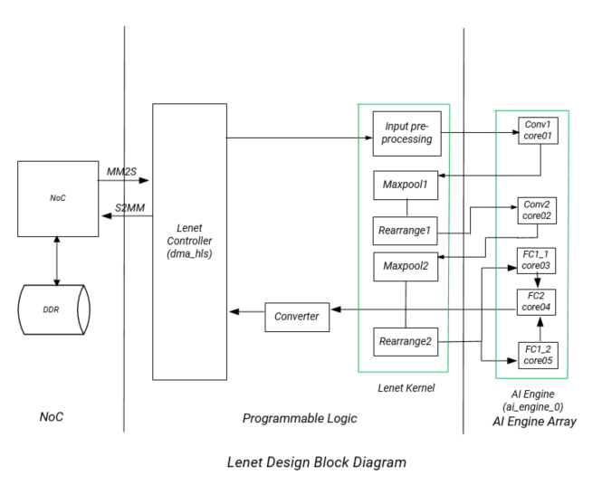
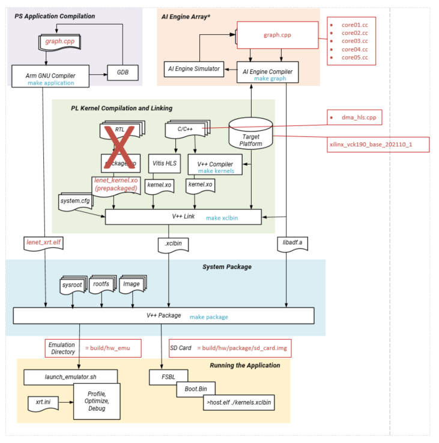
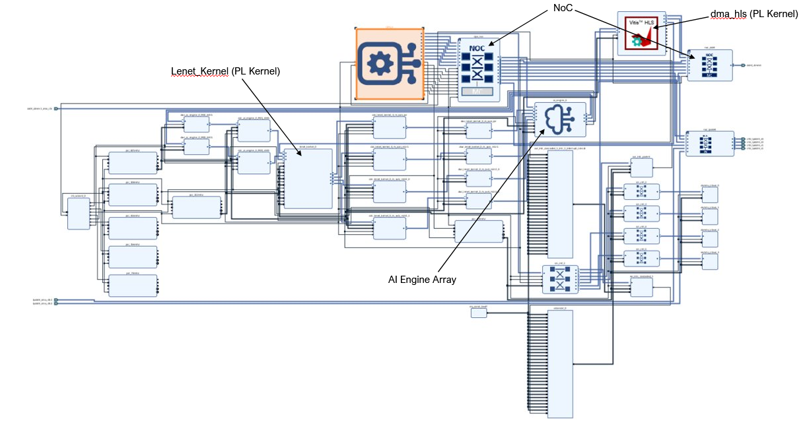
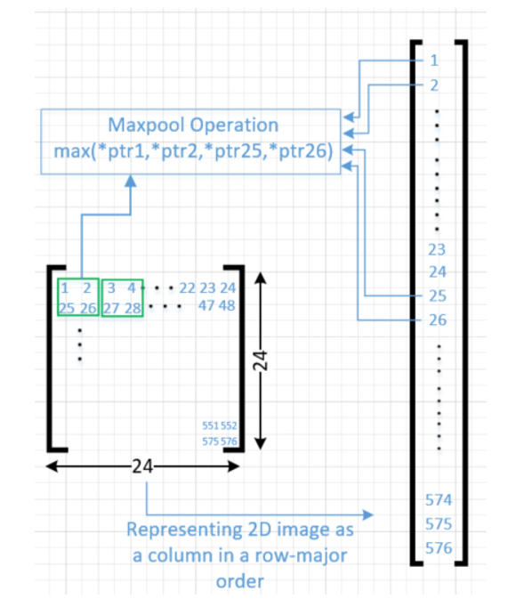
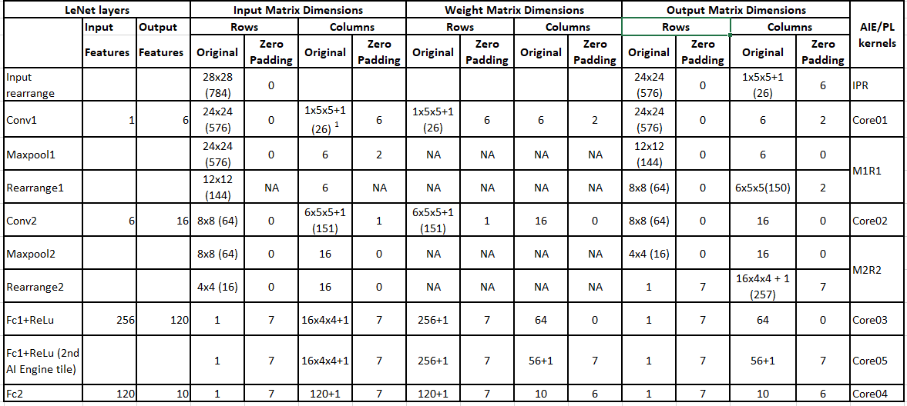
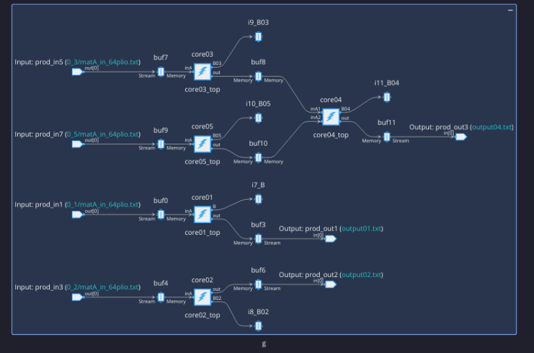
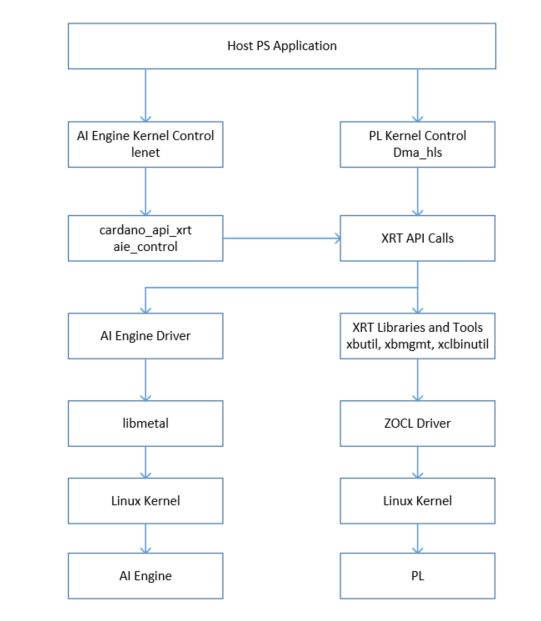
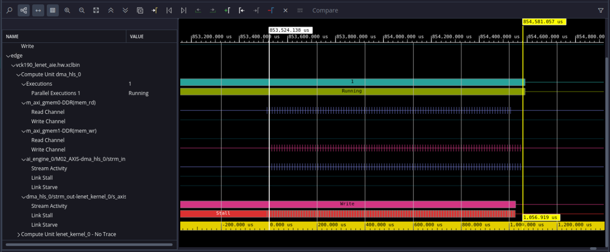
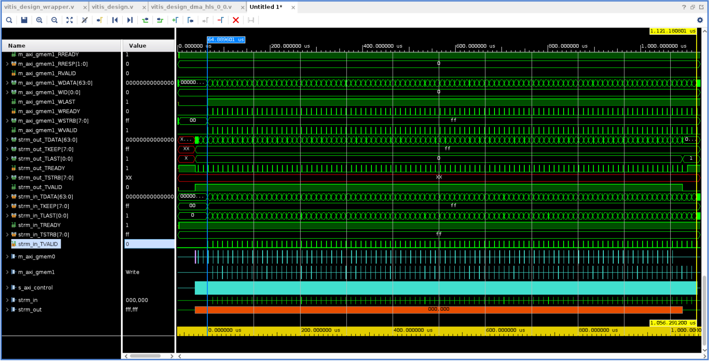
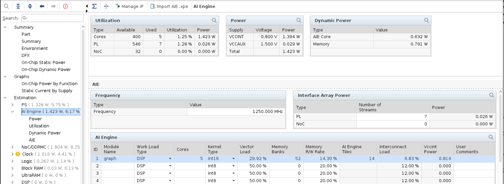

<table class="sphinxhide" width="100%">
 <tr width="100%">
    <td align="center"><h1>AI Engine Development</h1>
    <a href="https://www.xilinx.com/products/design-tools/vitis.html">See Vitis™ Development Environment on xilinx.com</br></a>
    <a href="https://www.xilinx.com/products/design-tools/vitis/vitis-ai.html">See Vitis™ AI Development Environment on xilinx.com</a>
    </td>
 </tr>
</table>

# Versal™ AI Engine LeNet Tutorial

***Version: Vitis 2023.2***

## Table of Contents

[Introduction](#introduction)

[Before You Begin](#Before-you-begin)

[Building the LeNet Design](#building-the-lenet-design)

[Hardware Design Details](#hardware-design-details)

[Software Design Details](#software-design-details)

[Throughput Measurement Details](#throughput-measurement-details)

[References](#references)

## Introduction

The AMD Versal™ adaptive SoC is a fully software-programmable, heterogeneous compute platform that combines the Processor System (PS) (Scalar Engines that include the Arm® processors), Programmable Logic (PL) (Adaptable Engines that include the programmable logic blocks and memory) and AI Engines which belong in the Intelligent Engine category.

This tutorial uses the LeNet algorithm to implement a system-level design to perform image classification using the AI Engine and PL, including block RAM. The design demonstrates functional partitioning between the AI Engine and PL. It also highlights memory partitioning and hierarchy among DDR memory, PL (block RAM) and AI Engine memory.

The tutorial takes you through hardware emulation and hardware flow in the context of a complete Versal ACAP system integration. A Makefile is provided that you can modify to suit your own needs in a different context.

<details>
  <summary>Objectives</summary>

### Objectives

After completing the tutorial, you should be able to:
* Build a complete system design by going through the various steps in the Vitis™ unified software platform flow, including creating the AI Engine Adaptive Data Flow (ADF) API graph, compiling the A72 host application and compiling PL kernels, using the Vitis compiler (V++) to link the AI Engine and HLS kernels with the platform, and packaging the design. You will also be able to run the design through the hardware emulation and hardware flow in a mixed System C/RTL cycle-accurate/QEMU-based simulator.
* Develop an understanding of Convolutional Neural Network (CNN) layer details using the LeNet algorithm and how the layers are mapped into data processing and compute blocks.
* Develop an understanding of the kernels developed in the design; AI Engine kernels to process fully connected convolutional layers and PL kernels to process the input rearrange and max pool and rearrange functions.
* Develop an understanding of the AI Engine IP interface using the AXI4-Stream interface.
* Develop an understanding of memory hierarchy in a system-level design involving DDR memory, PL block RAM, and AI Engine memory.
* Develop an understanding of graph control APIs to enable run-time updates using the run-time parameter (RTP) interface.
* Develop an understanding of performance measurement and functional/throughput debug at the application level.

</details>

<details>
  <summary>Tutorial Overview</summary>

## Tutorial Overview
In this application tutorial, the LeNet algorithm is used to perform image classification on an input image using five AI Engine tiles and PL resources including block RAM. A top-level block diagram is shown in the following figure. An image is loaded from DDR memory through the Network on Chip (NoC) to block RAM and then to the AI Engine. The PL input pre-processing unit receives the input image and sends the output to the first AI Engine tile to perform matrix multiplication. The output from the first AI Engine tile goes to a PL unit to perform the first level of max pool and data rearrangement (M1R1). The output is fed to the second AI Engine tile and the output from that tile is sent to the PL to perform the second level max pooling and data rearrangement (M2R2). The output is then sent to a fully connected layer (FC1) implemented in two AI Engine tiles and uses the rectified linear unit layer (ReLu) as an activation function. The outputs from the two AI Engine tiles are then fed into a second fully connected layer implemented in the `core04` AI Engine tile. The output is sent to a data conversion unit in the PL and then to the DDR memory through the NoC. In between the AI Engine and PL units is a datamover module (refer to the LeNet Controller in the following figure) that contains the following kernels:
* `mm2s`: a memory-mapped to stream kernel to feed data from DDR memory through the NoC to the AI Engine Array.
* `s2mm`: a stream to memory-mapped kernel to feed data from the AI Engine Array through NoC to DDR memory.



In the design, there are two major PL kernels. The input pre-processing units, M1R1 and M2R2 are contained in the `lenet_kernel` RTL kernel which has already been packaged as a Xilinx object `.xo` (XO) file. The datamover kernel `dma_hls` provides the interface between the AI Engine and DDR memory. The five AI Engine kernels all implement matrix multiplication. The matrix dimensions depend on the image dimension, weight dimension, and number of features.

</details>

<details>
  <summary>Directory Structure</summary>

### Directory Structure
```
lenet
|____design......................contains AI Engine kernel, HLS kernel source files, and input data files
|    |___aie_src.................contains all the aie source files
|    |___pl_src..................contains all the data mover source files
|    |___host_app_src............contains host application source files
|    |___directives..............contains directives for various vitis compilation stages 
|    |___exec_scripts............contains run commands
|    |___profiling_configs.......contains xrt.ini file
|    |___system_configs..........contains all system configuration files
|    |___vivado_metrics_scripts..contains scripts to get vivado metric reports
|____images......................contains images that appear in the README.md
|____Makefile....................with recipes for each step of the design compilation
|____description.json............for XOAH
|____sample_env_setup.sh.........required to setup Vitis environment variables and Libraries
```

</details>

## Before You Begin
Note: This tutorial targets the VCK190 Production board (see https://www.xilinx.com/products/boards-and-kits/vck190.html). If you have already purchased this board, download the necessary files from the website and ensure you have the correct licenses installed.

<details>

<summary>Documentation: Explore AI Engine Architecture</summary>

### *Documentation*: Explore AI Engine Architecture

* [AM009 AI Engine Architecture Manual](https://docs.xilinx.com/r/en-US/am009-versal-ai-engine/Revision-History)

* [Versal ACAP AI Engines for Dummies](https://forums.xilinx.com/t5/Design-and-Debug-Techniques-Blog/Versal-ACAP-AI-Engines-for-Dummies/ba-p/1132493)

</details>

<details>

<summary>Tools: Installing the Tools</summary>

### *Tools*: Installing the Tools

Tools Documentation:

* [AI Engine Documentation](https://docs.xilinx.com/search/all?filters=Document_ID~%2522UG1076%2522_%2522UG1079%2522&content-lang=en-US)

To build and run the LeNet tutorial, you will need the following tools downloaded/installed:

* Install the [Vitis Software Platform 2023.2](https://docs.xilinx.com/r/en-US/ug1393-vitis-application-acceleration/Installation)

* Obtain a license to enable Beta Devices in AMD tools (to use the `xilinx_vck190_base_202320_1` platform)

* Obtain licenses for AI Engine tools

* Follow the instructions in [Installing Xilinx Runtime and Platforms](https://docs.xilinx.com/r/en-US/ug1393-vitis-application-acceleration/Installing-Xilinx-Runtime-and-Platforms) (XRT)

* Download and set up the [VCK190 Vitis Platform for 2023.2](https://www.xilinx.com/support/download/index.html/content/xilinx/en/downloadNav/embedded-platforms.html)

</details>

<details>
<summary>Environment: Setting Up the Shell Environment</summary>

## Environment: Setting Up the Shell Environment
When the elements of the Vitis software platform are installed, update the shell environment script. Set the environment variables to your system-specific paths.

Edit `sample_env_setup.sh` script with your file paths:
```bash
export PLATFORM_REPO_PATHS=<YOUR-PLATFORM-DIRECTORY>

source <XILNX-TOOLS-LOCATION>/Vitis/<TOOLS-BUILD>/settings64.sh
```
Then source the environment script:
```bash
source sample_env_setup.sh
```  

</details>

<details>
<summary>Validation: Confirming Tool Installation</summary>

### Validation: Confirming Tool Installation
```bash
which vitis
which aiecompiler
```

Confirm you have the VCK190 Production Base Platform.
```bash
platforminfo --list | grep -m 1 -A 9 vck190_base
```
Output of the above command should be as follows:
```bash
"baseName": "xilinx_vck190_base_202320_1",
            "version": "1.0",
            "type": "sdsoc",
            "dataCenter": "false",
            "embedded": "true",
            "externalHost": "false",
            "serverManaged": "false",
            "platformState": "pre_synth",
            "usesPR": "false",
```

</details>

## Building the LeNet Design

<details>
  <summary>LeNet Design Build</summary>

### LeNet Design Build
In this section, you will build and run the LeNet design. You will compile the AI Engine design and integrate it into a larger system design (including the PL kernels and PS host application). You can review [Integrating the Application Section in the AI Engine Documentation](#ai-engine-documentation) for the general flow. The following image shows the Vitis tool flow with the `make` targets (in blue) and input source files and output file generation (in red) at each step.



At the end of this section, the design flow will generate a new directory (called `build/`) that contains the `Work/`, `hw_emu/`, and `hw/` subfolders. The `Work/` subfolder is an output from the AI Engine compiler. The `hw_emu/` subfolder contains the build for hardware emulation. The `hw/` subfolder contains the build for hardware run on a VCK190 board.   

</details>

## Make Steps
To run the following `make` steps (for example, `make kernels`, `make graph`, etc.), you must be in the leNet tutorial folder.
<details>
<summary>Build the Entire Design with a Single Command</summary>

### Build the Entire Design with a Single Command
If you are an advanced user and are already familiar with the AI Engine and Vitis kernel compilation flows, you can build the entire design with one command:

```bash
make all TARGET=hw_emu
```
or
```bash
make all TARGET=hw EN_TRACE=0
```
or
```bash
make all TARGET=hw EN_TRACE=1
```

The default value of EN_TRACE is 0. This command runs the `make kernels`, `make graph`, `make xsa`, `make application`, and `make package` for hardware emulation or for running on hardware (VCK190 board), depending on the `TARGET` you specify. Also, if the `TARGET` specified is hardware `EN_TRACE` can be set to 1 to enable trace to measure throughput.  

You can also run the following command to build the entire LeNet tutorial *and* launch hardware emulation:
```bash
make run TARGET=hw_emu
```
</details>

<details>
  <summary>make kernels: Compile PL Kernels</summary>

### make kernels: Compile PL Kernels
In this step, the Vitis compiler takes any Vitis compiler kernels (RTL or HLS C) in the PL region of the target platform (`xilinx_vck190_base_202320_1`) and the AI Engine kernels and graph and compiles them into their respective XO files. In this design, the `dma_hls` kernel is compiled as an XO file and the `Lenet_kernel` has already been pre-compiled as an XO file. You can access the source code by unzipping the XO file.

`unzip lenet_kernel.xo`

The files will be stored under the `ip_repo` folder.

The following commands compiles the kernels (default TARGET=hw_emu).

```
make kernels
```

The expanded command is as follows:
```
mkdir -p ./build/hw_emu

cd ./build/hw_emu

v++       --target hw_emu			     \
          --platform xilinx_vck190_base_202320_1     \
          --save-temps                               \
	  --temp_dir _x	                             \
          --verbose                                  \
          -c ../../design/pl_src/datamover/dma_hls.cpp\
          -k dms_hls                                 \
          -o dma_hls.hw_emu.xo

 cd ../../;
 ```
|Switch|Description|
|  ---  |  ---  |
|--target \| -t [hw\|hw_emu]|Specifies the build target.|
|--platform \| -f|Specifies the name of a supported acceleration platform as specified by the $PLATFORM_REPO_PATHS environment variable or the full path to the platform XPFM file.|
|--save-temps \| -s|Directs the Vitis compiler command to save intermediate files/directories created during the compilation and link process. Use the `--temp_dir` option to specify a location to write the intermediate files to.|
|--temp_dir <string>|This allows you to manage the location where the tool writes temporary files created during the build process. The temporary results are written by the Vitis compiler, and then removed, unless the `--save-temps` option is also specified.|
|--verbose|Display verbose/debug information.|
|--compile \| -c|Required for compilation to generate XO files from kernel source files.|
|--kernel \<arg\>\|-k \<arg\>|Compile only the specified kernel from the input file. Only one -k option is allowed per Vitis compiler command.|
|--output \| -o|Specifies the name of the output file generated by the `v++` command. The DMA HLS kernels output should be XO.|

|Input|Description|
|  ---  |  ---  |
|design/pl_src/datamover/dma_hls.cpp|Defines the datamover PL kernel.|

|Output|Description|
|  ---  |  ---  |
|build/hw_emu/dma_hls.hw_emu.xo|The datamover kernel object file.|

 </details>

<details>
  <summary>make graph: Creating the AI Engine ADF Graph for Vitis Compiler Flow</summary>

### make graph: Creating the AI Engine ADF Graph for Vitis Compiler Flow
An ADF graph can be connected to an extensible Vitis platform (the graph I/Os can be connected either to platform ports or to ports on Vitis kernels through Vitis compiler connectivity directives).
* The AI Engine ADF C++ graph of the design contains AI Engine kernels and PL kernels.
* All interconnects between kernels are defined in the C++ graph.
* All interconnections to external I/O are fully specified in the C++ simulation testbench (`graph.cpp`) that instantiates the C++ ADF graph object. All `adf::sim` platform connections from graph to PLIO map onto ports on the AI Engine subsystem graph that is connected using the Vitis compiler connectivity directives. No dangling ports or implicit connections are allowed by the Vitis compiler.

To compile the graph using the Makefile flow type:
```
make graph
```
The following AI Engine compiler command compiles the AI Engine design graph:
```
cd ./build;
aiecompiler --include= ./design/aie_src \
	    --include= ./design/aie_src/aiesim_data   \
            --verbose                    \
            --log-level=5                \
            --test-iterations=100        \      
            --dataflow                   \
            --heapsize=2048              \
            --workdir=Work               \
            ./design/aie_src/graph.cpp

cd ../../;
 ```
|Switch|Description|
|  ---  |  ---  |
|--include=\<string\>|Specify compile-time include directory (zero or more).|
|--verbose\|-v|Verbose output of the AI Engine compiler emits compiler messages at various stages of compilation. These debug and tracing logs provide useful messages on the compilation process.|
|--log-level=\<int\>|Log level for verbose logging (default=1).|
|--workdir=\<string\>|By default, the compiler writes all outputs to a sub-directory of the current directory, called Work. Use this option to specify a different output directory.|

The following is a description of the output objects that results from executing the AI Engine compiler (`aiecompiler`) command:

|Inputs Sources|Description|
|  ---  |  ---  |
|design/aie_src/graph.cpp|Defines the LeNet graph object.|

|Output Objects|Description|
|  ---  |  ---  |
|build/libadf.a|Compiled AI Engine design graph.|
|build/Work/|Directory that contains all outputs of the AI Engine compiler.|

 </details>

<details>
  <summary>make xsa: Use Vitis Tools to Link AI Engine and HLS Kernels with the Platform</summary>

### make xsa: Use Vitis Tools to Link AI Engine and HLS Kernels with the Platform
After the AI Engine kernels and graph and PL HLS kernels have been compiled, you can use the Vitis compiler to link them with the platform to generate both an XCLBIN and a new XSA file.

### Platform
The Vitis tools allow you to integrate the AI Engine, HLS, and RTL kernels into an existing extensible platform. This is an automated step from a software developer perspective where the platform chosen is provided by the hardware designer (or you can opt to use one of the many extensible base platforms provided by AMD) and the Vitis tool builds the hardware design and integrates the AI Engine and PL kernels into the design.

To test this feature in this tutorial, use the base VCK190 platform to build the design.

The command to run this step is as follows (default TARGET=hw_emu, default EN_TARCE=0):
```
make xsa
```

The expanded command is as follow:
```
cd ./build/hw_emu;

v++       -l                                                \
          --platform xilinx_vck190_base_202320_1            \
          --save-temps                                      \
	  --temp_dir _x	                                    \
          --verbose                                         \
	  --g                                               \
          --config system.cfg                               \
	  -t hw_emu                                         \
          dma_hls.hw_emu.xo                                 \	  
          ../../design/pl_src/lenet_kernel/lenet_kernel.xo  \
          ../build/libadf.a                             \
          -o vck190_aie_lenet.hw_emu.xsa   

cd ../../;
```

If EN_TRACE=1, the command is expanded as follow:
```
cd ./build/hw;

v++       -l                                                \
          --platform xilinx_vck190_base_202320_1            \
          --save-temps                                      \
	  --temp_dir _x	                                    \
          --verbose                                         \
	  --g                                               \
          --config system.cfg                               \
          --profile.data dma_hls:all:all                    \
          --profile.trace_memory DDR                        \
	  -t hw                                             \
          dma_hls.hw_emu.xo                                 \	  
          ../../design/pl_src/lenet_kernel/lenet_kernel.xo  \
          ../build/libadf.a                             \
          -o vck190_aie_lenet.hw_emu.xsa   

cd ../../;
```

The options to run this step are as follows:

|Switch|Description|
|  ---  |  ---  |
|--platform \| -f|Specifies the name of a supported acceleration platform as specified by the $PLATFORM_REPO_PATHS environment variable or the full path to the platform XPFM file.|
|--save-temps \| -s|Directs the `v++` command to save intermediate files/directories created during the compilation and link process. Use the `--temp_dir` option to specify a location to write the intermediate files to.|
|--temp_dir <string>|This allows you to manage the location where the tool writes temporary files created during the build process. The temporary results are written by the Vitis compiler, and then removed, unless the `--save-temps` option is also specified.|
|--verbose|Display verbose/debug information.|
|--config <config_file>|Specifies a configuration file containing `v++` switches.|
|--output \| -o|Specifies the name of the output file generated by the `v++` command. In this design the outputs of the DMA HLS kernels and the PL kernels interfacing with the AI Engine are in XO files.|

The information to tell the linker how to connect the AI Engine and PL kernels together is described in a configuration file `system.cfg`. The file describes the overall connection scheme of the system.

```
[connectivity]
nk=dma_hls:1:dma_hls
nk=lenet_kernel_1_0:1:lenet_kernel
stream_connect=dma_hls.strm_out:lenet_kernel.s_axis_ipr
stream_connect=lenet_kernel.m_axis_ipr:ai_engine_0.prod_in1
stream_connect=lenet_kernel.m_axis_m1r1:ai_engine_0.prod_in3
stream_connect=lenet_kernel.m_axis_m2r2_0:ai_engine_0.prod_in5
stream_connect=lenet_kernel.m_axis_m2r2_1:ai_engine_0.prod_in7

stream_connect=ai_engine_0.prod_out1:lenet_kernel.s_axis_m1r1
stream_connect=ai_engine_0.prod_out2:lenet_kernel.s_axis_m2r2
stream_connect=ai_engine_0.prod_out3:dma_hls.strm_in
[advanced]
param=hw_em.enableProfiling=false
param=compiler.addOutputTypes=hw_export
```

|Switch|Comment|
|  ---  |  ---  |
|--connectivity.nk|Number of kernels. `mm2s:2:mm2s_0.mm2s_1` means that the Vitis compiler should instantiate two MM2S kernels and name those instances `mm2s_0` and `mm2s_1`.|
|--connectivity.stream_connect|How the kernels will connect to IPs, platforms, or other kernels. The output of the AI Engine compiler tell you the interfaces that need to be connected. `mm2s_0.s:ai_engine_0.lte_0` means that the Vitis compiler should connect the port `s` of `mm2s` to the port `lte_0` of AI Engine port 0. The name of the AI Engine port is one that has been defined in `graph.cpp` PLIO instantiation.|
|param=compiler.addOutputTypes=hw_export| This option tells the Vitis compiler that besides creating an XCLBIN file, it also outputs an XSA file which is needed to create a post-Vivado fixed platform for Vitis software development.|

Note that the Vitis compiler calls Vivado™ IP integrator under the hood to build the design. The platform and kernels are input to the Vivado™ Design Suite, which produces a simulation XSA or an XSA after running place and route on the design. The point at which the XSA is produced from Vivado is dependent on what `-target` option is set on the the Vitis compiler command line.

Note that you can now view the Vivado project, which is located in the `build/[hw|hw_emu]/\_x/link/vivado/vpl/prj` directory.

Now you have generated the XCLBIN file that will be used to execute your design on the platform.
 </details>

 <details>
  <summary>make application: Compile the Host Application</summary>

### make application: Compile the Host Application
You can compile the host application by following the typical cross-compilation flow for the Cortex-A72. To build the application run the following command:
```
make application
```
or
```
aarch64-linux-gnu-g++   -O							\
                        -c							\
			-D__linux__                         			\
			--sysroot=$(PLATFORM_REPO_PATHS)/sw/versal/xilinx-versal-common-v2023.2/sysroots/aarch64-xilinx-linux \
			-DXAIE_DEBUG						\
                        -I $(PLATFORM_REPO_PATHS)/sw/versal/xilinx-versal-common-v2023.2/sysroots/aarch64-xilinx-linux/usr/include/xrt \
			-I $(XILINX_VITIS_AIETOOLS)/include                     \
			-I $(PLATFORM_REPO_PATHS)/sw/versal/xilinx-versal-common-v2023.2/sysroots/aarch64-xilinx-linux/usr/include \
			-I $(PLATFORM_REPO_PATHS)/sw/versal/xilinx-versal-common-v2023.2/sysroots/aarch64-xilinx-linux/usr/lib \
			../build//Work/ps/c_rts/aie_control_xrt.cpp   \
			-o ../build/app_control.o                   

aarch64-linux-gnu-g++   -O							\
                        -c							\
			-D__linux__                         			\
			--sysroot=$(PLATFORM_REPO_PATHS)/sw/versal/xilinx-versal-common-v2023.2/sysroots/aarch64-xilinx-linux \
			-DXAIE_DEBUG						\
                        -I $(PLATFORM_REPO_PATHS)/sw/versal/xilinx-versal-common-v2023.2/sysroots/aarch64-xilinx-linux/usr/include/xrt \
			-I $(XILINX_VITIS_AIETOOLS)/include                     \
			-I $(PLATFORM_REPO_PATHS)/sw/versal/xilinx-versal-common-v2023.2/sysroots/aarch64-xilinx-linux/usr/include \
			-I $(PLATFORM_REPO_PATHS)/sw/versal/xilinx-versal-common-v2023.2/sysroots/aarch64-xilinx-linux/usr/lib \
			../design/aie_src/main.cpp                              \
			-o ../build/lenet_app.o                    

aarch64-linux-gnu-g++   ./build/app_control.o			                \
			./build/lenet_app.o			                \
			--sysroot=$(PLATFORM_REPO_PATHS)/sw/versal/xilinx-versal-common-v2023.2/sysroots/aarch64-xilinx-linux \
			-L$(PLATFORM_REPO_PATHS)/sw/versal/xilinx-versal-common-v2023.2/sysroots/aarch64-xilinx-linux/usr/lib\
                        -L$(XILINX_VITIS_AIETOOLS)/lib/aarch64.o    		\
                        -L$(XILINX_VITIS_AIETOOLS)/lib/lnx64.o       		\
                        -ladf_api_xrt                      		        \
                        -lxrt_coreutil                          		\
                        -std=c++14                          		        \
			-o ../build/lenet_aie_xrt.elf

cd ../../;

```
|Switch|Description|
|  ---  |  ---  |
|-O \| Optimize.| Optimizing compilation takes somewhat more time, and a lot more memory for a large function. With -O, the compiler tries to reduce code size and execution time, without performing any optimizations that take a great deal of compilation time.|
|-D__linux__|
|-DXAIE_DEBUG|Enable debug interface capabilities where certain core status, event status, or stack trace can be dumped out.|
|-I \<dir\>|Add the directory `dir` to the list of directories to be searched for header files.|
|-o \<file\>|Place output in file `<file>`. This applies regardless of the output being produced, whether it be an executable file, an object file, an assembler file, or preprocessed C code.|
|--sysroot=\<dir\>|Use `dir` as the logical root directory for headers and libraries. For example, if the compiler normally searches for headers in `/usr/include` and libraries in `/usr/lib`, it instead searches in `dir/usr/include` and `dir/usr/lib`.|
|-l\<library\>|Search the library named `library` when linking. The LeNet tutorial requires `adf_api`, `xrt_coreutil`, `xrt_core`, `aiengine`, `metal`, and `open_amp` libraries.|
|-L \<dir\>|Add directory `<dir>` to the list of directories to be searched for -l.|

The following is a description of the input sources compiled by the AI Engine compiler command.

|Inputs Sources|Description|
|  ---  |  ---  |
|design/aie_src/main.cpp|Source application file for the `lenet_aie_xrt.elf` that will run on an A72 processor.|
|build/Work/ps/c_rts/aie_control_xrt.cpp|This is the AI Engine control code generated implementing the graph APIs for the LeNet graph.|

The following is a description of the output objects that results from executing the AI Engine compiler command with the above inputs and options.

|Output Objects|Description|
|  ---  |  ---  |
|build/lenet_aie_xrt.elf|The executable that will run on an A72 processor.|
</details>

<details>
  <summary>make package: Package the Design</summary>

### make package: Package the Design
With the AI Engine outputs created, as well as the new platform, you can now generate the Programmable Device Image (PDI) and a package to be used on an SD card. The PDI contains all executables, bitstreams, and configurations of the device. The packaged SD card directory contains everything to boot Linux, the generated applications and the XCLBIN file.

The command to run this step is as follows (default TARGET=hw_emu):
```
make package
```
or
```

v++	-p  							\
 	-t hw_emu					        \
	--save-temps						\
	--temp_dir ./build/hw_emu/_x			        \
	-f xilinx_vck190_base_202320_1  			\
	--package.sd_dir $(PLATFORM_REPO_PATHS)/sw/versal/xrt 	\
	--package.rootfs $(PLATFORM_REPO_PATHS)/sw/versal/xilinx-versal-common-v2023.2/rootfs.ext4 \
	--package.kernel_image $(PLATFORM_REPO_PATHS)/sw/versal/xilinx-versal-common-v2023.2/Image \
	--package.boot_mode=sd					\
	--package.out_dir ./build/hw_emu/package	        \
	--package.sd_dir ./design/aie_src/aiesim_data	                \
	--package.image_format=ext4				\
	--package.sd_file ./build/lenet_aie_xrt.elf ./build/hw_emu/vck190_aie_lenet.hw_emu.xsa ./build/libadf.a \
	--package.defer_aie_run

cd ../../;

```

If TARGET=hw and EN_TRACE=1

```
make package
```
or
```

v++	-p  							\
 	-t hw_emu					        \
	--save-temps						\
	--temp_dir ./build/hw_emu/_x			        \
	-f xilinx_vck190_base_202320_1  			\
	--package.sd_dir $(PLATFORM_REPO_PATHS)/sw/versal/xrt 	\
	--package.rootfs $(PLATFORM_REPO_PATHS)/sw/versal/xilinx-versal-common-v2023.2/rootfs.ext4 \
	--package.kernel_image $(PLATFORM_REPO_PATHS)/sw/versal/xilinx-versal-common-v2023.2/Image \
	--package.boot_mode=sd					\
	--package.out_dir ./build/hw_emu/package	        \
	--package.sd_dir ./design/aie_src/aiesim_data	                \
	--package.image_format=ext4				\
	--package.sd_file ./build/lenet_aie_xrt.elf ./build/hw_emu/vck190_aie_lenet.hw_emu.xsa ./build/libadf.a \
	--package.defer_aie_run                                                                                \
        --package.sd_file $(MAKEFILES_REPO)/xrt.ini

cd ../../;

```

|Switch|Description|
|  ---  |  ---  |
|--target \| -t [hw\|hw_emu]|Specifies the build target.|
|--package \| -p|Packages the final product at the end of the Vitis compile and link build process.|
|--package.rootfs \<arg\>|Where \<arg\> specifies the absolute or relative path to a processed Linux root file system file. The platform RootFS file is available for download from xilinx.com. Refer to [Vitis Software Platform Installation](https://docs.xilinx.com/r/en-US/ug1393-vitis-application-acceleration/Installation) for more information.|
|--package.kernel_image \<arg\>|Where \<arg\> specifies the absolute or relative path to a Linux kernel image file. Overrides the existing image available in the platform. The platform image file is available for download from xilinx.com. Refer to [Vitis Software Platform Installation](https://docs.xilinx.com/r/en-US/ug1393-vitis-application-acceleration/Installation) for more information.|
|--package.boot_mode \<arg\>|Where \<arg\> specifies <ospi\|qspi\|sd> Boot mode used for running the application in emulation or on hardware.|
|--package.image_format|Where \<arg\> specifies \<ext4\|fat32\> output image file format. `ext4`: Linux file system and `fat32`: Windows file system.|
|--package.sd_file|Where \<arg\> specifies an ELF or other data file to package into the `sd_card` directory/image. This option can be used repeatedly to specify multiple files to add to the `sd_card`.|
|--package.defer_aie_run| Load the AI Engine application with the ELF file, but wait to run it until graph run directs it. This is required in the PS-based AI Engine flow.|

|Inputs Sources|Description|
|  ---  |  ---  |
|$(PLATFORM_REPO_PATHS)/sw/versal/xrt|The PS host application needs the XRT headers in this folder to execute.|
|$(PLATFORM_REPO_PATHS)/sw/versal/xilinx-versal-common-v2023.2/rootfs.ext4|The root filesystem file for Petalinux.|
|$(PLATFORM_REPO_PATHS)/sw/versal/xilinx-versal-common-v2023.2/Image|The pre-built Petalinux Image the processor boots from.|
|design/aie_src/aiesim_data|The data folder that contains the input data stored in DDR memory. It also contains the output golden refernece data the PS host application uses to verify the output data from the AI Engine.|
|build/hw_emu/lenet_aie_xrt.elf|The PS host application executabled created in the `make application` step.|
|build/hw_emu/vck190_aie_lenet.hw_emu.xsa|The XSA file created in the `make xsa` step.|
|build/libadf.a|The compiled AI Engine design graph created in the `make graph` step.|

The output of the Package step is the package directory that contains the contents to run hardware emulation.

|Output Objects|Description|
|  ---  |  ---  |
|build/hw_emu/package|The hardware emulation package that contains the boot file, hardware emulation launch script, the PLM and PMC boot files, the PMC and QEMU command argument specification files, and the Vivado simulation folder.|

</details>

<details>
  <summary>make run_emu: Run Hardware Emulation</summary>

### make run_emu: Run Hardware Emulation
After packaging, everything is set to run emulation on hardware. To run emulation use the following command:
```
make run_emu
```
or
```
cd ./build/hw_emu/package
./launch_hw_emu.sh
```
When launched, you will see the QEMU simulator load. Wait for the autoboot countdown to go to zero, and after a few minutes, you will see the root Linux prompt display:
```bash
root@versal-rootfs-common-2023_2:~#
```

In some cases, the following error might display:
```
root@versal-rootfs-common-2023_2:~## xinit: giving up
xinit: unable to connect to X server: Connection refused
xinit: server error
Enabling notebook extension jupyter-js-widgets/extension...
      - Validating: OK
[C 13:46:09.233 NotebookApp] Bad config encountered during initialization:
[C 13:46:09.239 NotebookApp] No such notebook dir: ''/usr/share/example-notebooks''
```

After the root prompt displays, run the following commands to run the design:  
```
cd /mnt/
./lenet_aie_xrt.elf a.xclbin
```

The `lenet_aie_xrt.elf` should execute, and after a few minutes, you should see the output with *TEST PASSED* on the console. When this is shown, run the following keyboard command to exit the QEMU instance:

```
#To exit QEMU Simulation
Press CtrlA, let go of the keyboard, and then press x
```

</details>

<details>
  <summary>TARGET=hw: Run on Hardware</summary>

## Run on Hardware	  
To run your design on hardware, re-run the following steps with TARGET=hw:

```
make kernels TARGET=hw
make xsa TARGET=hw
make package TARGET=hw
```
These command create a `build/hw` folder with the kernels, `xsa`, and `package` for a hardware run.

Now follow **Steps 1-9** to run the `lenet_aie_xrt.elf` excutable on your VCK190 board:

**Step 1.** Ensure your board is powered off.

**Step 2.** Use an SD card writer (such as balenaEtcher) to flash the `sd_card.img` file onto an SD card.

**Step 3.** Plug the flashed SD card into the top slot of the VCK190 board.

**Step 4.** Set the switch SW1 Mode\[3:0\]=1110 = OFF OFF OFF ON.

**Step 5.** Connect your computer to the VCK190 board using the included USB cable.

**Step 6.** Open a TeraTerm terminal and select the correct COM port. Set the port settings to the following:

```
Port: <COMMXX>
Speed: 115200
Data: 8 bit
Parity: none
Stop Bits: 1 bit
Flow control: none
Transmit delay: 0 msec/char 0 msec/line
```

**Step 7.** Power on the board.

**Step 8.** Wait until you see the `root@versal-rootfs-common-2023_2` Linux command prompt. Press enter a few times to get past any `xinit` errors.

**Step 9.** Run the following commands into the TeraTerm terminal:

```
cd /mnt/
./lenet_aie_xrt.elf a.xclbin
```


</details>


## Hardware Design Details
<details>
  <summary>LeNet Architecture and AI Engine/PL Function Partitioning</summary>

## LeNet Architecture and AI Engine/PL Function Partitioning

The architecture of the LeNet design is shown in the following figure. The details of the individual layers and their implementation will be described in a later section. This design provides an illustration of the functional partitioning between the AI Engine and PL resources, as shown in the block diagram previously. The input rearrange, max pooling, and rearrange are scalar byte operations and interact with read/write memories to ensure sustained throughput. This set of operations are suitable for implementation in PL rather than in the AI Engine array. With appropriate data rearrangement, the computations in the convolutional layers are presented as matrix multiplications and they are optimized to be implemented in the AI Engine array.


</details>

<details>
  <summary>Design Platform Details</summary>

## Design Platform Details
In the base platform, the CIPS, NoC, and AI Engine are instantiated and interfaces among them are created. To add the various functions in a system-level design, PL kernels are added to the base platform depending on the application developed, that is, the PL kernels present in each design might vary. An ADF graph is connected to an extensible Vitis platform where the graph I/Os are connected either to the platform ports or to ports on Vitis kernels through the Vitis compiler connectivity directives.
For this design, the components are added by the `v++ -l` step (make XCLBIN in the tool flow section above) and include the following:
* AI Engine kernel `graph.o`
* Data mover kernel (`dma_hls.[hw|hw_emu].xo`)
* LeNet kernel (`lenet_kernel.xo`)
* `ai_engine_system` block which includes the data width converter and clock converter kernels
* Any other necessary connections and interfaces

To see a schematic view of the design with the extended platform (as shown in the following figure), open in the Vivado  `build/lenet_x1/[hw|hw_emu]/_x/link/vivado/vpl/prj/prj.xpr` folder.



</details>

<details>
	<summary>AI Engine and PL Kernel details</summary>

### AI Engine and PL Kernel Details
The design implements the LeNet CNN to perform digital classification on gray scale images. The AI Engine kernels have been covered in the [Tutorial Overview](#tutorial-overview) section and more details will be provided in the [Software Design Details](#software-design-details) section.

The PL kernels perform the following functions:
*  Loading input images of LeNet into block RAMs through the AXI interfaces
*  Moving and rearranging data from one AI Engine to another

The AI Engine kernels are mainly used to perform matrix multiplication due to their high INT8 MAC performance.

Most of the data processing function is handled in the PL kernel, `lenet_kernel`, which comes pre-compiled and contains the following
modules.

**Input Rearrange (IPR)**

The LeNet algorithm in this design starts with an image of size 28x28 input imported from DDR memory through the NoC. An input rearrange function is implemented in PL to arrange pixels from the input according to a 5x5 convolution kernel and pad with seven zeros to form 32 pixels to form a 576x32 matrix. The matrix is sent to the first AI Engine tile (Conv1) using an AXI4-Stream interface to perform matrix multiplication.

**Max Pool and Data Rearrangement Set 1 (M1R1)**

The pooling operation in CNN enables the detection of the object when presented with different versions of the images by reducing the size of the feature map. From the types of pooling available, 'max' is chosen to account for distortion.
In this design, the output from the first AI Engine tile (core01) is a 576x8 matrix, which is sent to the PL. Each of the columns in the matrix corresponds to a 24x24 dimensional image laid out in the row-major format. The network being implemented has only six output features for the Conv1 layers and hence two of the eight columns do not contain real images. Then a max pool operation is performed and a value is returned from a 2x2 matrix, as seen in the green squares in the following diagram.



The resulting 144x8 byte matrix, which is stored in RAMB36 module, then goes through a rearrange operation, where the data is written into six RAMB18s populated with zeros in the appropriate positions and the addresses are generated by the fanout table. Each RAMB18 is configured as 2048x8 (depth x width). The arrays then go through a second stage or rearrange operation where each array is configured in read mode and 512x32. These block RAMS are rearranged to four block RAMS and five register files After the rearrange function, the data is output as six images each of 64x25 dimension. The data for the previous image needs to be sent out to memory-mapped AXI4 before the writing of the new image starts.

Also in M1R1 are two instances of the AXI2BRAM module, one at the PL-AI Engine interface and another at the AI Engine-PL interface. At the PL-AI Engine interface, data is coming into the module in AXI4-Stream format from the AI Engine.

The AXI stream supplies a data rate of 128 bits/cycle at 312.5 MHz and the data is written into four 32-bit RAMB18. A corresponding set of operations is performed at the AI Engine-PL interface.

**Max Pool and Data Rearrangement Set 2 (M2R2)**

This module performs the similar operations of max pooling and data rearrangement to M1R1 but on a smaller set of the feature map. It moves and rearranges data from AI Engine tile core02, to AI Engine tiles core03 and core05. The output from the second AI Engine tile, core02, is sent to the PL as 16 images of 8x8 representing the 2D image as a column in a row-major order is laid out as an array of 64x16 bytes array. Then a max pool operation is performed and a value is returned from a 2x2 matrix. The results are stored in a register file configured as 16 images of 4x4 bytes which then are rearranged before being sent out using two AXI4-Stream to the two AI Engine tiles, core03 and core05.

**Data Mover Kernel**

The PL-based data mover kernel consist of MM2S and S2MM kernels. This module gets the initial image from DDR memory through the NoC and sends the data to AI Engine tile, core01 (after input processing unit inside `lenet_kernel`). It also receives data from AI Engine tile, core04, and streams out the data to DDR memory through the NoC. The side-facing NoC uses a memory-mapped AXI4 interface (MM-AXI4) and the side facing the AI Engine array uses an AXI4-Stream interface.

</details>

<details>
  <summary>Design Implementation</summary>

### Design Implementation

The following table provides details on the design implementation. It includes image dimensions, weight dimensions, and the number of features in each layer.



Notes:

[1] One image on 5x5 kernel with bias value of 1

[2] Rearrange2 fanouts to two AI Engine tiles (core03 and core05) to implement the FC1+RELU layer

</details>

## Software Design Details

The software design in the LeNet tutorial consists of the following sections:

<details>
  <summary>AI Engine Kernels and Graph Representation</summary>

### AI Engine Kernels and Graph Representation

An AI Engine kernel is a C/C++ program written using specialized intrinsic calls that targets the VLIW vector processor. The AI Engine compiler compiles the kernel code to produce an executable ELF file for each of the AI Engines being used in the design. Review the [AI Engine Kernel Programming](https://docs.xilinx.com/r/en-US/ug1079-ai-engine-kernel-coding/Single-Kernel-Programming) section in the AI Engine Documentation for a high-level overview of kernel programming. These kernels can be stitched together to function as AI Engine graphs written in C++.

The AI Engine compiler writes a summary of compilation results called `lenet.aiecompile_summary`. You can view the graph by running the following command:

`vitis_analyzer build/lenet_x1/hw/Work/graph.aiecompile_summary`

The following figure shows the graph representation of the AI Engine kernels. The five cores correspond to the description shown in the block diagram in the [Tutorial Overview](#tutorial-overview) section; core01 implements the first convolutional layer, core02 implements the second convolutional layer, core03 and 05 implement FC1 and ReLu, and core04 implements the FC2.



Note: Also defined in the AI Engine graph are the weights (`core<xx>lut.h`). The weights are used in the matrix multiplication with the input matrix running in the AI Engine tiles. Whereas the input feature maps (IFMs) are streamed from the PL to the AI Engine, the weights are stored in the AI Engine tiles.

</details>

<details>
  <summary>Data Flow Graph</summary>

### Data Flow Graph

This section describes the overall data-flow graph specification of the LeNet design which is compiled by the AI Engine compiler. Refer to [AI Engine Graph Programming](https://docs.xilinx.com/r/en-US/ug1079-ai-engine-kernel-coding/Introduction-to-Graph-Programming) section in the AI Engine Documentation for information on ADF graphs.

The overall graph definition of the design is contained in the `graph.cpp` file. The following steps describe the definition of the graph.

#### Include ADF Library
```
#pragma once

#include "adf.h"
using namespace adf;
```

#### Define the Graph Class
Define the LeNet graph class by using the objects defined in the appropriate name space. It must include the Adaptive Data Flow (ADF) library. All user graphs are derived from the class graph, for example in this design:

`class myGraph : public graph`.

#### Declare PLIO Ports
Declare top level ports to the graph:

```
public:
   output_plio out[3];
   input_plio in[4];
```
#### Define the Graph Constructor
Define graph constructor `myGraph()`

Use `input_plio::create` function to create input and output plio ports, for example:

`in[0] = input_plio::create("prod_in1", plio_64_bits, "0_1/matA_in_64plio.txt");`

Use the `kernel::create` function to instantiate the C++ kernel objects, for example:

`core01 = kernel::create(core01_top);`
Use `source` function to source the kernel files and `runtime<ratio>` to provide kernel utilization.

```
source(core01) = "core01.cc";
runtime<ratio>(core01) = 0.6;
```
The source file `core01.cc` contains the source code for core01. The ratio of the function runtime compared to the cycle budget, known as the runtime ratio, must be between 0 and 1.

```
source(core01) = "core01.cc";
runtime<ratio>(core01) = 0.6;
```
#### Add Connectivity Information
This is done by using the templated connect<> object. The connection can be buffer<> or stream. If a window connection is used, then buffer parameters must be specified.
In this description, ports are referred to by indices. An example of the connection between the input port of the graph and input of an AI Engine kernel is as follows:

```
connect(in[0].out[0], core01.in[0]);
dimensions(core01.in[0]) = {(ROW_A * COL_A)/4};
single_buffer(core01.in[0]);

```
In this case, the parameters correspond to the matrix dimension. Single buffer is selected instead of ping-pong buffer to keep the design simple without an impact on performance.

An example of connection of weights already loaded in AI Engine tile is:
```
connect<>(core01lut,core01);
```
Based on the datatype of `core01lut`, the API call is inferred as a look up table in the AI Engine tile.

#### LeNet Top Level Application
Define a top level application file (`graph.cpp` in this design) 
The main program is the driver of the graph(graph.cpp). It contains an instance of the graph class and used to load, execute, and terminate the graph. This is done by using the Run Time Graph control API calls, which in this design are:

```
   myGraph g;
   int main(int argc, char ** argv)
   {
      g.init();
      g.run(100);
      g.end();

      return 0;
   }
```
</details>

<details>
  <summary>PL Kernels</summary>

### PL Kernels
In addition to kernels operating in the AI Engine array, this design specifies two kernels to run on the PL region of the device (written in HLS C++), `lenet_kernel` and `dma_hls`. Note the `dma_hls` kernel is brought into the design during the Vitis kernel compilation whereas the `lenet_kernel` is only brought in later in the Vitis link stage because the kernel is pre-packaged.

The `dma_hls` kernel is an IP which contains `dma_mm2s` and `dma_s2mm`. `dma_mm2s` reads data from a memory-mapped AXI4 interface and writes it to an AXI4-Stream interface. `dma_s2mm` reads data from an AXI4-Stream interface and writes it to a memory-mapped AXI4 interface. The kernel specifies the following pragmas:

* #pragma HLS INTERFACE m_axi
* #pragma HLS INTERFACE axis
* #pragma HLS INTERFACE s_axilite
* #pragma HLS PIPELINE II=1
* #pragma HLS DATAFLOW
</details>

<details>
  <summary>PS Host Application</summary>

### PS Host Application

The LeNet tutorial uses the embedded processing system (PS) as an external controller to control the AI Engine graph and data mover PL kernels. Review [Programming the PS Host Application Section in the AI Engine Documentation](https://docs.xilinx.com/r/en-US/ug1076-ai-engine-environment/Programming-the-PS-Host-Application) to understand the process to create a host application.

In addition to the PS host application (`main.cpp`), the AI Engine control code must also be compiled. This control code (`aie_control_xrt.cpp`) is generated by the AI Engine compiler when compiling the AI Engine design graph and kernel code.
The AI Engine control code is used by the PS host application to do the following:
* Control the initial loading of the AI Engine kernels.
* Run the graph for several iterations, update the run time parameters associated with the graph, exit, and reset the AI Engine tiles.

The PS Host application stack diagram for the LeNet tutorial is shown in the following diagram.



The steps to run the A72 application are as follows:

#### 1. Include graph.cpp
Include the `graph.cpp` AI Engine application file. This file contains the instantiation of the AI Engine LeNet data flow graph object.
```
#include graph.cpp
```

#### 2. Check Command Line Argument
The beginning of the A72 application is represented by the `main` function. It takes in three command line argument, an elf file , XCLBIN file and iteration count.

```
int main(int argc, char** argv)
if((argc < 2) || (argc > 3)) {
      std::cout << "Usage: " << argv[0] <<" <xclbin>" << "iteration count(optional)" << std::endl;
      return EXIT_FAILURE;
   }
```

#### 3. Open XCLBIN and Create Data Mover Kernel Handles
The A72 application loads the XCLBIN binary file and creates the data mover kernels to be executed on the device. The steps are:
* Open device and load XCLBIN
```
auto dhdl = xrtDeviceOpen(0);
auto xclbin = load_xclbin(dhdl, xclbinFilename);
auto top = reinterpret_cast<const axlf*>(xclbin.data());
```

* Create the data mover kernel

`xrtKernelHandle dmahls_khdl = xrtPLKernelOpen(dhdl, top->m_header.uuid, "dma_hls:{dma_hls_0}");`

#### 4. Allocate Buffers for Input Data and Results in Global Memory
The A72 application allocates buffer objects (BO) to store input data and output results in global memory (DDR). For example:
```
xrtBufferHandle in_bohdl = xrtBOAlloc(dhdl, input_size_in_bytes,  0, 0);
auto in_bomapped = reinterpret_cast<uint32_t*>(xrtBOMap(in_bohdl));
```
Additionally, the `memcpy` and `memset` functions are used to initialize the data in global memory.

#### 5. Open Graph, Obtain Handle, and Execute Graph
The following registration function was added in 2023.2 for XRT to use ADF API callbacks:

`adf::registerXRT(dhdl, top->m_header.uuid);`

* The A72 processor opens and obtains its handle using the ` xrtGraphOpen` function.
* The A72 processor resets the graph using the `xrtGraphReset` function and runs the LeNet graph execution using the `xrtGraphRun` function.
Note there is no reading or updating of coefficients in the LeNet design.

#### 6. Execute the Data Mover Kernels and Generate the Output Results
* Open the PL kernels and obtain handles with the `xrtPLKernelOpen` function.
* Create kernel handle to start `dma_hls_0` PL kernel using the `xrtRunOpen` function.
* Set the `dma_hls_0` kernel arguments using the  `xrtRunSetArg` function.
* Start the `dma_hls_0` kernels using the `xrtRunStart` function.
* Wait for `dma_hls_0` execution to finish using the `xrtRunWait` function.
* Close the run handles and close the opened kernel handles using `xrtRunClose` and `xrtKernelClose`.

#### 7. Verify Output Results
Compare data in `out_bomapped` to golden reference data in `golden.h`.

#### 8. Release Allocated Resources
After post-processing the data, release the allocated objects using `xrtBOFree`, `xrtGraphClose` and `xrtDeviceClose` functions.

</details>

</details>

## Throughput Measurement Details
To measure throughput the design is run in hardware and trace data is captured in run time.
To set up the flow to measure throughput, build the design with `TARGET`=hw and `EN_TRACE`=1. A xrt.ini with below contents is included:
```
[Debug]
xrt_trace=true
data_transfer_trace=fine
trace_buffer_size=500M
```
Then run the design with the steps in **Run on Hardware** in [Make Steps](#make-steps).Transfer the .csv and \_summary files back to the design directory, for example:
```
scp -r *.csv *_summary <user>@10.10.71.101:<path>
```
Then run the Vitis analyzer on the summary file, for example, `vitis_analyzer xrt.run_summary &`
The following is the snapshot of the time trace for the LeNet design run in hw.


Throughput calculation is as follows:
```
Difference in timeline (processing time) = (End Timestamp of strm_in - Start Timestamp of strm_in)
					 = 2136.679 us
Throughput = (no of images / processing time)

Throughput (with 156.25 MHz) = 100 / 2136.679us
		             = 46801.6019  images/s

The processing time reported by trace is with the data mover kernel running at 156.250MHz. Since the data mover kernel is running at 312.5MHz, we need to scale the execution time. Hence,
Throughput (scaled to 312.5 MHz),
	  = 46801.6019 images/s x (312.5 / 156.25 ) 
	  = 93,603.2038 images/s
```
The following is the snapshot of the time trace for the LeNet design run in Emulator.



Throughput calculation is as follows:
```
Difference in timeline (processing time) = (End Timestamp of strm_in - Start Timestamp of strm_in)
					 = 1067.641 us
Throughput = (no of images / Processing time)
           = 100 / 1067.641  us
           = 93,664.4434 images/s

```

## Power Measurement Details
Resource utilization and power are measured using vcdanalyze, and Xilinx Power Estimator (XPE) for Versal (2023.2 version) tools.

The registers and CLB LUT utilization information can be found in the Vivado project if you perform the following steps:

1. Open the Vivado project: ``$(BUILD_TARGET_DIR)/_x/link/vivado/vpl/prj/prj.xpr``.

2. Go to **Open Implemented Design** then click **Report Utilization**. In the Utilization tab shown in the following figure, select **ai_engine_0** and view the **Registers** and **CLB LUTs** :

** Or **

1. Do `make report_metrics TARGET=hw`, (recipe expanded below), alongwith relevant options, to generate `utilization_hierarchical.txt` under `$(BLD_REPORTS_DIR)/` directory:

```
report_metrics:
ifeq ($(TARGET),hw_emu)
	@echo "This build target (report-metrics) not valid when design target is hw_emu"

else
	rm -rf $(BLD_REPORTS_DIR)
	mkdir -p $(BLD_REPORTS_DIR)
	cd $(BLD_REPORTS_DIR); \
	vivado -mode batch -source $(VIVADO_METRICS_SCRIPTS_REPO)/report_metrics.tcl $(BUILD_TARGET_DIR)/_x/link/vivado/vpl/prj/prj.xpr

endif
```

The vcdanalyze tool is used to generate a `graph.xpe` file which can be input to XPE for viewing the AI Engine resource utilization and power. The steps are as follows:

1. Run `make vcd` (recipe expanded below) to create the `graph.xpe` file under `$(BUILD_TARGET_DIR)/aiesim_xpe/`:

```
cd $(BUILD_TARGET_DIR); \
aiesimulator $(AIE_SIM_FLAGS) --dump-vcd $(VCD_FILE_NAME) 2>&1 | tee -a vcd.log
cd $(BUILD_TARGET_DIR); \
vcdanalyze --vcd x$(VCD_FILE_NAME).vcd --xpe
```

2. If you do not already have it installed, download and install [XPE for Versal Version 2023.2](https://www.xilinx.com/products/technology/power/xpe.html). For full documentation of XPE, see [this page](https://docs.xilinx.com/r/en-US/ug1275-xilinx-power-estimator-versal).

3. Load the `graph.xpe` into XPE to see the AI Engine power comsumption and resource utilization for  lenet design:



A summary of resource utilization and power is given in the following table.

| Number of Compute Cores | Vector Load | Number of Active Memory Banks | Mem R/W Rate | Active AI Engine Tiles | Interconnect Load | Dynamic Power<br/>(in mW) | 
|:-----------------------:|:-----------:|:-----------------------------:|:------------:|:----------------:|:-----------------:|:-------------------------------:|
| 5                       | 36%         | 52                            | 20%          | 14               | 7%                | 1524                            |

## References

The following documents provide supplemental information for this tutorial.

#### [AI Engine Documentation](https://docs.xilinx.com/r/en-US/ug1079-ai-engine-kernel-coding/Overview)

Contains sections on how to develop AI Engine graphs, how to use the AI Engine compiler, AI Engine simulation, and performance analysis.

#### [Xilinx Runtime (XRT) Architecture](https://xilinx.github.io/XRT/master/html/index.html)

The following are links to the XRT information used by this tutorial:

* [XRT Documentation](https://xilinx.github.io/XRT/master/html/index.html): Explains general XRT API calls used in the PS Host Application.

* [XRT Github Repo](https://github.com/Xilinx/XRT): Contains the XRT source code.

* [XRT AIE API](https://github.com/Xilinx/XRT/blob/master/src/runtime_src/core/include/experimental/xrt_aie.h): Documents the AI Engine XRT API calls.

#### [Vitis Unified Software Development Platform Documentation](https://docs.xilinx.com/v/u/en-US/ug1416-vitis-documentation)

The following are links to Vitis related information referenced in this tutorial:

* [Vitis Application Acceleration Development Flow Documentation](https://docs.xilinx.com/r/en-US/ug1393-vitis-application-acceleration)

* [Vitis Application Acceleration Development Flow Tutorials](https://github.com/Xilinx/Vitis-Tutorials)

* [Vitis HLS](https://docs.xilinx.com/r/en-US/ug1399-vitis-hls)

##### Revision History

* Apr 2023 - Updated for 2023.2
* Jan 2023 - Updated for 2022.2
* May 2022 - Updated for 2022.1
* Oct 2021 - Updated for 2021.2
* July 2021 - Updated for 2021.1
* Dec 2020 - Initial Release


<p class="sphinxhide" align="center"><sub>Copyright © 2020–2023 Advanced Micro Devices, Inc</sub></p>
<p class="sphinxhide" align="center"><sup><a href="https://www.amd.com/en/corporate/copyright">Terms and Conditions</a></sup></p>
