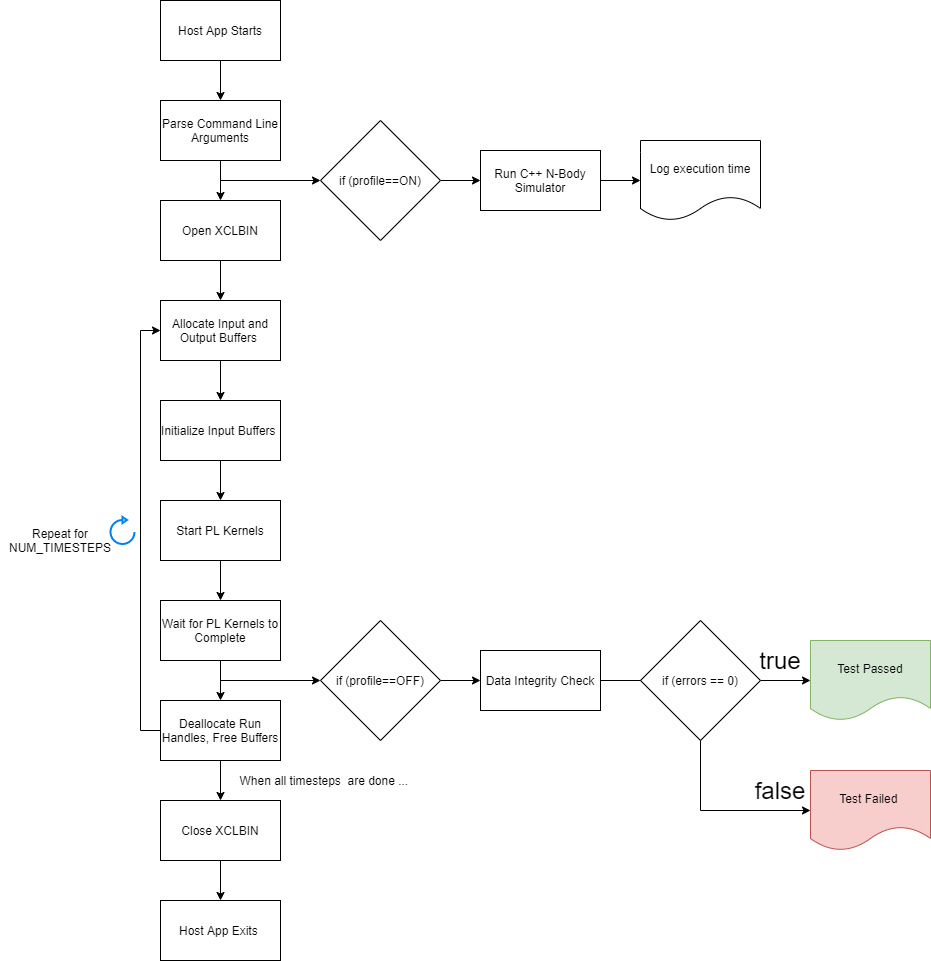

<table class="sphinxhide" width="100%">
 <tr width="100%">
    <td align="center"><h1>AMD Versal™ Adaptive SoC AI Engine Tutorials</h1>
    <a href="https://www.xilinx.com/products/design-tools/vitis.html">See AMD Vitis™ Development Environment on xilinx.com</br></a>
    <a href="https://www.xilinx.com/products/design-tools/vitis/vitis-ai.html">See AMD Vitis™ AI Development Environment on xilinx.com</a>
    </td>
 </tr>
</table>

# Building the Design

*Estimated time: less than 1 minute*

```
make all
```
or, follow steps 1 and 2 as follows:

## Step 1: Compile Host Software
Following is an example of how to compile the `../Module_02_aie/Work_x4_x100/ps/c_rts/aie_control_xrt.cpp` file.
```
XFLIB_DIR_REL_PATH :=$(DSPLIB_VITIS)/data_mover
XFLIB_DIR := $(shell readlink -f $(XFLIB_DIR_REL_PATH))
VITIS_PYTHON3 := python3

$(XILINX_VITIS)/gnu/aarch64/lin/aarch64-linux/bin/aarch64-linux-gnu-g++ -Wall -c -g \
                      -fmessage-length=0  \
                      -std=c++17 \
                      -Wno-unknown-pragmas
                      -Wno-unused-label
                      -Wno-int-to-pointer-cast
                      --sysroot=$(SDKTARGETSYSROOT)
                      -I$(SDKTARGETSYSROOT)/usr/include/xrt
                      -I$(SDKTARGETSYSROOT)/usr/include
                      -I./
                      -I../Module_02_aie
                      -I../Module_02_aie/src
                      -I$XILINX_VITIS/aietools/include
                      -I$XILINX_VITIS/include
                      -I$(XFLIB_DIR)/ext/xcl2
                      -I$(XFLIB_DIR)/utils/L1/include
                      -o ./build/aie_control_xrt.o
                      ../Module_02_aie/build/Work_x4_x100/ps/c_rts/aie_control_xrt.cpp
```
The same compilation options were used to compile the `host/nbody.cpp`, `host/log.cpp`, `host/main_xrt.cpp`, and `host/main_animate.cpp` files.

## Step 2: Link Host Software
Following is an example of how to link the `build/aie_control.o`, `build/nbody.o`, `build/log.o`, and `build/ps_app.o` into a `build/ps_app.exe` executable:

```
$(XILINX_VITIS)/gnu/aarch64/lin/aarch64-linux/bin/aarch64-linux-gnu-g++ ./build/aie_control_xrt.o \
                      ./build/ps_app.o \
                      ./build/log.o \
                      ./build/nbody.o \
                      -lxaiengine -ladf_api_xrt -lxrt_core    \
                      -lxrt_coreutil -lgcc -lc -lxilinxopencl \
                      -lpthread -lrt -ldl -lcrypt -lstdc++    \
                      -lOpenCL -std=c++17                     \
                      -Wno-unused-label -Wno-narrowing        \
                      -DVERBOSE                               \
                      -L$(SDKTARGETSYSROOT)/usr/lib                      \
                      --sysroot=$(SDKTARGETSYSROOT)                      \  
                      -L$(XILINX_VITIS)/aietools/lib/aarch64.o  \
                      -o ./build/ps_app.exe
```
The same linking options were used to generate the `build/ps_app_animate.exe` executable.

## Host Software  
After the full hardware design is implemented, the next step is to focus on the host software that enables the entire design. In the AMD Vitis™ core development kit, host code is written in C++ language using the Xilinx® runtime (XRT) API. The XRT native API is described on the [XRT site](https://xilinx.github.io/XRT/master/html/xrt_native_apis.html).

This module compiles the following host applications and custom APIs:

* `host/nbody.cpp` - NbodySimulator API that implements an NBody Simulator in C++
* `host/log.cpp` - Logger API that logs messages to a file
* `host/main_xrt.cpp` - Host application that compares AI Engine output to golden data (functional check)
* `host/main_animate.cpp` - Host application that runs the design for multiple iterations and saves position data to a file to post-process and create an `animation.gif` later.

## NBodySimulator API
The NBodySimulator API is a C++ implementation of an N-Body Simulator which runs on the native A72 processor. It also writes the position data to an `animation_data.txt` file which you will post-process later to create an `animation.gif`.

## Logger API
The Logger API is used to save logging messages from the host applications to the `run.log` file. The host application can set the log level of which messages are written to the `run.log` and which messages are shown on the console during execution. By default, the log level is set to `LMESSAGE`, meaning all messages will be written to `run.log`. The cout log level is set to `LINFO`, meaning any messages set to `LINFO` will be also displayed on the output console during execution.

### Log Levels:

* LMESSAGE
* LINFO
* LERROR
* LNONE

## Host Applications
The `host/main_xrt.cpp` host application is compiled into the `build/ps_app.exe` executable. This host application reads in the `m2s_i.txt` and `input_j.txt` files that initalize the `mm2s_mp` PL kernel's `ibuff` and `jbuff` DDR buffer inputs.  This host application starts the PL kernels and the AI Engine graph and waits for one iteration of data to flow through the design. Once the `s2mm_mp` PL kernel completes, this host application compares the AI Engine output to the golden output files (`s2m_golden_i_k0.txt`, `s2m_golden_i_k1.txt`, `s2m_golden_i_k2.txt`, and `s2m_golden_i_k3.txt` files). If there are any data mismatches, then the `TEST FAILED`, else the `TEST PASSED`. If you provide the `--profile` command line input, this host application also calculates the execution times for the C++ N-Body Simulator and the AI Engine N-Body Simulator for comparison.

The `host/main_animate.cpp` host application is compiled into the `build/ps_animate.exe` executable. This host application does the following:

* uses the NBodySimulator API to generate initial data (`input_i` and `input_j`)
* save the position data (x,y,and z) for all 12,800 particles to the `animation_data.txt`
* feeds input data through the AI Engine design
* captures the output data from the `s2mm_mp` kernel
* reconstructs the output data into a new `input_i` and new `input_j` arrays
* feeds the new `input_i` and `input_j` back into the AI Engine design and computes another timesteps

The host application repeats these actions for 300 timesteps. You can provide the `--timesteps <num_timesteps>` command line input to specify how many timesteps (iterations) the design runs for.

The following is the general execution flow for the host applications.



## References

* [XRT Documentation](https://xilinx.github.io/XRT/master/html/index.html)

* [XRT Github Repo](https://github.com/Xilinx/XRT)

* [Vitis Developing Application Documentation](https://docs.xilinx.com/r/en-US/ug1393-vitis-application-acceleration/Developing-Applications)
* [Vitis Building-and-Running-the-Application Documentation](https://docs.xilinx.com/r/en-US/ug1393-vitis-application-acceleration/Building-and-Running-the-Application)

## Next Steps
After compiling the host software, you are ready to create the sd_card.img and run the design on hardware in the next module, [Module 06 - SD Card and Hardware Run](../Module_06_sd_card_and_hw_run).


<p class="sphinxhide" align="center"><sub>Copyright © 2020–2024 Advanced Micro Devices, Inc</sub></p>

<p class="sphinxhide" align="center"><sup><a href="https://www.amd.com/en/corporate/copyright">Terms and Conditions</a></sup></p>
