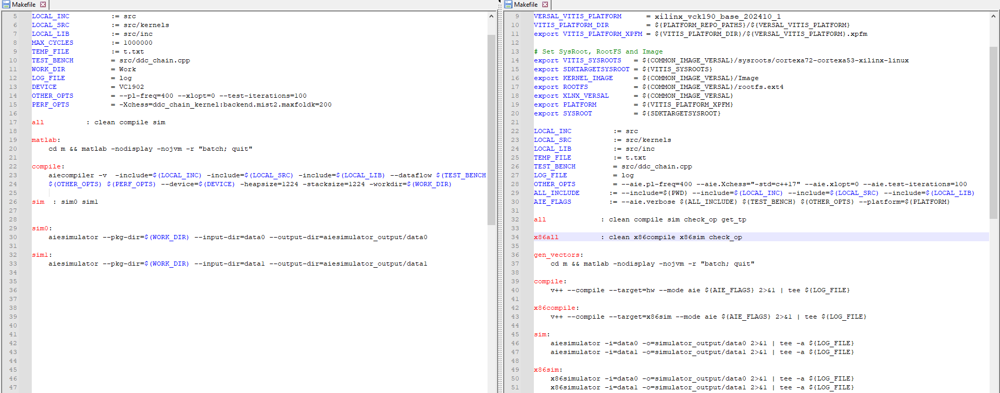
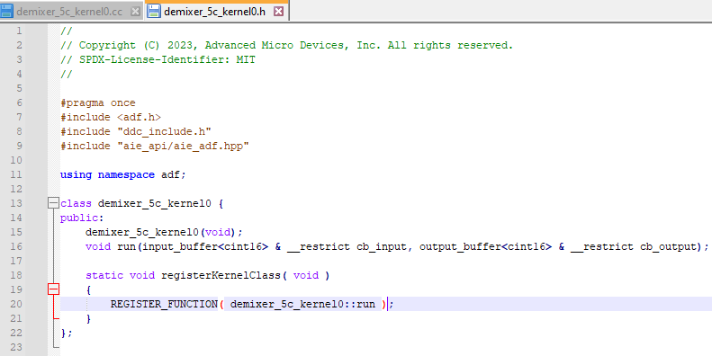
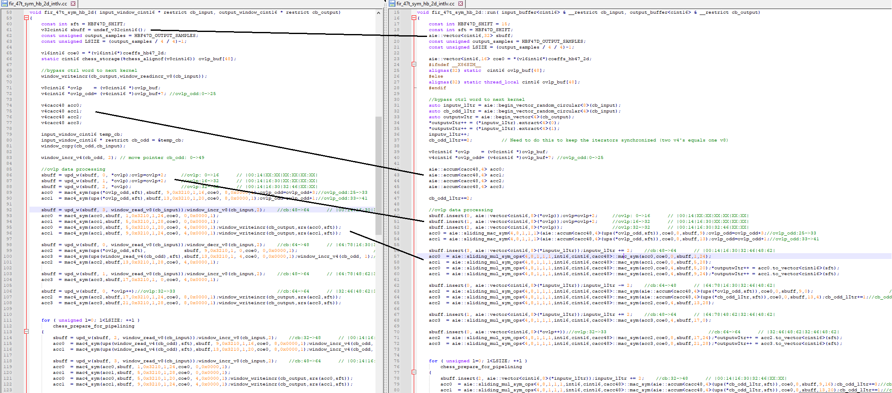
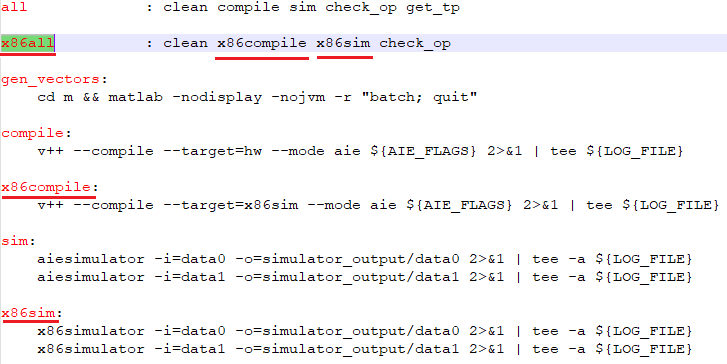

<!--
Copyright (C) 2023, Advanced Micro Devices, Inc. All rights reserved.
SPDX-License-Identifier: MIT
-->

<table class="sphinxhide" width="100%">
 <tr width="100%">
    <td align="center"><h1>AI Engine Development</h1>
    <a href="https://www.xilinx.com/products/design-tools/vitis.html">See Vitis™ Development Environment on xilinx.com</br></a>
    <a href="https://www.xilinx.com/products/design-tools/vitis/vitis-ai.html">See Vitis™ AI Development Environment on xilinx.com</a>
    </td>
 </tr>
</table>

# Digital Down-conversion Chain: Converting from Intrinsics to API

***Version: Vitis 2024.1***

## Table of Contents <!-- omit from toc -->

- [Digital Down-conversion Chain: Converting from Intrinsics to API](#digital-down-conversion-chain-converting-from-intrinsics-to-api)
  - [Introduction](#introduction)
  - [Upgrading Tools, Device Speed Grade, and Makefile](#upgrading-tools-device-speed-grade-and-makefile)
  - [Upgrading the Code](#upgrading-the-code)
    - [Converting Kernel Functions to Kernel Classes](#converting-kernel-functions-to-kernel-classes)
    - [Migrating from Windows to Buffers](#migrating-from-windows-to-buffers)
    - [Replacing Intrinsics with APIs](#replacing-intrinsics-with-apis)
    - [Relocating Global Variables to Kernel Class Data Members](#relocating-global-variables-to-kernel-class-data-members)
    - [Handling State Variables to Enable x86sim](#handling-state-variables-to-enable-x86sim)
    - [Updating Older Pragmas](#updating-older-pragmas)
    - [Supporting x86 Compilation and Simulation](#supporting-x86-compilation-and-simulation)
  - [Building and Running the Design](#building-and-running-the-design)
    - [Setup and Initialization](#setup-and-initialization)
    - [x86 Functional Simulation](#x86-functional-simulation)
    - [Hardware Simulation](#hardware-simulation)
  - [Summary](#summary)
  - [Support](#support)
  - [License](#license)

## Introduction

Versal™ adaptive SoCs combine programmable logic (PL), processing system (PS), and AI Engines with leading-edge memory and interfacing technologies to deliver powerful heterogeneous acceleration for any application. The hardware and software are targeted for programming and optimization by data scientists and software and hardware developers. A host of tools, software, libraries, IP, middleware, and frameworks enable Versal adaptive SoCs to support all industry-standard design flows.

This tutorial demonstrates the steps to upgrade a 32-branch digital down-conversion chain so that it is compliant with the latest tools and coding practice. Examples for the following changes with side-by-side view of the original and upgraded code are included in the tutorial.

- Converting coding style from kernel functions to kernel C++ classes
- Relocating global variables to kernel class data members
- Handling state variables to enable x86sim
- Migrating Windows (deprecated) to buffers for non-stream based kernel I/O
- Replacing kernel intrinsics with equivalent AI Engine APIs
- Updating older pragmas
- Supporting x86 compilation and simulation

You can find the design description in the [Digital Down-conversion Chain Implementation on AI Engine (XAPP1351)](https://docs.amd.com/r/en-US/xapp1351-ddc-ai-engine). The codebase associated with the original design can be found in the [Reference Design Files](https://www.xilinx.com/cgi-bin/docs/ctdoc?cid=d3643c02-32f7-407c-b680-59c0b234e703;d=xapp1352-beamforming-ai-engine.zip).

## Upgrading Tools, Device Speed Grade, and Makefile

>**Note:** Simply loading the latest version of the tools and compiling the design is not possible because the baseline Makefile has deprecated compiler options.



Important changes to the Makefile are listed below:

- Upgrade part speed grade xcvc1902-vsva2197-1LP-e-S-es1 (previously specified by ``--device``) to xcvc1902-vsva2197-2MP-e-S (specified by ``--platform``). As can be seen in the following table (referenced from Versal AI Core Series Data Sheet: DC
and AC Switching Characteristics [(DS957)](https://www.xilinx.com/support/documents/data_sheets/ds957-versal-ai-core.pdf)), this increases the AI Engine clock frequency from 1 GHz to 1.25 GHz.

  

  Recompiling and simulating the design with this change causes the throughput to increase by around 17-25%.

- Upgrade to use v++ unified compiler command.

- Add support for x86 compilation and simulation.

## Upgrading the Code

### Converting Kernel Functions to Kernel Classes

Functionality included in the `init()` function is migrated to the new kernel C++ class constructor. The main kernel function wrapper is migrated to a new class `run()` member function.


Create a header file for the class. You are required to write the `static void registerKernelClass()` method in the header file. Inside the `registerKernelClass()` method, call the `REGISTER_FUNCTION` macro. This macro is used to register the class run method to be executed on the AI Engine core to perform the kernel functionality.



When creating the kernel in the upper graph or subgraph, use `kernel::create_object` instead of `kernel::create`. Remove ``initialization_function`` as it is now part of class constructor.


### Migrating from Windows to Buffers

Windows I/O connections between kernels were deprecated in the 2023.2 release of the AMD Vitis™ software platform. The AI Engine Kernel and Graph Programming Guide [(UG1079)](https://docs.amd.com/r/en-US/ug1079-ai-engine-kernel-coding/Comparison-between-Buffer-Ports-and-Windows) describes how the source code of a design should change to upgrade it to buffer I/Os. The following figures show the steps required (repeated for every kernel) to upgrade I/O connections from Windows to buffers.

1. Make the changes shown in the following figure in the ``kernel.cc`` file:

   

2. If the design uses classes, upgrade the associated header file.

   

3. In the graph file, modify the connection type and specify dimension. Note division by 4 to convert from bytes to samples.

   

### Replacing Intrinsics with APIs

The following example shows a side-by-side comparison of intrinsic-based code compared to API-based code. Both are functionally equivalent and produce the same final hardware usage and throughput.



### Relocating Global Variables to Kernel Class Data Members


### Handling State Variables to Enable x86sim

Move the state variables instantiation from ``kernel::run`` to class member or use ``thread_local``, as shown below. More information can be found in the in Memory Model section of the AI Engine Tools and Flows User Guide [(UG1076)](https://docs.amd.com/r/en-US/ug1076-ai-engine-environment/Memory-Model).


### Updating Older Pragmas

Update `chess_alignof` to `alignas`. This is highlighted in the previous figure.

### Supporting x86 Compilation and Simulation

x86 compilation and functionally correct simulation is enabled using the following actions:

- Modifying the Makefile to include target=x86sim capability.

  

- Relocating global variables to kernel class data members, as highlighted in a [previous step](#relocating-global-variables-to-kernel-class-data-members).

- Moving state variables instantiation from ``kernel::run`` to class member or use ``thread_local``, as highlighted in a [previous step](#handling-state-variables-to-enable-x86sim).

## Building and Running the Design

The 32-branch digital down-conversion design can be built using the command line.

### Setup and Initialization

The first step is to set the environment variable ```COMMON_IMAGE_VERSAL``` to the full path where you have downloaded the Versal platforms corresponding to your tool release. This edit should be done in the ```09-ddc_chain/Makefile``` file.

```shell
VERSAL_VITIS_PLATFORM      = xilinx_vck190_base_202410_1
VITIS_PLATFORM_DIR         = ${PLATFORM_REPO_PATHS}/${VERSAL_VITIS_PLATFORM}
export VITIS_PLATFORM_XPFM = ${VITIS_PLATFORM_DIR}/${VERSAL_VITIS_PLATFORM}.xpfm

# Set SysRoot, RootFS and Image
export VITIS_SYSROOTS   = ${COMMON_IMAGE_VERSAL}/sysroots/cortexa72-cortexa53-xilinx-linux
export SDKTARGETSYSROOT = ${VITIS_SYSROOTS}
export KERNEL_IMAGE     = ${COMMON_IMAGE_VERSAL}/Image
export ROOTFS           = ${COMMON_IMAGE_VERSAL}/rootfs.ext4
export XLNX_VERSAL      = ${COMMON_IMAGE_VERSAL}
export PLATFORM         = --platform=${VITIS_PLATFORM_XPFM}
export SYSROOT          = ${SDKTARGETSYSROOT}
```

### x86 Functional Simulation

The DDC design can be built and simulated targeting x86sim to functionally verify the C code as follows:

```shell
[shell]% cd <path-to-09-ddc_chain-dir>
[shell]% make x86all
```

The number of simulation samples mismatch compared to expected outputs is displayed. 

### Hardware Simulation

The DDC design can be built and simulated by targeting hardware using the Makefile as follows:

```shell
[shell]% cd <path-to-09-ddc_chain-dir>
[shell]% make all
```

The number of simulation samples mismatch compared to expected outputs is displayed. 
Achieved throughput for all branches against minimum requirement is also displayed.

## Summary

In this tutorial, we highlight steps that an AI Engine designer can take to upgrade their design to use APIs instead of intrinsics.
The upgraded AIE API version achieves the same throughput performance as the original code base, while being easier to read and maintain.

Table below summarizes key parameters for the older design (ran on newer version of the tools) and compares it to upgraded design.

||Original|Upgraded|
|---|---|---|
|Support x86sim | No | Yes |
| Intrinsics vs API | Intrinsics | Mostly APIs |
| Windows vs Buffers | Windows | Buffers |
| Functionally correct | Yes | Yes |
| Throughput (MSPS)| ~247/224 | ~247/224 |

## Support

GitHub issues will be used for tracking requests and bugs. For questions, go to [support.xilinx.com](http://support.xilinx.com/).

## License

Components: xilinx-images

images in the documentation

Components: xilinx-files

The MIT License (MIT)

Copyright (c) 2023 Advanced Micro Devices, Inc.

Permission is hereby granted, free of charge, to any person obtaining a copy
of this software and associated documentation files (the "Software"), to deal in the Software without restriction, including without limitation the rights to use, copy, modify, merge, publish, distribute, sublicense, and/or sell copies of the Software, and to permit persons to whom the Software is
furnished to do so, subject to the following conditions:

The above copyright notice and this permission notice shall be included in all copies or substantial portions of the Software.

THE SOFTWARE IS PROVIDED "AS IS", WITHOUT WARRANTY OF ANY KIND, EXPRESS OR
IMPLIED, INCLUDING BUT NOT LIMITED TO THE WARRANTIES OF MERCHANTABILITY,
FITNESS FOR A PARTICULAR PURPOSE AND NONINFRINGEMENT. IN NO EVENT SHALL THE
AUTHORS OR COPYRIGHT HOLDERS BE LIABLE FOR ANY CLAIM, DAMAGES OR OTHER
LIABILITY, WHETHER IN AN ACTION OF CONTRACT, TORT OR OTHERWISE, ARISING FROM, OUT OF OR IN CONNECTION WITH THE SOFTWARE OR THE USE OR OTHER DEALINGS IN THE SOFTWARE.

<p class="sphinxhide" align="center"><sub>Copyright © 2023 Advanced Micro Devices, Inc</sub></p>

<p class="sphinxhide" align="center"><sup><a href="https://www.amd.com/en/corporate/copyright">Terms and Conditions</a></sup></p>

<p class="sphinxhide" align="center"><sub>Copyright © 2021 Xilinx Inc.</sub></p>

Components: generated-xilinx-files

Redistribution and use in binary form only, without modification,
is permitted provided that the following conditions are met:

1. Redistributions must reproduce the above copyright notice,
this list of conditions and the following disclaimer in the documentation
and/or other materials provided with the distribution.

1. The name of Xilinx, Inc. may not be used to endorse or promote products
redistributed with this software without specific prior written permission.

THIS SOFTWARE IS PROVIDED BY XILINX, INC. "AS IS" AND ANY EXPRESS OR IMPLIED
WARRANTIES, INCLUDING, BUT NOT LIMITED TO, THE IMPLIED WARRANTIES OF
MERCHANTABILITY AND FITNESS FOR A PARTICULAR PURPOSE ARE DISCLAIMED.
IN NO EVENT SHALL XILINX, INC. BE LIABLE FOR ANY DIRECT, INDIRECT, INCIDENTAL, SPECIAL, EXEMPLARY, OR CONSEQUENTIAL DAMAGES (INCLUDING, BUT NOT LIMITED TO, PROCUREMENT OF SUBSTITUTE GOODS OR SERVICES; LOSS OF USE, DATA, OR PROFITS; OR BUSINESS INTERRUPTION) HOWEVER CAUSED AND ON ANY THEORY OF LIABILITY, WHETHER IN CONTRACT, STRICT LIABILITY, OR TORT (INCLUDING NEGLIGENCE OR OTHERWISE) ARISING IN ANY WAY OUT OF THE USE OF THIS SOFTWARE, EVEN IF ADVISED OF THE POSSIBILITY OF SUCH DAMAGE.
