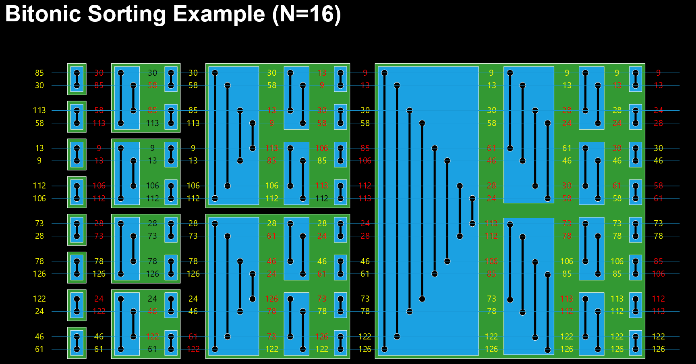
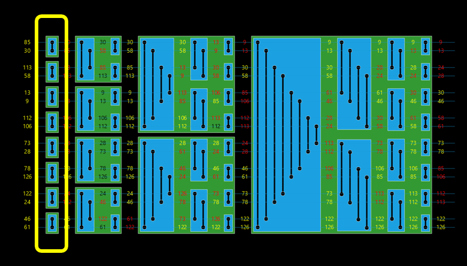
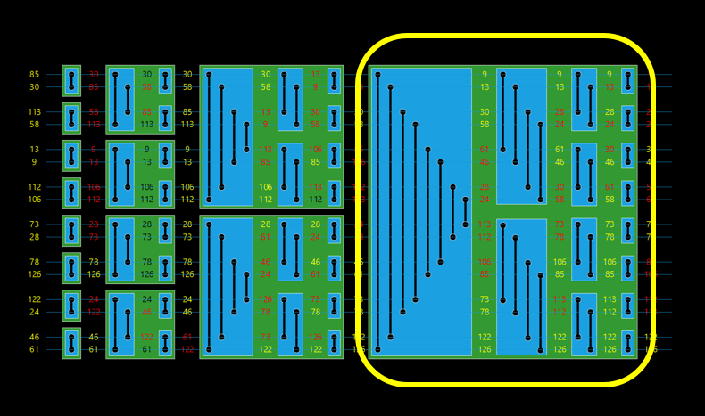
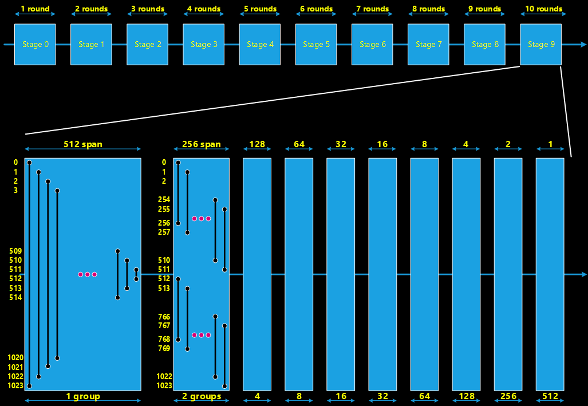
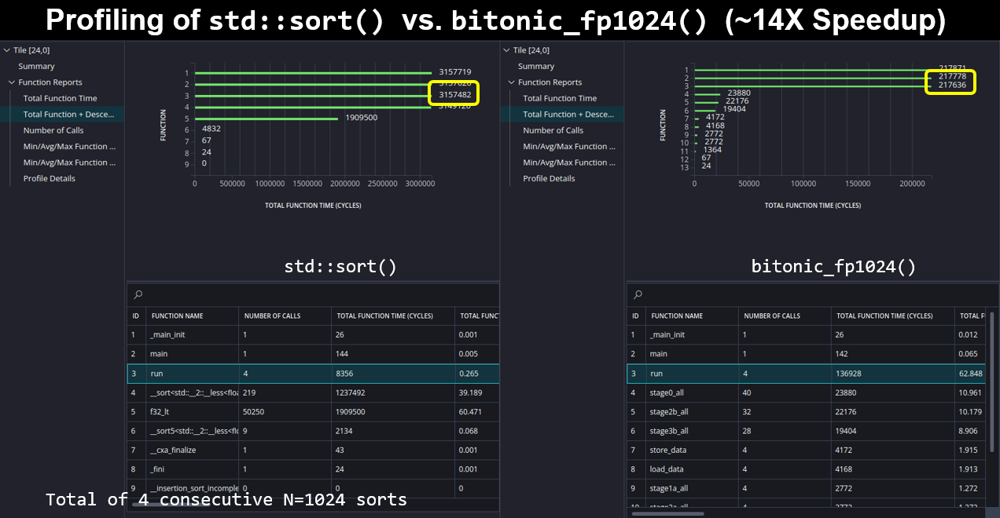

<!--
Copyright (C) 2023, Advanced Micro Devices, Inc. All rights reserved.
SPDX-License-Identifier: MIT
Author: Faisal El-Shabani
-->
<table class="sphinxhide" width="100%">
 <tr width="100%">
    <td align="center"><h1>AI Engine Development</h1>
    <a href="https://www.xilinx.com/products/design-tools/vitis.html">See Vitis™ Development Environment on xilinx.com</br></a>
    <a href="https://www.xilinx.com/products/design-tools/vitis/vitis-ai.html">See Vitis™ AI Development Environment on xilinx.com</a>
    </td>
 </tr>
</table>

# Bitonic SIMD Sorting on AI Engine for `float` Datatypes

***Version: Vitis 2024.1***

## Table of Contents

1. [Introduction](#introduction)
2. [Small Bitonic Sorting Example](#small-bitonic-sorting-example)
3. [Large Bitonic Sorting Example](#large-bitonic-sorting-example)

[References](#references)

[Support](#support)

[License](#license)

## Introduction

Bitonic Sorting [[1]] is parallel algorithm for sorting developed originally by Ken Batcher. Designed originally to target hardware sorting networks, the technique sorts $N$ elements in decreasing (or alternately increasing) order using a network with $O(N\log^2(N))$ comparator elements with a parallel sorting delay of $O(\log^2(N))$ time. The algorithm consists of $q(q+1)/2$ "rounds" of parallel pairwise comparisons across the $N$ elements. These rounds of comparisons between pairs of elements occur in a "butterfly network" whose crossover points change with each round to deliver partial sorted results to the next round. Bitonic sorting is attractive on architectures provisioned with many parallel execution units, particular when $N$ is large. Hardware solutions in programmable logic fit well. Software solutions also yield excellent results on Single-Instruction Multiple Data (SIMD) architectures capable of performing many parallel comparisons in a single cycle.

This tutorial illustrates how to implement a Bitonic SIMD Sorter on AI Engine in Versal for `float` data types. Two examples are given. First, a small example using $N=16$ demonstrates the concept and identifies strategies for vectorization & management of the vector register space. These ideas are then applied to a second larger example using $N=1024$. Profiling & throughput performance are then compared to `std::sort()` which uses Introsort [[2]] employing $O(N\log(N))$ comparisons on a scalar CPU.

## Small Bitonic Sorting Example

The diagram below shows a small Bitonic Sorting example with $N=16$ elements. The network consists of $q=10$ rounds of butterfly comparisons. These rounds are collected into $\log_2(N)=4$ stages, where there are a different number of rounds per stage. Stage 0 consists of 1 round, Stage 1 consists of 2 rounds, Stage 2 consists of 3 rounds and Stage 4 consists of 4 rounds. The figure highlights in yellow output samples from that stage whos ordering has not been affected, and highlights in red output samples from that stage whos ordering has been affected. 

Notice how some identical rounds are included in each stage of processing. For example, the last two rounds of Stage 2 and Stage 3 contain identical processing. This fact is used in the second example below to construct Bitonic Sorting designs for larger $N$.

The Bitonic Sorting algorithm works using the following "divide-and-conquer" approach. Each processing stage performs reording of samples in a local fashion with an increasing "span":
* Stage 0 performs 1 round of butterfly comparisons to output consecutive 2-tuples in sorted order.
* Stage 1 performs 2 rounds of butterfly comparisons to output consecutive 4-tuples in sorted order.
* Stage 2 performs 3 rounds of butterfly comparisons to output consecutive 8-tuples in sorted order.
* Stage 3 performs 4 rounds of butterfly comparisons to output consecutive 16-tuples in sorted order.

After all stages of processing, the output of the final round is presented in fully sorted order. 



### Stage 0

The figure below shows the processing performed by Stage 0. Here a single round of butterflies performs local reordering of pairs of consecutive samples. A total of 8 parallel comparisons must be performed per stage. With `float` data types, this may be done with the `fpmax()` and `fpmin()` intrinsics or using the some of the AIE API calls as shown below.



The code block below implements Stage 0 using intrinsics. The full compliment of 16 input samples are stored in a 16-lane vector register. The `fpmax()` and `fpmin()` intrinsics provide the core sorting functionality, each performin 8 parallel comparisons in SIMD fashion in a single cycle. The `fpshuffle16()` intrinsics perform input and output data shuffling so that all eight "top" samples of each butterfly are moved to a single 8-lane vector register, and similarly for the "bottom" samples of each butterfly. After the maximum and minimum samples are identified, they are stored back to the 16-lane vector with smallest values in the top positions and largest values in the bottom positions. Profiling with `aiesimulator` shows this intrinsic code requires 27 cycles per invocation. 

```
void __attribute__((noinline)) bitonic_fp16::stage0_intrinsic( aie::vector<float,16>& vec )
{
  static constexpr unsigned BFLY_STAGE0_TOP_I = 0xECA86420;
  static constexpr unsigned BFLY_STAGE0_BOT_I = 0xFDB97531;
  static constexpr unsigned BFLY_STAGE0_TOP_O = 0xB3A29180;
  static constexpr unsigned BFLY_STAGE0_BOT_O = 0xF7E6D5C4;
  vec = fpshuffle16(vec,0,BFLY_STAGE0_TOP_I,BFLY_STAGE0_BOT_I);
  aie::vector<float,8> v_top = vec.extract<8>(0);
  aie::vector<float,8> v_bot = vec.extract<8>(1);
  aie::vector<float,8> v_mx = fpmax(v_top,v_bot);
  aie::vector<float,8> v_mn = fpmin(v_top,v_bot);
  vec = aie::concat(v_mn,v_mx);
  vec = fpshuffle16(vec,0,BFLY_STAGE0_TOP_O,BFLY_STAGE0_BOT_O);
}
```

The code below implements Stage 0 using AIE API. The full compliment of 16 input samples are stored in a 16-lane vector register. Here, the `aie::filter_even()` API pulls out the top butterfly samples by selecting the even numbered lanes. The `aie::filter_odd()` pulls out the bottom butterfly samples by selecting the odd numbered lanes. The `aie::max()` and `aie::min()` API's identify the largest and smallest samples for each butterfly. Finally, the `aie::interleave_zip()` API collects the two 8-lane inputs into a 16-lane output vector, assigning even lanes from the first vector and odd lanes from the second vector. This code is functionally equivalent to the intrinsic version above. Profiling reveals it requires 28 cycles per invocation. 

```
void __attribute__((noinline)) bitonic_fp16::stage0_api( aie::vector<float,16>& vec )
{
  aie::vector<float,8> v_top = aie::filter_even(vec);
  aie::vector<float,8> v_bot = aie::filter_odd(vec);
  aie::vector<float,8> v_mx = aie::max(v_top,v_bot);
  aie::vector<float,8> v_mn = aie::min(v_top,v_bot);
  std::tie(v_mn,v_mx) = aie::interleave_zip(v_mn,v_mx,1);
  vec = aie::concat(v_mn,v_mx);
}

```

### Stage 1
The figure below shows the processing performed by Stage 1. Here two rounds of butterflies perform local reordering of 4-tuples of consecutive samples. As with Stage 0, SIMD instructions perform a total of 8 parallel comparisons per cycle. Notice the second round of butterfly processing is identical to the single round from Stage 0. 


The code block below implements the first round of Stage 1 using AIE API. It uses the same 16-lane vector register along with the `aie::max()` and `aie::min()` routines for sample comparison, and the `fpshuffle16()` intrinsic to perform I/O sample extraction for the "top" and "bottom" samples of each butterfly. Note how AI Engine coding style permits a mixed usage of AIE API and intrinsics in the same code using a common set of AIE API register definitions. This makes it very convenient to "drop down" to intrinsics if necessary from within an AIE API coding framework. Profiling reveals this function requires 27 cycles per invocation. 

```
void __attribute__((noinline)) bitonic_fp16::stage1a( aie::vector<float,16>& vec )
{
  static constexpr unsigned BFLY_STAGE1a_TOP_I = 0xDC985410;
  static constexpr unsigned BFLY_STAGE1a_BOT_I = 0xEFAB6723;
  static constexpr unsigned BFLY_STAGE1a_TOP_O = 0xAB328910;
  static constexpr unsigned BFLY_STAGE1a_BOT_O = 0xEF76CD54;
  vec = fpshuffle16(vec,0,BFLY_STAGE1a_TOP_I,BFLY_STAGE1a_BOT_I);
  aie::vector<float,8>  v_top = vec.extract<8>(0);
  aie::vector<float,8>  v_bot = vec.extract<8>(1);
  aie::vector<float,8>  v_mx = aie::max(v_top, v_bot);
  aie::vector<float,8>  v_mn = aie::min(v_top, v_bot);
  vec = aie::concat(v_mn,v_mx);
  vec = fpshuffle16(vec,0,BFLY_STAGE1a_TOP_O,BFLY_STAGE1a_BOT_O);
}
```

### Stage 2
The figure below shows the processing performed by Stage 2. Here three rounds of butterflies perform local reordering of 8-tuples of consecutive samples. As with the previous two stages, SIMD instructions perform a total of 8 parallel comparisons per cycle. Notice again how the third round of butterfly processing is identical to the last round from both Stage 0 and Stage 1. 


The code block below implements the first round of Stage 2 using AIE API. It uses the same 16-lane vector register along with the `aie::max()` and `aie::min()` routines for sample comparison, and the `fpshuffle16()` intrinsic to perform I/O sample extraction for the "top" and "bottom" samples of each butterfly. Notice how the code here is identical to that used for the first round of Stage 1 except for the I/O sample extraction permutations. This is due only to the nature of the "top" and "bottom" butterfly sample being located within different positions in the 16-lane vector register. The code for the second round of Stage 2 (not shown here) exhibits exactly the same structure with yet another distinct set of permutations. Profiling reveals both of these function require 27 cycles per invocation.

```
void __attribute__((noinline)) bitonic_fp16::stage2a( aie::vector<float,16>& vec )
{
  static constexpr unsigned BFLY_STAGE2a_TOP_I = 0xBA983210;
  static constexpr unsigned BFLY_STAGE2a_BOT_I = 0xCDEF4567;
  static constexpr unsigned BFLY_STAGE2a_TOP_O = 0x89AB3210;
  static constexpr unsigned BFLY_STAGE2a_BOT_O = 0xCDEF7654;
  aie::vector<float,8> v_mx;
  aie::vector<float,8> v_mn;
  vec = fpshuffle16(vec,0,BFLY_STAGE2a_TOP_I,BFLY_STAGE2a_BOT_I);
  v_mx = aie::max(vec.extract<8>(0),vec.extract<8>(1));
  v_mn = aie::min(vec.extract<8>(0),vec.extract<8>(1));
  vec = aie::concat(v_mn,v_mx);
  vec = fpshuffle16(vec,0,BFLY_STAGE2a_TOP_O,BFLY_STAGE2a_BOT_O);
}
```

### Stage 3
The figure below shows the processing performed by Stage 3. Here four rounds of butterflies perform local reordering of 16-tuples of consecutive samples. As with the previous three stages, SIMD instructions perform a total of 8 parallel comparisons per cycle. Notice how the last two rounds of butterfly processing is identical to the last rounds from Stage 2. 



The code block below implements the first round of Stage 3 using AIE API. In this case the "bottom" set of butterfly inputs must be reversed in order to perform the required sample comparisons. We use the `aie::reverse()` API for this purpose. After sample comparison a second reversal is used to restore sample placement prior to storage back to the 16-lane register. This round is simpler than previous cases as no I/O permutations are required during sample extraction. Profiling reveals this function requires 27 cycles per invocation.

```
void __attribute__((noinline)) bitonic_fp16::stage3a( aie::vector<float,16>& vec )
{
  aie::vector<float,8>  v_top = vec.extract<8>(0);
  aie::vector<float,8>  v_bot = aie::reverse(vec.extract<8>(1));;
  aie::vector<float,8>  v_mx  = aie::max(v_top,v_bot);
  aie::vector<float,8>  v_mn  = aie::min(v_top,v_bot);
  vec   = aie::concat(v_mn,aie::reverse(v_mx));
}
```

### Profiling of $N=16$ Bitonic Sort vs. `std::sort()`

To show the advantage of Bitonic SIMD Sorting we compare its profiling against the `std::sort()` routine provided as part of the C++-17 standard library. The diagram below captured from Vitis Analyzer shows the average # of cycles for each algorithm. A total of 24 random sorting runs were made. The Bitonic sort took the same time of 170 total cycles per invocation. The `std::sort()` cycles were dependent on the particular sort data, taking a minimum of 3,197 cycles, a maximum of 7,061 cycles and an average of 5,073 cycles. This gives Bitonic SIMD sorting an advantage of ~30X over `std::sort()`.


## Large Bitonic Sorting Example

This section reviews the design of a larger Bitonic SIMD sorting example for $N=1024$ samples. This is more challenging than the previous $N=16$ example because the entire array to be sorted no longer fits in the available vector register space. Instead we must store the array in local tile memory and work on smaller portions of the array using the vector registers. The existing $N=16$ code base serves us nicely for this task. It remains to build up the additional stages and memory addressing to manage the computation across the full $N=1024$ array.

The block diagram below shows the Bitonic Sorter design for $N=1024$. The design requires a total of $q(q+1)/2=55$ rounds of processing where $q=\log_2(N)=10$. Once again, these rounds are collected into $q$ stages. The first four stages (ie. Stage 0 to Stage 3) are identical to the stages we have seen earlier in the $N=16$ example. The only difference is these stages operate on the full vector of $N=1024$ samples; they are processed as 64 groups of 16 samples each, where the processing of each group of 16 samples is identical to the previous example. 

The diagram below breaks apart the ten rounds of Stage 9 to illustrate the nature of processing which occurs from Stages 4 to 9. Each round of a given stage may be categorized by three parameters, "GROUP", "SPAN", and "ITERATION":
* The GROUP indicates the number of sets of identical processing that occurs in each round. 
* The SPAN indicates the width or straddle in samples between the "top" (or "bottom") of two consecutive butterflies in the round.
* The ITERATION indicates the number of SIMD comparisons performed per GROUP (where we know from the $N=16$ example we process 8 samples per SIMD comparison).



Based on these definitions, each round may be characterized. For example, the first round of Stage 9 may be characterized as <GROUP,SPAN,ITER>=<1,1024,64> since the largest span of the first butterfly is 1024 samples (SPAN=1024). There is a single group of butterflies that span the array vertically (GROUP=1). There are 64 SIMD cycles required to process $8\times64=512$ butterflies in the round (ITER=64). The second round of Stage 9 may be characterized as <GROUP,SPAN,ITER>=<2,256,32> since the span of all butterfiles is 256 samples (SPAN=256), there are two groups (GROUP=2), and there are $8\times32=512$ butterflies in the round (ITER=32).

It turns out the first round in Stages 1 to $q$ always contains these butterflies with "reducing span" dropping from the largest span down to a single sample. All other rounds in the stage consist of butterflies with identical spans. This creates two fundamental types of processing that must be managed. For each type, they only differ in the number of groups processed in each round. This is identified in the figure below where the different types of processing are each identified with a unique color. Notice how all of the rounds from Stage 4 onwards are made up of five different types of processing. Three of these originate from Stage 0 and Stage 1. The other two consists of these forms of "reducing span" butterflies vs. "fixed span" butterflies identified above. 


The code block below shows the implementation of the "reducing span" algorithm required for the first round of every stage for Stage 4 and above.  Notice how we loop over `GROUP*ITER` iterations of 8-lane comparison operations. For these "reducing span" comparisons we must reverse the order of the bottom butterfly data to perform the proper comparisons. Afterwards, we may omit the reversal prior to storage since the remaining rounds will reorder each half of the samples properly. This omission saves cycles. After processing `ITER` sets of SIMD computations for each `GROUP`, we adjust the butterfly memory pointers and load another 16-lanes of data from memory, storing previously sorted results. 

```
template<unsigned GROUP,unsigned SPAN,unsigned ITER> void __attribute__((noinline)) bitonic_fp1024::stageY(void)
{
  float* __restrict gTop = &data[0];
  float* __restrict gBot = &data[SPAN];
  float* __restrict pTop = gTop;
  float* __restrict pBot = gBot - 8;
  for (unsigned ii=0, jj=0; ii < GROUP*ITER; ii++)
    chess_prepare_for_pipelining
    {
      // ------------------------------------------------------------
      aie::accum<accfloat,8> v_top; v_top.from_vector(aie::load_v<8>(pTop));
      aie::vector<float,8>   v_bot = aie::load_v<8>(pBot);
      aie::vector<float,8>   v_mx = fpmax(v_top,v_bot,0,0x01234567);
      aie::vector<float,8>   v_mn = fpmin(v_top,v_bot,0,0x01234567);
      v_mn.store(pTop);
      v_mx.store(pBot); // Algorithm works whether or not we use aie::reverse() here -- Omit to save cycles
      // ------------------------------------------------------------
      if (jj==ITER-1) {
        // Time to hop to next group:
        pTop = gTop + SPAN;
        pBot = gBot + SPAN - 8;
        gTop = gTop + SPAN;
        gBot = gBot + SPAN;
        jj=0;
      }
      else {
        // Next set of 8 butterflies:
        pTop = pTop + 8;
        pBot = pBot - 8;
        jj++;
      }
    }
}
```

The code block below shows the implementation of the "fixed span" algorithm required for the remaining rounds of every stage for Stage 4 and above. Here no reversal operations are required since the butterfly assignments follow a regular pattern. Again, the memory management adjusts the top and bottom butterfly pointers according to the different `GROUP` and `ITER` to be processed

```
template<unsigned GROUP,unsigned SPAN,unsigned ITER> void __attribute__((noinline)) bitonic_fp1024::stageB(void)
{
  float* __restrict gTop = &data[0];
  float* __restrict gBot = &data[SPAN];
  float* __restrict pTop = gTop;
  float* __restrict pBot = gBot;
  for (unsigned ii=0, jj=0; ii < GROUP*ITER; ii++)
    chess_prepare_for_pipelining
    {
      // ------------------------------------------------------------
      aie::vector<float,8>  v_top = aie::load_v<8>(pTop);
      aie::vector<float,8>  v_bot = aie::load_v<8>(pBot);
      aie::vector<float,8>  v_mx  = aie::max(v_top,v_bot);
      aie::vector<float,8>  v_mn  = aie::min(v_top,v_bot);
      v_mn.store(pTop);
      v_mx.store(pBot);
      // ------------------------------------------------------------
      if (jj==ITER-1) {
        // Time to hop to next group:
        gTop = gTop + 2*SPAN;
        gBot = gBot + 2*SPAN;
        pTop = gTop;
        pBot = gBot;
        jj=0;
      }
      else {
        // Next set of 8 butterflies:
        pTop = pTop + 8;
        pBot = pBot + 8;
        jj++;
      }
    }
}
```

### Profiling of $N=1024$ Bitonic Sort vs. `std::sort()`

Once again we compare Bitonic SIMD Sorting against the `std::sort()` routine provided as part of the C++-17 standard library. The diagram below captured from Vitis Analyzer shows the average # of cycles for each algorithm. A total of 4 random sorting runs were made. The Bitonic sort takes 217,636 total cycles overall. The `std::sort()` takes 3,157,482 cycles. This gives Bitonic SIMD sorting an advantage of ~14X over `std::sort()` for this larger array size. 




## References

[1]: <https://en.wikipedia.org/wiki/Bitonic_sorter> "Bitonic Sorter"

[[1]] Wikipedia, "[Bitonic Sorter]([https://en.wikipedia.org/wiki/Bitonic_sorter])"

[2]: <https://en.wikipedia.org/wiki/Introsort> "Introsort"

[[2]] Wikipedia, "[Introsort]([https://en.wikipedia.org/wiki/Introsort])"

## Support

GitHub issues will be used for tracking requests and bugs. For questions, go to [support.xilinx.com](http://support.xilinx.com/).

## License

Components: xilinx-images

images in the documentation

Components: xilinx-files

The MIT License (MIT)

Copyright (c) 2024 Advanced Micro Devices, Inc.

Permission is hereby granted, free of charge, to any person obtaining a copy
of this software and associated documentation files (the "Software"), to deal
in the Software without restriction, including without limitation the rights
to use, copy, modify, merge, publish, distribute, sublicense, and/or sell
copies of the Software, and to permit persons to whom the Software is
furnished to do so, subject to the following conditions:

The above copyright notice and this permission notice shall be included in all
copies or substantial portions of the Software.

THE SOFTWARE IS PROVIDED "AS IS", WITHOUT WARRANTY OF ANY KIND, EXPRESS OR
IMPLIED, INCLUDING BUT NOT LIMITED TO THE WARRANTIES OF MERCHANTABILITY,
FITNESS FOR A PARTICULAR PURPOSE AND NONINFRINGEMENT. IN NO EVENT SHALL THE
AUTHORS OR COPYRIGHT HOLDERS BE LIABLE FOR ANY CLAIM, DAMAGES OR OTHER
LIABILITY, WHETHER IN AN ACTION OF CONTRACT, TORT OR OTHERWISE, ARISING FROM,
OUT OF OR IN CONNECTION WITH THE SOFTWARE OR THE USE OR OTHER DEALINGS IN THE
SOFTWARE.

<p class="sphinxhide" align="center">  &copy; Copyright 2024 Advanced Micro Devices, Inc.</p>
<p class="sphinxhide" align="center">  &copy; Copyright 2021 Xilinx Inc.</p>

