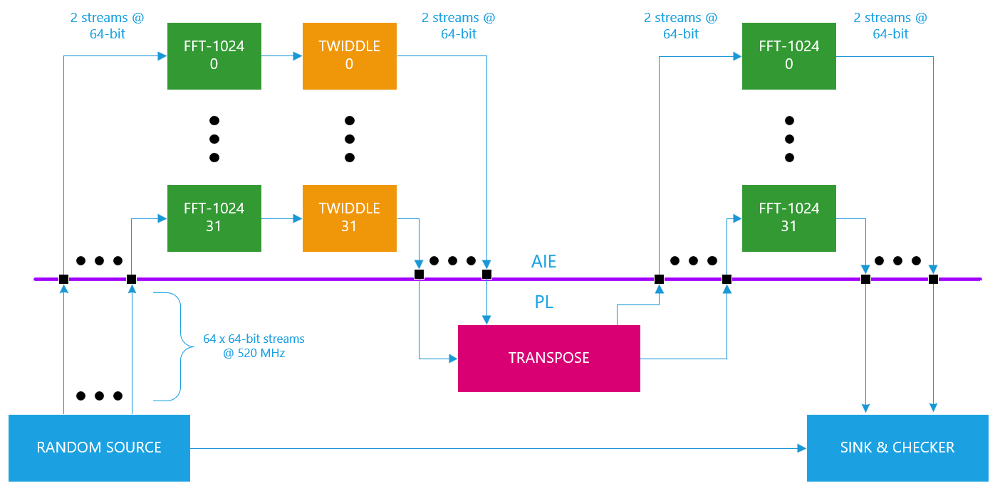
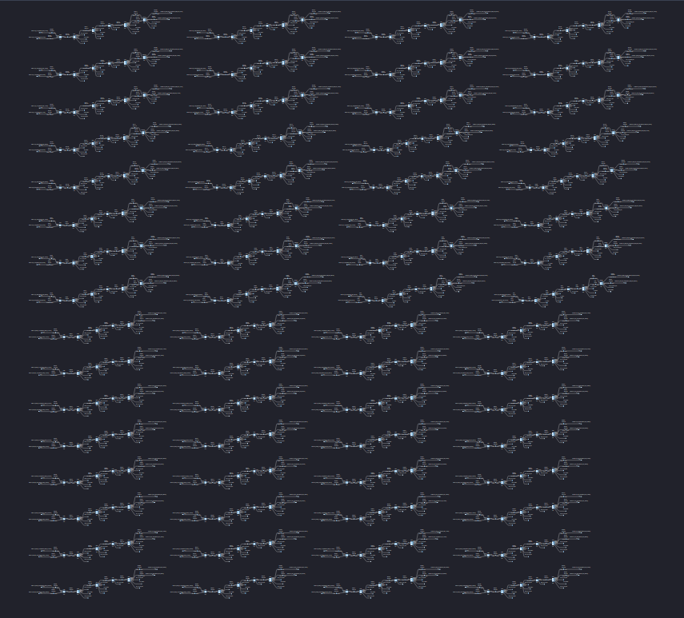
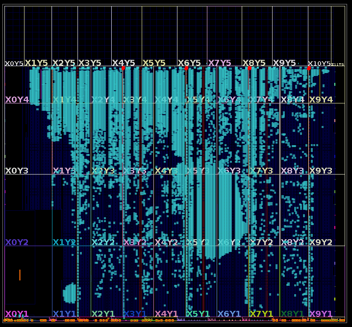
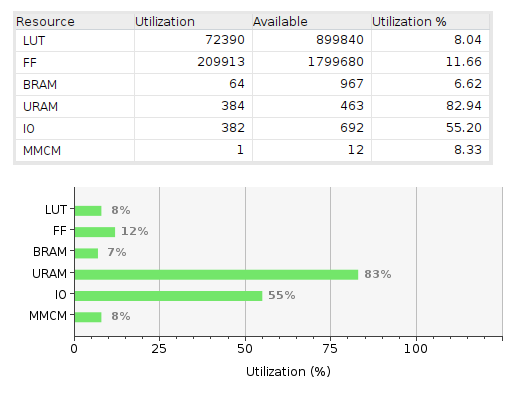
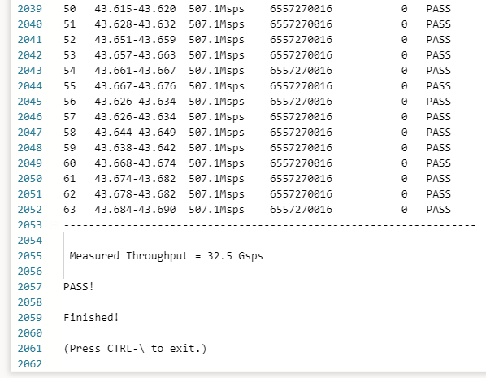

<!--
Copyright (C) 2024, Advanced Micro Devices, Inc. All rights reserved.
SPDX-License-Identifier: MIT
Author: Mark Rollins
-->
<table class="sphinxhide" width="100%">
 <tr width="100%">
    <td align="center"><h1>AI Engine Development</h1>
    <a href="https://www.xilinx.com/products/design-tools/vitis.html">See Vitis™ Development Environment on xilinx.com</br></a>
    <a href="https://www.xilinx.com/products/design-tools/vitis/vitis-ai.html">See Vitis™ AI Development Environment on xilinx.com</a>
    </td>
 </tr>
</table>

# 1 Million Point `float` FFT @ 32 Gsps on AI Engine

***Version: Vitis 2024.1***

## Table of Contents

1. [Introduction](#introduction)
2. [Matlab Models](#matlab-models)
3. [Design Overview](#design-overview)
4. [Design Resources](#design-resources)
5. [Build and Run Design](#build-and-run-design)

[References](#references)

[Support](#support)

[License](#license)

## Introduction

A 1D FFT may be implemented on the AI Engine array using a 2D FFT algorithm with higher efficiency overall. This alternative "divide & conquer" approach provides a better solution on the AI Engine array since it is less reliant on "butterfly routing" and we can break large $N$ point sizes into much smaller factors of size $\sqrt N$. This results in a significant reduction in AI Engine tile memory and overall usage of fewer compute tiles.

This approach is used in this tutorial to design a 1M-pt FFT for `float` data types that achieves an impressive throughput rate exceeding 32 Gsps. The design partitions all compute to the AI Engine array and uses URAM resources in programmable logic to implement the sample reordering  needed for the "matrix transpose" operation outlined in detail below. 

## Matlab Models

A Matlab model `matlab/aie_model_fft_fp_1mpt.m` provides a simple algorithmic model of the 1M-pt transform, implementing it using a $1024\times 1024$ 2D architecture. The algorithm performs conceptually the following steps:
* Write the 1M incoming samples into a $1024\times 1024$ matrix in column major order
* Perform 1K-pt transforms along the matrix rows
* Multiply the 2D matrix pointwise with another 2D matrix of equal size filled with "twiddle factors".
* Perform 1K-pt transforms along the matrix columns
* Extract the 1M outgoing samples in row-major order

The Matlab models are used to validate the AI Engine design. The I/O testvectors may be generated into the folder `<path-to-design>/aie_src/data` using the following approach below. Note these I/O testvectors are not required to run the design on the VCK190 evaluation board. They are required only for the purpose of simulating the AI Engine portion of the design in isolation using either `x86simulator` or `aiesimulator`.
```
[shell]% cd <path-to-design>/aie_src
[shell]% make testvectors
```
## Design Overview

The figure below shows block diagram of the 1M-pt transform. It may be described as follows:
* The "front-end" compute consists of 32 identical instances of a FFT-1024 kernel followed by a twiddle rotation kernel. The FFT-1024 kernels use 5 AI Engine tiles, one for each radix-4 stage, given $1024=4\times 4\times 4\times 4\times 4$. Each tile employs two 64-bit PLIO streams @ 520 MHz. Given these streams carry `cfloat` data types requiring 64-bits per sample, it follows each PLIO stream may transfer 520 Msps; overall this provides a throughput of $32\times 2\times 520=33.28$ Gsps.
* The "transpose" block in the PL provides sample reordering that effects the "row-wise" vs "column-wise" processing outlined above -- in effect performing a matrix transpose operation using URAM resources in the PL. Note a very large multi-ported memory resource is required with 64 I/O streams.
* The "back-end" compute consists of 32 identical instances of an FFT-1024 kernel. Once again, these kernels use 5 AI Engine tiles each with two 64-bit PLIO streams @ 520 MHz. 
* The 1M-pt FFT design is driven with stimulus from a random source block in the PL. A sink block in the PL captures the FFT output samples and compares them to a regenerated copy of the input stimulus to validate the design functionality. 



### AI Engine Graph View
The diagram below shows the graph view of the AI Engine array for this design. As noted above, the design contains 32 instances of 1024-pt "row" FFTs in the front-end and 32 instances of 1024-pt "column" FFTs in the back-end. Each 1024-pt transform is implemented using 5 tiles in each case. An extra tile implements "twiddle rotation" for each FFT instance in the front-end. Consequently, we can see in the diagram below there are 32 instances of a "6-tile subgraph" that implement the front-end transforms and twiddle rotations, along with 32 instances of a "5-tile subgraph" for the back-end compute processing.



### AI Engine Array View
The diagram below shows the floor plan view of the AI Engine array. The design requires resources from a $44\times 8$ rectangular region of the array. The three leftmost and rightmost array columns are left unused in this case. 


### VC1902 Floorplan View
The diagram below shows the floorplan view of the VC1902 device, where all the PL resources for the design are highlighted showing the utilization. Since the AI Engine array makes use of PLIO resources distributed across the full width of the die, the PL circuitry exhibits the same characteristic. 



### AI Engine Design Validation
The AI Engine design may be validated in functional simulation using either the X86 or AIE simulators. To use the X86 simulator to compile, simulate, then validate the outputs of the simulation, use the following approach:
```
[shell]% cd <path-to-design>/aie_src
[shell]% make x86_compile
[shell]% make x86_sim
[shell]% make x86_check_op
```

To use the AIE simulator to do the same things plus validate the design I/O throughput as measured from simulated PLIO timestamps, use the following approach:
```
[shell]% cd <path-to-design>/aie_src
[shell]% make aie_compile
[shell]% make aie_sim
[shell]% make aie_check_op
[shell]% make aie_get_tp
```

### VC1902 Timing Closure
The diagram below shows the timing summary report for the overall design. Timing closure is achieved on all end-points. 


## Design Resources

The diagram below summarizes the AI Engine resources used by the design. A total of 352 tiles are used for the combined functions of compute and local buffering. The $32 \times 6=192$ tiles implement the "row transforms" and "twiddle rotations" of the front-end portion of the design. The $32\times 5=160$ tiles implement the "column transforms" of the back-end portion of the design. A total of 352 AI Engine tiles is utilized by the design. A total of 256 PLIO stream resources transfer data between the AI Engine array and PL. Notice how careful floorplanning leads to a design that does not use additional overhead resources from the array.


The diagram below summarizes the PL resources used by the design. BRAM and URAM blocks provide the required storage to implement the "matrix transpose" operation sitting between the front-end and back-end AI Engine compute kernels. A modest amount of LUT and FF resources supports the design, including the PRBS generators & checkers. The PL design runs @ 520 MHz. 



## Build and Run Design

### Setup & Initialization

This design runs on the VCK190 evaluation board using a custom platform and bare metal OS. Consequently, no environment setup is needed to point to base platforms or Linux filesystems. The bitstream may be built directly from the top level Makefile.

### Hardware
To build the design for hardware, please execute the following steps:
```
[shell]% cd <path-to-design>
[shell]% make all
```

The build process will generate the SD card image in `<path-to-design>/package/build_hw/sd_card.img`. The full build process may take up to 2.5 hours on a high performance server.

The figure below shows a screen capture of the application when run on the VCK190. It shows an overall measured throughput of 32.5 Gsps and a measured latency of ~44 us on each of the PLIO streams. The full log captured from the board is shown [here](images/1M_point_FFT_log.txt). 



## References

[1]: <https://en.wikipedia.org/wiki/Fast_Fourier_transform> "Fast Fourier Transform"

[[1]] Wikipedia, "[Fast Fourier Transform]([https://en.wikipedia.org/wiki/Fast_Fourier_transform])"

## Support

GitHub issues will be used for tracking requests and bugs. For questions, go to [support.xilinx.com](http://support.xilinx.com/).

## License

Components: xilinx-images

images in the documentation

Components: xilinx-files

The MIT License (MIT)

Copyright (c) 2024 Advanced Micro Devices, Inc.

Permission is hereby granted, free of charge, to any person obtaining a copy
of this software and associated documentation files (the "Software"), to deal
in the Software without restriction, including without limitation the rights
to use, copy, modify, merge, publish, distribute, sublicense, and/or sell
copies of the Software, and to permit persons to whom the Software is
furnished to do so, subject to the following conditions:

The above copyright notice and this permission notice shall be included in all
copies or substantial portions of the Software.

THE SOFTWARE IS PROVIDED "AS IS", WITHOUT WARRANTY OF ANY KIND, EXPRESS OR
IMPLIED, INCLUDING BUT NOT LIMITED TO THE WARRANTIES OF MERCHANTABILITY,
FITNESS FOR A PARTICULAR PURPOSE AND NONINFRINGEMENT. IN NO EVENT SHALL THE
AUTHORS OR COPYRIGHT HOLDERS BE LIABLE FOR ANY CLAIM, DAMAGES OR OTHER
LIABILITY, WHETHER IN AN ACTION OF CONTRACT, TORT OR OTHERWISE, ARISING FROM,
OUT OF OR IN CONNECTION WITH THE SOFTWARE OR THE USE OR OTHER DEALINGS IN THE
SOFTWARE.

<p class="sphinxhide" align="center">  &copy; Copyright 2024 Advanced Micro Devices, Inc.</p>
<p class="sphinxhide" align="center">  &copy; Copyright 2021 Xilinx Inc.</p>

