<table class="sphinxhide" width="100%">
 <tr width="100%">
    <td align="center"><h1>AI Engine Development</h1>
    <a href="https://www.xilinx.com/products/design-tools/vitis.html">See Vitis™ Development Environment on xilinx.com</br></a>
    <a href="https://www.xilinx.com/products/design-tools/vitis/vitis-ai.html">See Vitis™ AI Development Environment on xilinx.com</a>
    </td>
 </tr>
</table>

# AI Engine Versal Integration

***Version: Vitis 2024.1***

## Introduction

Versal™ adaptive SoCs combine programmable logic (PL), processing system (PS), and AI Engines with leading-edge memory and interfacing technologies to deliver powerful heterogeneous acceleration for any application. The hardware and software are targeted for programming and optimization by data scientists and software and hardware developers. A host of tools, software, libraries, IP, middleware, and frameworks enable Versal adaptive SoCs to support all industry-standard design flows.

This tutorial demonstrates creating a system design running on the AI Engine, PS, and Programmable Logic (PL). The AI Engine domain contains a simple graph consisting of three kernels. These kernels are connected by both windows and streams. The PL domain contains data movers that provide input and capture output from the AI Engine. The PS domain contains a host application that controls the entire system. You will validate the design running on these heterogeneous domains by first emulating the hardware and then running on actual hardware.

This tutorial steps through software emulation, hardware emulation, and hardware flow in the context of a complete Versal adaptive SoC system integration. By default, the Makefile is set for `sw_emu`. If you need to build for `hw_emu`,`hw`, use the corresponding TARGET option as described in corresponding sections.

**IMPORTANT**: Before beginning the tutorial ensure you have installed Vitis&trade; 2024.1 software. The software includes all the embedded base platforms including the VCK190 base platform that is used in this tutorial. In addition, ensure you have downloaded the Common Images for Embedded Vitis Platforms from this link.

https://www.xilinx.com/support/download/index.html/content/xilinx/en/downloadNav/embedded-platforms/2024.1.html

The 'common image' package contains a prebuilt Linux kernel and root file system that can be used with the Versal board for embedded design development using Vitis.
Before starting this tutorial run the following steps:

1. Navigate to the directory where you have unzipped the Versal Common Image package.
2. In a Bash shell, run the ```/Common Images Dir/xilinx-versal-common-v2024.1/environment-setup-cortexa72-cortexa53-xilinx-linux``` script. This script sets up the SDKTARGETSYSROOT and CXX variables. If the script is not present, you must run the ```/Common Images Dir/xilinx-versal-common-v2024.1/sdk.sh```.

**Note** : This tutorial demonstrates how software emulation can run the PS application on an x86 process instead of an Arm process(QEMU). So, you may need to unset the `CXX` variable during the step `Running software emulation`. More information is provided in the software emulation flow section.

3. Set up your ROOTFS, and IMAGE to point to the ```rootfs.ext4``` and Image files located in the ```/Common Images Dir/xilinx-versal-common-v2024.1``` directory.
4. Set up your PLATFORM_REPO_PATHS environment variable to ```$XILINX_VITIS/lin64/Vitis/2024.1/base_platforms/xilinx_vck190_base_202410_1/xilinx_vck190_base_202410_1.xpfm```.

This tutorial targets VCK190 production board for 2024.1 version.

## Objectives

After completing this tutorial, you should be able to:

* Compile HLS functions for integration in the PL.
* Compile ADF graphs.
* Explore Vitis Analyzer for viewing the compilation and simulation summary reports.
* Create a configuration file that describes system connections and use it during the link stage.
* Create a software application that runs Linux.
* Package the design to run on software emulation, hardware emulation, and an easy-to-boot SD card image to run on hardware.
* Become familiar with the new Vitis unified IDE

This tutorial contains two flows that you can work through: the Vitis classic command line flow incorporating the aiecompiler, aiesimulator, and v++ command, and the new Vitis unified IDE flow which demonstrates the use of the new tool available in the 2024.1 release as described in the *Vitis Unified IDE and Common Command-Line Reference Guide* ([UG1393](https://docs.amd.com/r/en-US/ug1393-vitis-application-acceleration/Using-the-Vitis-Unified-IDE)). The classic command-line flow is documented in the following text. The new Vitis unified IDE flow can be found [here](./unified-ide.md).

## Tutorial Overview

**Section 1**: Compile AI Engine code using the AI Engine compiler for `x86simulator`, viewing compilation results in Vitis Analyzer.

**Section 2**: Simulate the AI Engine graph using the `x86simulator`.

**Section 3**: Run software emulation using QEMU and x86 process.

**Section 4**: Compile AI Engine code for `aiesimulator`, viewing compilation results in Vitis Analyzer.

**Section 5**: Simulate the AI Engine graph using the `aiesimulator` and viewing trace and profile results in Vitis Analyzer.

**Section 6**: Run the hardware emulation, and view run summary in Vitis Analyzer.

**Section 7**: Run on hardware.

The design that will be used is shown in the following figure.


|Kernel|Type|Comment|
|  ---  |  ---  |  ---  |
|MM2S|HLS|Memory Map to Stream HLS kernel to feed input data from DDR to AI Engine interpolator kernel via the PL DMA.|
|Interpolator |AI Engine| Half-band 2x up-sampling FIR filter with 16 coefficients. Its input and output are cint16 window interfaces and the input interface has a 16 sample margin. |
|Polar_clip|AI Engine| Determines the magnitude of the complex input vector and clips the output magnitude if it is greater than a threshold. The polar_clip has a single input stream of complex 16-bit samples, and a single output stream whose underlying samples are also complex 16-bit elements.|
|Classifier |AI Engine| This kernel determines the quadrant of the complex input vector and outputs a single real value depending which quadrant. The input interface is a cint16 stream and the output is a int32 window.  |
|S2MM|HLS|Stream to Memory Map HLS kernel to feed output result data from AI Engine classifier kernel to DDR via the PL DMA.|

## Section 1: Compile AI Engine Code using the AI Engine Compiler for `x86simulator`, Viewing Compilation Results in Vitis Analyzer

In the early stages of the development cycle, it is critical to verify the design behavior functionally which identifies the errors. The x86 simulator is an ideal choice for testing and debugging because of the speed of iteration and the high level of data visibility it provides the developer. The x86 simulator runs exclusively on the tool development machine. This means its performance and memory use are defined by the development machine.

This tutorial design has three AI Engine kernels (interpolator, polar_clip, and classifier) and two HLS PL kernels (`s2mm` and `mm2s`).

### Compiling an AI Engine ADF Graph for V++ Flow

An ADF Graph can be connected to an extensible Vitis platform. That is, the graph I/Os can be connected either to platform ports or to ports on Vitis kernels through the `v++` connectivity directives.

* An AI Engine ADF C++ graph contains AI Engine kernels only.
* All interconnections between AI Engine kernels are defined in the C++ graph (`graph.h`).
* All interconnections to external I/Os are fully specified in the C++ simulation test bench (`graph.cpp`) that instantiates the C++ ADF graph object. All platform connections from the graph to the PLIO map onto ports on the AI Engine subsystem graph that are connected via v++ connectivity directives.
* No dangling ports or implicit connections are allowed by `v++`.
* Stream connections are specified through the `v++ --sc` option, including employment of PL-based data movers, either in the platform or defined outside the ADF graph as Vitis PL kernels.

To compile the graph for x86 simulator, the target to be used is x86sim, use:

```bash
make aie
```

Or

```bash
v++ -c --mode aie --target x86sim --platform $PLATFORM_REPO_PATHS/xilinx_vck190_base_202410_1/xilinx_vck190_base_202410_1.xpfm --include "$XILINX_VITIS/aietools/include" --include "./aie" --include "./data" --include "./aie/kernels" --include "./" --work_dir=./Work aie/graph.cpp
```

| Flag | Description |
| ---- | ----------- |
| --target | Target how the compiler will build the graph and it is set to `x86sim`.  Default is `hw` |
| --include | All the include files needed to build the graph. |
| --work_dir | The location where the work directory will be created. |

The generated output from `aiecompiler` is the `Work` directory, and the `libadf.a` file. This file contains the compiled AI Engine configuration, graph, and Kernel `.elf` files.

#### Vitis Analyzer Compile Summary

Vitis Analyzer is used to view the AI Engine compilation results. Below is the `graph.aiecompile_summary` file generated by the `aiecompiler`, which is located in the `Work` directory.

To open the summary file, use the following command:

`vitis_analyzer -a ./Work/graph.aiecompile_summary`

The **Summary** view displays compilation runtime,  version of the compiler used, the platform targeted, kernels created, and the exact command line used for the compilation.


The **Graph** view provides an overview of your graph and how the graph is designed in a logical fashion.

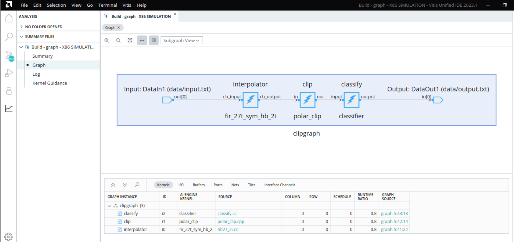

Clicking on any kernel in the logical diagram highlights the corresponding kernel source in the graph instance column. You can cross-probe to the source code by clicking the file.

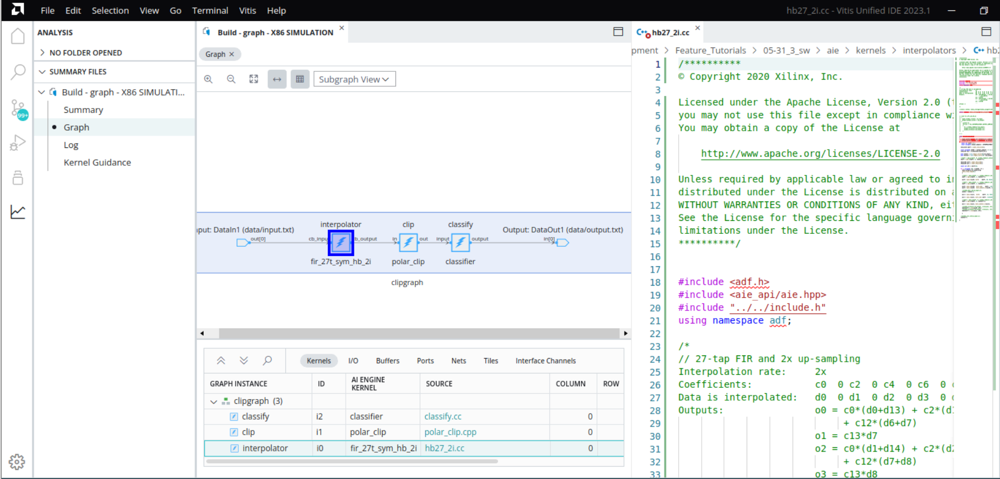

You can click **Log** to view the compilation log for your graph.

## Section 2: Simulate the AI Engine Graph using the `x86simulator`

After the graph has been compiled, you can simulate your design with the `x86simulator` command. The x86 simulator is an ideal choice for testing, debugging, and verifying behavior because of the speed of iteration and the high level of data visibility it provides the developer. The x86 simulation does not provide timing, resource, or performance information.

1. To run simulation run the command:

   ```bash
    make sim
    ```

    Or

    ```bash
    x86simulator --pkg-dir=./Work
    ```

    | Flag | Description |
    | ---- | ----------- |
    | --pkg-dir | The ***Work*** directory. |

2. When the simulation is completed, navigate to the `x86simulator_output` directory from a terminal and run: `cd x86simulator_output; ls`

   You should see something similar to the following:

    ```bash
     data/  x86sim.aierun_summary  x86simulator.log
    ```

    As you can see, a variety of files in the `data` directory are generated with the output file(s) you have in the `graph.cpp` for the PLIO objects and the `x86sim.aierun_summary` is generated, which contains all the information generated by `x86simulator`.

**Vitis Analyzer**

3. Open the generated `x86sim.aierun_summary` from the `x86simulator_output` directory for Vitis Analyzer. To do this, run the command:

    ```bash
    vitis_analyzer x86simulator_output/x86sim.aierun_summary
    ```

This opens the summary view in Vitis Analyzer that displays the simulation run time and the exact command line used for simulation.


**Note:** As the x86 simulation runs the design at a functional level, kernels do not physically map and route on the AI engine array. Therefore, the Array view is not available in ```aierun``` summary.

## Section 3: Compile and Run Software Emulation

### 1. Compiling HLS Kernels using v++

To compile the `mm2s`, and `s2mm` PL HLS kernels, use the `v++` compiler command which takes in an HLS kernel source and produces an `.xo` file.

To compile the kernels, run the following command:

```bash
make kernels
```

Or

```bash
v++ -c -t sw_emu --platform $PLATFORM_REPO_PATHS/xilinx_vck190_base_202410_1/xilinx_vck190_base_202410_1.xpfm --save-temps -k s2mm pl_kernels/s2mm.cpp -o s2mm.xo
v++ -c -t sw_emu --platform $PLATFORM_REPO_PATHS/xilinx_vck190_base_202410_1/xilinx_vck190_base_202410_1.xpfm --save-temps -k mm2s pl_kernels/mm2s.cpp -o mm2s.xo
```

Looking at the `v++` command line, you will notice several options. The following table describes each option.

|Switch/flag|Description|
|  ---  |  ---  |
|`-c`|Tells ```v++``` to just compile the kernel.|
|`-t`|Specifies the compilation target for software emulation.|
|`--platform/-f`|Specifies the path to an extensible platform.|
|`-k`|The kernel name. This has to match the function name in the corresponding file defining the kernel. (E.g., For kernel `mm2s` the function name needs to be `mm2s.cpp`.|
|`-o`|The output file must always have the suffix `.xo`.|
|`--save-temps/-s`|Saves the generated output process in the `_x` directory.|

### 2. Use V++ to Link AI Engine and HLS Kernels with the Platform

After the AI Engine kernels, graph, PL kernel, and HLS kernels have been compiled and simulated, you can use `v++` to link them with the platform to generate an `.xsa`.

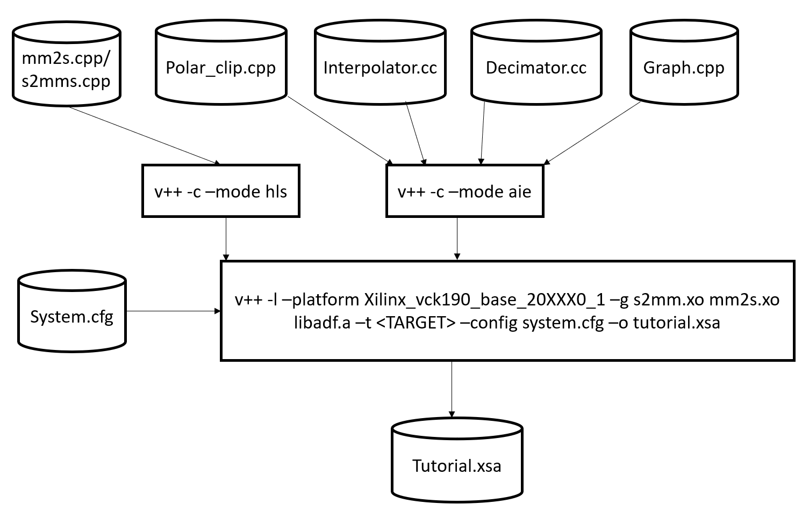

`v++` lets you integrate your AI Engine, HLS, and RTL kernels into an existing extensible platform. This step is where the platform chosen is provided by the hardware designer (or you can opt to use one of the many extensible base platforms provided by AMD and have `v++` build the hardware design for you in addition to integrating the AI Engine and PL kernels in the design.

You have a number of kernels at your disposal, but you need to tell the linker how you want to connect them together (from the AI Engine array to PL and vice versa). These connections are described in a configuration file: `system.cfg`, shown below.

```ini
[connectivity]
nk=mm2s:1:mm2s
nk=s2mm:1:s2mm
sc=mm2s.s:ai_engine_0.DataIn1
sc=ai_engine_0.DataOut1:s2mm.s
```

| Option/Flag | Description |
| --- | --- |
| `nk` | Specifies the number of instantiations of the kernel. For example, `nk=mm2s:1:mm2s` means that the kernel `mm2s` will instantiate one kernel with the name `mm2s`.|
| `stream_connect/sc` | Specifies the streaming connections to be made between PL/AI Engine or PL/PL. In this case, it should always be an output of a kernel to the input of a kernel.|

**NOTE:** The `v++` command line can get cluttered, and using the `system.cfg` file can help contain it.

For `ai_engine_0` the names are provided in the `graph.h`. For the design, as an example, this line:

```in = adf::input_plio::create("DataIn1", adf::plio_32_bits,"data/input.txt");```

has the name **DataIn1** which is the interface name.

You can see the `v++` switches in more detail in the [Vitis Unified Software Platform Documentation](https://docs.amd.com/r/en-US/ug1393-vitis-application-acceleration/v-Command).

To build the design run the follow command:

```bash
make xsa
```

or

```bash
v++ -l --platform -t sw_emu $PLATFORM_REPO_PATHS/xilinx_vck190_base_202410_1/xilinx_vck190_base_202410_1.xpfm s2mm.xo mm2s.xo libadf.a --save-temps -g --config system.cfg -o tutorial.xsa
```

| Flag/Switch | Description |
| --- | --- |
| `--link`/`-l` | Tells ```v++``` that it will be linking a design, so only the `*.xo` and `libadf.a` files are valid inputs. |
| `--target`/`-t`| Tells ```v++``` to build to software emulation (which will build the emulation models). |
| `--platform` |  Same as the previous two steps. |
| `--config` | This allows you to simplify the v++ command line if it gets too unruly and have items in an `.ini` style file. |

Now you have a generated `.xsa` that will be used to execute your design on the platform.

### 3. Compile the A72 Host Application

When all the new AI Engine outputs are created, you can compile your host application using g++(Note: we are not using a typical cross-compilation flow for the Cortex-A72) . As you might notice, the host code uses [XRT](http://www.github.com/Xilinx/XRT) (Xilinx Run Time) as an API to talk to the AI Engine and PL kernels. Notice that in the linker, it is using the library `-lxrt_coreutil`. Note that to compile the host code, it is required to use the c++17 package. Ensure your `gcc` or `g++` compiler has the necessary packages installed.

a. Open `sw/host.cpp` and familiarize yourself with the contents. Pay close attention to API calls and the comments provided.

   **Note:** [XRT](https://xilinx.github.io/XRT/2021.2/html/index.html) is used in the host application. This API layer is used to communicate with the PL, specifically the PLIO kernels for reading and writing data. To understand how to use this API in an AI Engine application refer to ["Programming the PS Host Application"](https://docs.amd.com/r/en-US/ug1076-ai-engine-environment/Host-Programming-on-Linux).

b. Open the `Makefile`, and familiarize yourself with the contents. Take note of the `GCC_FLAGS`, `GCC_INCLUDES` which are self-explanatory that you will be compiling this code with C++ 17. More explanation will be provided in the packaging step.

**Note**: XRT needs to be installed on the host and the $XILINX_XRT variable should be set by sourcing the `/opt/xilinx/xrt/setup.sh`.

c. Unset the CXX variable that points to the aarch64-linux-gnu-g++ compiler. Run the following command to set g++ for the x86 process.

d. Close the `Makefile`, and run the command:

```bash
     make host
```

or

```bash
     cd ./sw

     g++ -Wall -c -std=c++17 -D__PS_ENABLE_AIE__ -Wno-int-to-pointer-cast -I$XILINX_XRT/include -I./ -I../aie -I$XILINX_VITIS/aietools/include  -o host.o host.cpp
 
     g++ *.o -lxrt_coreutil -std=c++17 -L$XILINX_XRT/lib -o ./host_ps_on_x86

cd ..
```

The follow table describes some of the GCC options being used.

| Flag | Description |
| ---- | ----------- |
| `-Wall` | Print out all warnings. |
| `-std=c++17` | This is required for Linux applications using XRT. |
| `-I$XILINX_XRT/lib` | This includes the XRT libraries that are used in host code. |

### 4. Package the Design

With all the AI Engine outputs and the new platform created, you can now generate the packaged SD card directory contains everything to run your generated application and `.xclbin`. In addition to packaging, the `emconfigutil` command is used to generate the device, board, and device tree details (emconfig.json) which are required by XRT before loading the xclbin.

To package the design, run the following command:

```bash
make package
```

Or

```bash
emconfigutil --platform $PLATFORM_REPO_PATHS/xilinx_vck190_base_202410_1/xilinx_vck190_base_202410_1.xpfm --nd 1
```

followed by

```bash
cd ./sw
v++ -p -t sw_emu \
    --package.defer_aie_run \
    --platform $PLATFORM_REPO_PATHS/xilinx_vck190_base_202410_1/xilinx_vck190_base_202410_1.xpfm \
    --package.out_dir ./package.sw_emu \
    ../tutorial.xsa ../libadf.a
cd ..
```

**NOTE:** By default the `--package` flow will create a `a.xclbin` automatically if the `-o` switch is not set.

The following table describes the packager options:

| Switch/flag | Description |
| --- | --- |
| `defer_aie_run` | Tells the packager at boot to not start the AI Engine and let the host application control it. |
| `out_dir` | Specifies the package output directory. |

### 5. Run Software Emulation

After packaging everything is set to run emulation. This step demonstrates how software emulation can run the PS application on an x86 process (instead of an Arm process for an AI Engine design). Software emulation is an abstract model and first step to build and test the system in a functional process. It does not use any of the PetaLinux drivers such as Zynq OpenCL (ZOCL), interrupt controller, or Device Tree Binary (DTB). Hence, the overhead of creating an sd_card.img, and booting PetaLinux on a full QEMU machine is too heavyweight for software emulation and can be avoided.

a. To run emulation use the following command:

```bash
make run_emu 
```

Or

```bash
cd ./sw
setenv XCL_EMULATION_MODE sw_emu
./host_ps_on_x86 a.xclbin 
```

b. You should see an output displaying **TEST PASSED**. 


## Section 4: Compile AI Engine Code for AIE Simulator: Viewing Compilation Results in Vitis Analyzer

### **Important**

If you have performed the steps for **Software Emulation**, ensure you follow the guidance below. If not, you can skip this step and proceed to 'Compiling an AI Engine Graph'.

1. Set back the `SYSROOT` and `CXX` variables as mentioned in the **Introduction**.
2. Clean the `Working` directory to remove all the files that are related to the software emulation by running the following command:

    ```bash
    make clean
    ```

### Compiling an AI Engine ADF Graph for V++ Flow

To compile the graph type to be used in either HW or HW_EMU, use:

```bash
make aie TARGET=hw
```

Or

```bash
v++ -c --mode aie --target hw --platform $PLATFORM_REPO_PATHS/xilinx_vck190_base_202410_1/xilinx_vck190_base_202410_1.xpfm --include "$XILINX_VITIS/aietools/include" --include "./aie" --include "./data" --include "./aie/kernels" --include "./" --aie.xlopt=0 --work_dir=./Work aie/graph.cpp
```

The generated output from `aiecompiler` is the `Work` directory, and the `libadf.a` file. This file contains the compiled AI Engine configuration, graph, and Kernel `.elf` files.

#### Vitis Analyzer Compile Summary

Vitis Analyzer is used to view the AI Engine compilation results. It highlights the state of compilation, displays the graph solution in both the **Graph** and **Array** views, provides guidance around the kernel code, and allows you to open various reports produced by `aiecompiler`. Below is the `graph.aiecompile_summary` file generated by the `aiecompiler`, which is located in the `Work` directory.

To open the summary file, use the following command:

`vitis_analyzer -a ./Work/graph.aiecompile_summary`

The **Summary** View displays the compilation runtime, the version of the compiler used, the platform targeted, kernels created, and the exact command line used for the compilation.


1. Click **Kernel Guidance**. This view provides a list of messages (INFO, Warning, Critical Warning) and provides optimization and best practice guidance for kernel development. By default, ***INFO*** messages are hidden.

    

2. Click **Mapping Analysis**. This report provides detailed mapping information which the `aiecompiler` generates for mapping the graph to the AI Engine.

    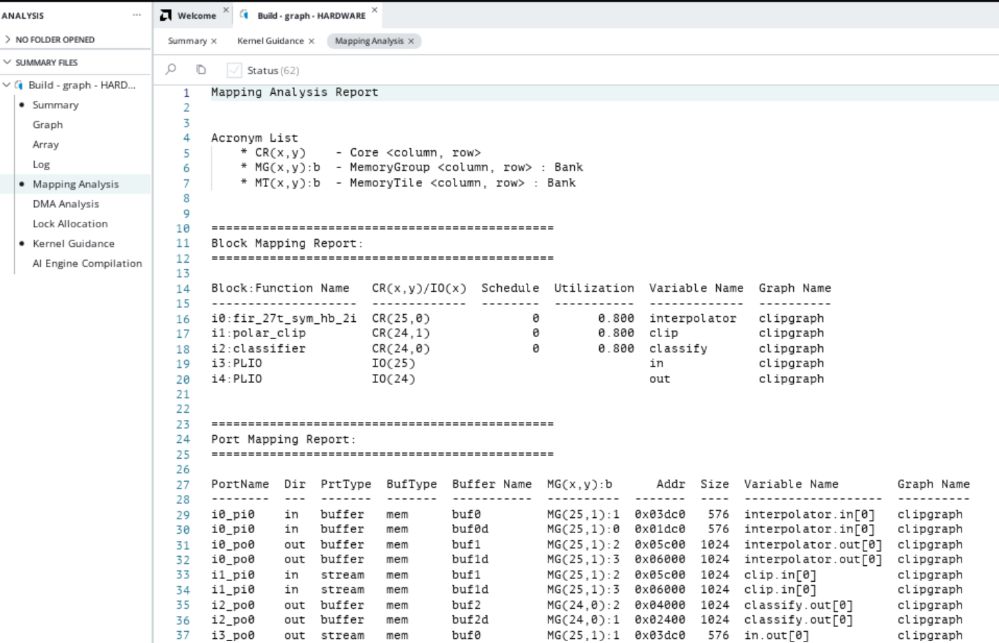

3. Click **DMA Analysis**. This is a text report showing a summary of the DMA accesses from the graph.

    

4. Click **Lock Allocation**. This shows the locks per buffer and where it is mapped in the ADF Graph.

    

5. Click **Log**. This is the compilation log for your graph.

    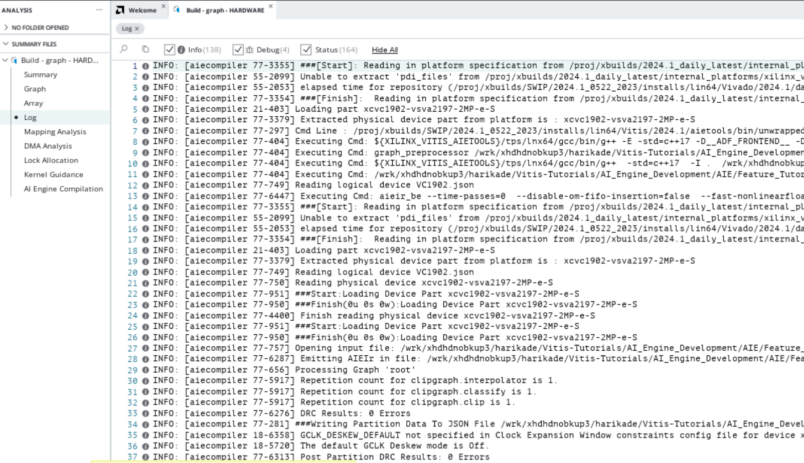

6. Click **AI Engine Compilation**. This view shows the individual logs and command line options for the individual Tile compilations. The following figure shows an example of the kernel in ***Tile [24,0]***.

    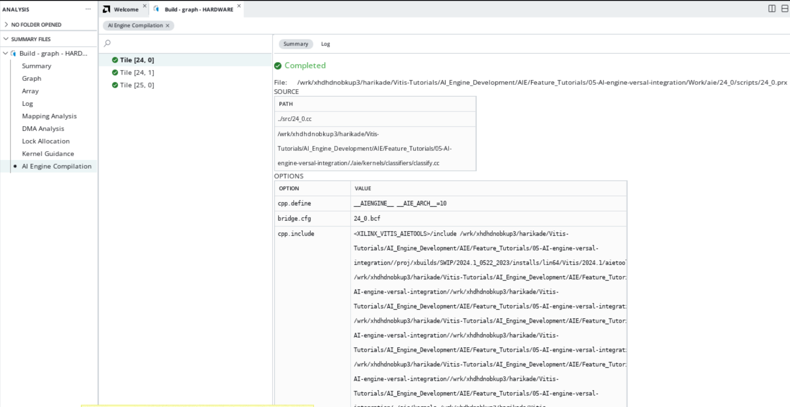
    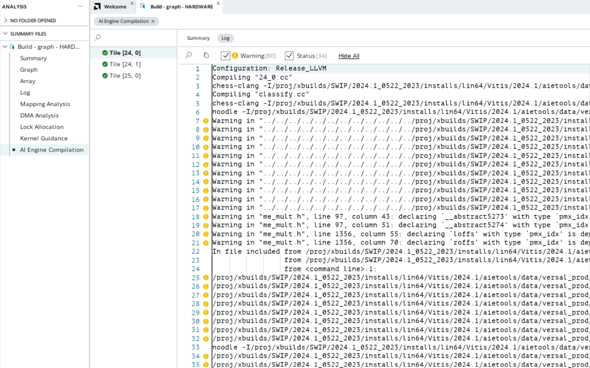

**Note**: The **Graph View** and **Array View** are presented in the next section.

## Section 5: Simulate the AI Engine Graph using the `aiesimulator` and Viewing Trace and Profile Results in Vitis Analyzer

After the graph has been compiled, you can simulate your design with the `aiesimulator` command. This uses a cycle-approximate model to test your graph and get preliminary throughput information early in the design cycle, while the PL developers continue to work on the platform for the application.

**Note**: Simulating the design with VCD will increase simulation runtime. To learn more about this feature, see [AI Engine SystemC Simulator](https://docs.amd.com/access/sources/dita/map?isLatest=true&ft:locale=en-US&url=ug1076-ai-engine-environment).

1. To run simulation use the command:

    ```bash
    make sim TARGET=hw
    ```

    or

    ```bash
    aiesimulator --profile --dump-vcd=tutorial --pkg-dir=./Work
    ```

    | Flag | Description |
    | ---- | ----------- |
    | --profile | Profiles all kernels, or select kernels (col,row)...(col,row).|
    | --dump-vcd | Grabs internal signals of tiles and dumps it in a VCD file. |
    | --pkg-dir | The ***Work*** directory. |

2. When simulation has completed, use a terminal to navigate to the `aiesimulator_output` directory by running: `cd aiesimulator_output; ls`

   You should see something similar to this:

    ```bash
    aiesim_options.txt      profile_funct_24_0.xml  profile_funct_25_0.xml  profile_instr_24_0.xml  profile_instr_25_0.xml
    data                    profile_funct_24_1.txt  profile_funct_25_1.txt  profile_instr_24_1.txt  profile_instr_25_1.txt  
    default.aierun_summary  profile_funct_24_1.xml  profile_funct_25_1.xml  profile_instr_24_1.xml  profile_instr_25_1.xml
    profile_funct_24_0.txt  profile_funct_25_0.txt  profile_instr_24_0.txt  profile_instr_25_0.txt
    ```

    The files prefixed with `profile_` are the outputs of the profiling and calculated per tile. In this tutorial, profiling is done for all tiles that are used, but you can limit profiling to specific tiles by providing the row and column of the tile. For more information about profiling with `aiesimulator` see [here](https://docs.amd.com/r/en-US/ug1076-ai-engine-environment/Simulating-an-AI-Engine-Graph-Application). You can open up these files to see what was calculated, but it is better to view it in Vitis Analyzer where it is curated. The `data` directory is generated here with the output file(s) you have in the `graph.cpp` for the PLIO objects. Finally, the `default.aierun_summary` is generated, which contains all the information generated by `aiesimulator` with profiling and trace information. Opening this file in Vitis Analyzer allows you to browse all the output files, and profile/trace data.

    **NOTE**: The `tutorial.vcd` is generated on the same level as the `./Work` directory.

    You can now open the generated `default.aierun_summary` from the `aiesimulator_output` directory for Vitis Analyzer.

3. To do this,run the command:

    ```bash
    vitis_analyzer -a ./aiesimulator_output/default.aierun_summary
    ```

    With this tool you can use a variety of views to debug and potentially optimize your graph.

    The **Summary** view provides an overview of running `aiesimulator`. As you can see in the following figure, it provides information on status, version used, time, platform used, and the command line used to execute.

    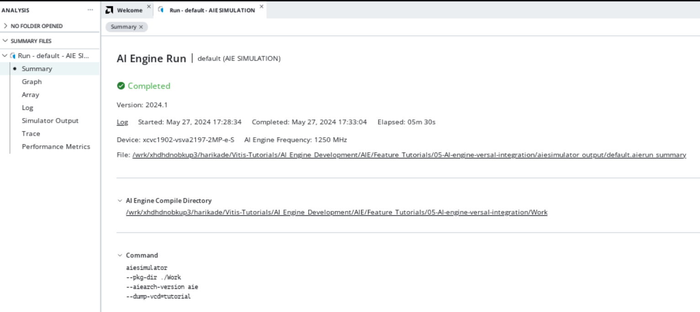

4. Click **Profile**.

    The **Profile View** provides detailed information collected during the simulation. Information includes cycle count, total instructions executed, program memory, and specific information per functions in the two tiles that the kernels are programmed.

    

    This is the top-level view of the profile. The left column allows you to select one of many types of reports generated per function.

5. Select the first **Total Function Time** from this column. You will see the following.

    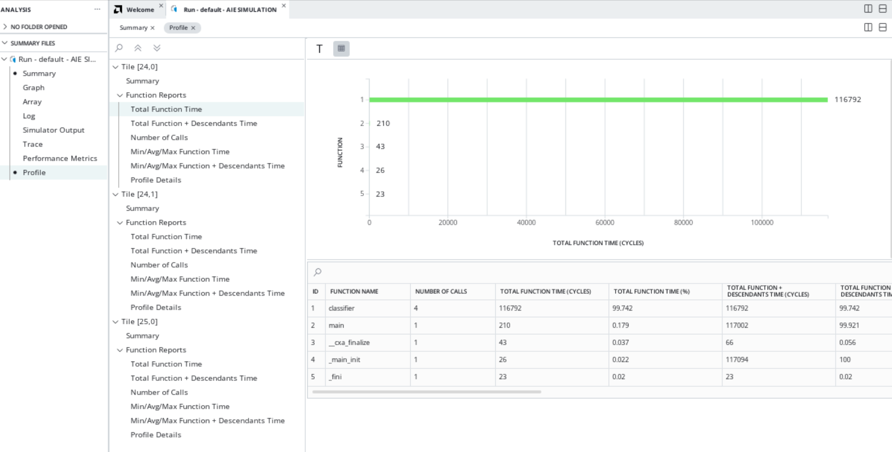

    In this chart you can see what function is called most, function time, etc. This information can be useful in determining if the tile is under- or over-utilized in your design.

6. Click **Graph**.

    The **Graph** view provides an overview of your graph and how the graph is designed in a logical fashion. In this view, you can see all the PLIO ports, kernels, buffers, and net connections for the entire ADF Graph.

    **Note**: This view, as well as the **Array** view have cross-probe selection, meaning selecting an object in this view will select it in the other and vice versa.

    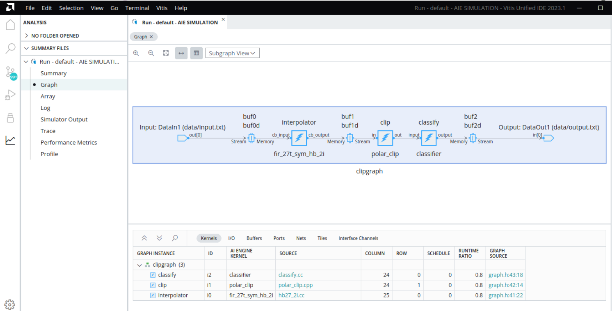

7. Click **Array**.

    The **Array** view provides a logical device view of the AI Engine, kernel placement, and how they are connected to each other as well as the shim.

    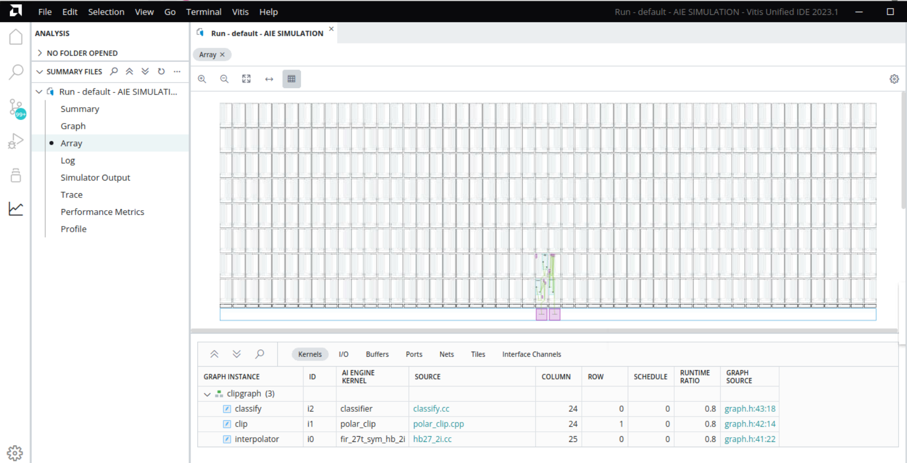

    * Cross probe to kernel and graph source files.
    * The table at the bottom shows the following:
      * **Kernel** - The kernels in the graph.
      * **PL** - Shows connections between the graph and PLIO.
      * **Buffer** - Shows all the buffers used for inputs/outputs of the graph and the buffers for kernels.
      * **Port** - Shows all the ports of each kernel and ADF Graph.
      * **Net** - Shows all nets, named and generated, mapped in the ADF Graph.
      * **Tile** - Shows tile data (kernels, buffers) of mapped tiles and their grid location.

    **Tip**: For more detailed information about these tables, see [Section: "Viewing Compilation Results in the Vitis Analyzer"](https://docs.amd.com/r/en-US/ug1076-ai-engine-environment/Viewing-Compilation-Results-in-the-Analysis-View-of-the-Vitis-Unified-IDE).

    You can zoom into the view to get finer detail of the AI Engine and see how tiles are made up as seen in the following screenshot.

8. To zoom in, click and drag from the upper-left to the lower-right of the area you want to view to have a box show up around the area to zoom. Below is a zoomed-in area.

    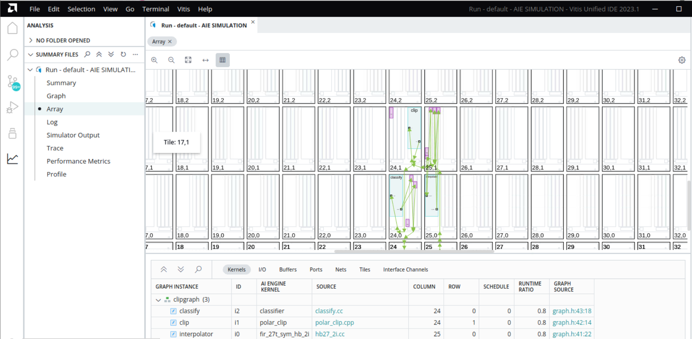

    In this zoomed in location you can see how the kernels are connected to a variety of tiles and how the shim is connected to the PLIO ports of this design.

9. Click **Simulator Output**.

    Finally, the **Simulator Output** view. This will print out the `output.txt` generated by the graph. This is a timestamped output.

    **Note**: If you need to compare this file to a golden one, you will need have to remove the -`T ####ns`- from the file.

    

    If you need to make any changes to the ADF Graph or the kernels inside based on results of the `aiesimulator` you can do so and re-run the compiler and view the results in Vitis Analyzer to see the changes you have made.

10. When you are done with Vitis Analyzer, close it by clicking **File** > **Exit**.

## Section 6: Run the Hardware Emulation, and View Run Summary in Vitis Analyzer

### 1. Compiling HLS Kernels Using v++

As done for sw_emu target in **Section 3**, compile the `mm2s`, and `s2mm` PL HLS kernels using the `v++` compiler command - which takes in an HLS kernel source and produces an `.xo` file.

To compile the kernels, run the following command:

```bash
make kernels TARGET=hw_emu
```

or

```bash
v++ -c --mode hls --platform $PLATFORM_REPO_PATHS/xilinx_vck190_base_202410_1/xilinx_vck190_base_202410_1.xpfm --config pl_kernels/s2mm.cfg
v++ -c --mode hls --platform $PLATFORM_REPO_PATHS/xilinx_vck190_base_202410_1/xilinx_vck190_base_202410_1.xpfm --config pl_kernels/mm2s.cfg
```

To get more details about several options of `v++` command line, refer to the **Compiling HLS Kernels Using V++** topic in **Section 3**
The only extra switch that is added is `-g`, which is required to capture waveform data.

### 2. Use V++ to Link AI Engine, HLS Kernels with the Platform

After the AI Engine kernels, graph, PL kernel, and HLS kernels have been compiled and simulated, you can use `v++` to link them with the platform to generate an `.xsa`.

As explained in **Section 3**, you use the `system.cfg` configuration file to connect the AI Engine and PL kernels in the design.

```ini
[connectivity]
nk=mm2s:1:mm2s
nk=s2mm:1:s2mm
sc=mm2s.s:ai_engine_0.DataIn1
sc=ai_engine_0.DataOut1:s2mm.s
```

To build the design, run the following command:

```bash
make xsa TARGET=hw_emu
```

or

```bash
v++ -l --platform $PLATFORM_REPO_PATHS/xilinx_vck190_base_202410_1/xilinx_vck190_base_202410_1.xpfm s2mm.xo mm2s.xo libadf.a -t hw_emu --save-temps -g --config system.cfg -o tutorial.xsa
```

Now you have a generated `.xsa` that will be used to execute your design on the platform.

### 3.Compile the A72 Host Application

Note: Unlike the software emulation where we used a g++ compiler to compile the host application, you use Arm cross-compiler `aarch64-xilinx-linux-g++` in hardware emulation. If you have exercised the software emulation step, please make sure to setback the `SYSROOT` and `CXX` variables as mentioned in the **Introduction**.

To compile the A72 host application, run the command:

```bash
make host TARGET=hw_emu
```

Or

```bash
cd ./sw

aarch64-xilinx-linux-g++ -Wall -c -std=c++14 -Wno-int-to-pointer-cast --sysroot=$SDKTARGETSYSROOT -I$SDKTARGETSYSROOT/usr/include/xrt -I$SDKTARGETSYSROOT/usr/include -I./ -I../aie -I$XILINX_VITIS/aietools/include -I$XILINX_VITIS/include -o main.o .cpp

aarch64-xilinx-linux-g++ main.o -lxrt_coreutil -L$SDKTARGETSYSROOT/usr/lib --sysroot=$SDKTARGETSYSROOT -L$XILINX_VITIS/aietools/lib/aarch64.o -o host.exe
cd ..
```

For more details about the GCC options being used, refer to **Section 3** topic - **Compile the A72 Host Application**.

### 4.Package the Design

With all the AI Engine outputs and the new platform created, you can now generate the Programmable Device Image (PDI) and a package to be used on an SD card. The PDI contains all executables, bitstreams, and configurations of every element of the device. The packaged SD card directory contains everything to boot Linux and have your generated application, and `.xclbin`.

To package the design, run the following command:

```bash
make package TARGET=hw_emu
```

Or

```bash
cd ./sw
v++ --package -t hw_emu \
    -f $PLATFORM_REPO_PATHS/xilinx_vck190_base_202410_1/xilinx_vck190_base_202410_1.xpfm \
    --package.rootfs=$PLATFORM_REPO_PATHS/sw/versal/xilinx-versal-common-v2024.1/rootfs.ext4 \
    --package.image_format=ext4 \
    --package.boot_mode=sd \
    --package.kernel_image=$PLATFORM_REPO_PATHS/sw/versal/xilinx-versal-common-v2024.1/Image \
    --package.defer_aie_run \
    --package.sd_file host.exe ../tutorial.xsa ../libadf.a
cd ..
```

**NOTE:** By default the `--package` flow will create a `a.xclbin` automatically if the `-o` switch is not set.

For more details on the packager options, refer to **Section 3**, topic: **Package the Design**.

### 5.Run Hardware Emulation

After packaging, everything is set to run emulation. Since you ran `aiesimulator` with profiling enabled, you can bring that to hardware emulation. You can pass the `aiesim_options.txt` to the `launch_hw_emu.sh` which will enable the profiling options used in `aiesimulator` to be applied to hardware emulation. To do this, add the `-aie-sim-options ../aiesimulator_output/aiesim_options.txt`.
Since Profiling is deprecated in Hardware Emulation Flow, comment the line 'AIE_PROFILE=All' in `aiesimulator_output/aiesim_options.txt`

1. To run emulation use the following command:

    ```bash
    make run_emu TARGET=hw_emu
    ```

    or

    ```bash
    cd ./sw
    ./launch_hw_emu.sh -aie-sim-options ../aiesimulator_output/aiesim_options.txt -add-env AIE_COMPILER_WORKDIR=../Work
    ```

    When launched, use the Linux prompt presented to run the design.  Note that the emulation process is slow, so do not touch the keyboard of your terminal or you might stop the emulation of the Versal booth (as it happens in the real HW board).

2. Execute the following command when the emulated Linux prompt appears:

    ```bash
    cd /run/media/*1
    export XILINX_XRT=/usr
    dmesg -n 4 && echo "Hide DRM messages..."
    ```

    This will set up the design to run emulation and remove any unnecessary DRM messaging.

3. Run the design using the following command:

    ```bash
    ./host.exe a.xclbin
    ```

    **Note**: The design runs with dumping VCD, which will extend emulation time. It may seem as if it is hung, but it is not.

4. You should see an output displaying **TEST PASSED**. When this is shown, run the keyboard command: `Ctrl+A x` to end the QEMU instance.

5. To view the profiling results and trace in Vitis Analyzer, run the command:

    ```bash
    vitis_analyzer -a sw/sim/behav_waveform/xsim/default.aierun_summary
    ```

    

    When you open the run Summary, you will notice that it is the same layout as that from `aiesimulator`.

6. Click **Trace**. This will open up the VCD data (as defined in the `aiesim_options.txt`). This gives detailed information about kernels, tiles, and nets within the AI Engine during execution. Here you can see stalls in regards to each kernel and can help you identify where they are originating.

    

7. From the trace information, you can calculate the kernel latency as follows:

   Click the Trace in the AI Engine simulation run summary, and navigate to the any function to calculate the latency. For example, consider the classifier function. 
   You can notice the function classifier ran for seven iterations. Zoom into the period of one iteration (between two main() function calls as follows), add a  marker, and drag it to the end of the kernel function as follows:
    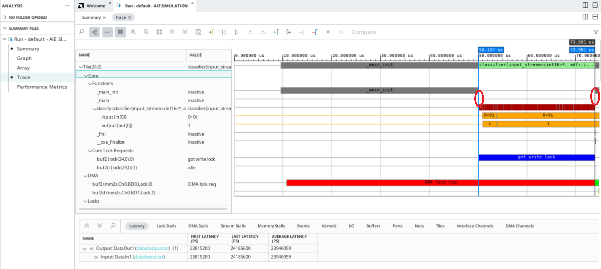
    
    Notice the difference of 25.093 us as highlighted above. This is the time the kernel took to complete one iteration.

   If you click the AI Engine Simulation Summary, you can notice the AI Engine Frequency as 1250 MHz, i.e., 0.8 ns, i.e., one cycle = 0.8 ns. Now, the classifier function took 23.854 us for one iteration, i.e., 23.854 us / 0.8 ns ~= 29817 cycles. Compare this with the latency you got during the aiesimulation where the AI Engine is a standalone module;
   
   This Latency calculated can also be compared against the value(average Latency) displayed in the trace.

8. Explore the two reports and take note of any differences and similarities. This will help you debug and optimize your design.

9. Open the `aiesimulator` run Summary by clicking **File** > **Open Summary**, navigating to the `aiesimulator_output` directory, and clicking `default.aierun_summary`.

    Explore the two reports and take note of any differences and similarities. This will help you debug and optimize your design.

10. Close out of the **Vitis Analyzer** and build for hardware.

## Section 7: Build and Run on Hardware

1. To build for hardware, run the following command:

    ```bash
    cd ..
    make xsa TARGET=hw
    ```

    or

    ```bash
    v++ -l --platform $PLATFORM_REPO_PATHS/xilinx_vck190_base_202410_1/xilinx_vck190_base_202410_1.xpfm s2mm.xo mm2s.xo libadf.a -t hw --save-temps -g --config system.cfg -o tutorial.xsa
   ```

2. Then re-run the packaging step with:

    ```bash
    make package TARGET=hw
    ```

    or

    ```bash
    cd ./sw
    v++ --package -t hw \
        -f $PLATFORM_REPO_PATHS/xilinx_vck190_base_202410_1/xilinx_vck190_base_202410_1.xpfm \
        --package.rootfs=$PLATFORM_REPO_PATHS/sw/versal/xilinx-versal-common-v2024.1/rootfs.ext4 \
        --package.image_format=ext4 \
        --package.boot_mode=sd \
        --package.kernel_image=$PLATFORM_REPO_PATHS/sw/versal/xilinx-versal-common-v2024.1/Image \
        --package.defer_aie_run \
        --package.sd_file host.exe ../tutorial.xsa ../libadf.a
    cd ..
    ```

    When you run on hardware, ensure you have a supported SD card. Format the SD card with the `sw/sd_card.img` file. Then plug the SD card into the board and power it up.

3. When a Linux prompt appears, run the following commands:

    ```bash
    dmesg -n 4 && echo "Hide DRM messages..."
    cd /run/media/*1
    export XILINX_XRT=/usr
    ./host.exe a.xclbin
    ```

You should see **TEST PASSED**. You have successfully run your design on hardware.

**IMPORTANT**: To re-run the application you need to power cycle the board.

### Summary

In this tutorial you learned the following:

* How to compile PLIO and PL Kernels using `v++ -c`.
* How to link the `libadf.a`, PLIO, and PL kernels to the `xilinx_vck190_base_202410_1` platform.
* How to use Vitis Analyzer to explore the various reports generated from compilation and emulation/simulation.
* How to package your host code, and the generated `xclbin` and `libadf.a` into an SD card directory.
* How to execute the design for software emulation.
* How to execute the design for hardware emulation.
* How to execute the design on the board.

To read more about the use of Vitis in the AI Engine flow see: [UG1076: AI Engine Tools and Flows User Guide: Integrating the Application Using the Vitis Tool Flow](https://docs.amd.com/access/sources/dita/map?isLatest=true&ft:locale=en-US&url=ug1076-ai-engine-environment).

#### Support

GitHub issues will be used for tracking requests and bugs. For questions go to [support.xilinx.com](https://support.xilinx.com/).

<p class="sphinxhide" align="center"><sub>Copyright © 2020–2024 Advanced Micro Devices, Inc</sub></p>

<p class="sphinxhide" align="center"><sup><a href="https://www.amd.com/en/corporate/copyright">Terms and Conditions</a></sup></p>
