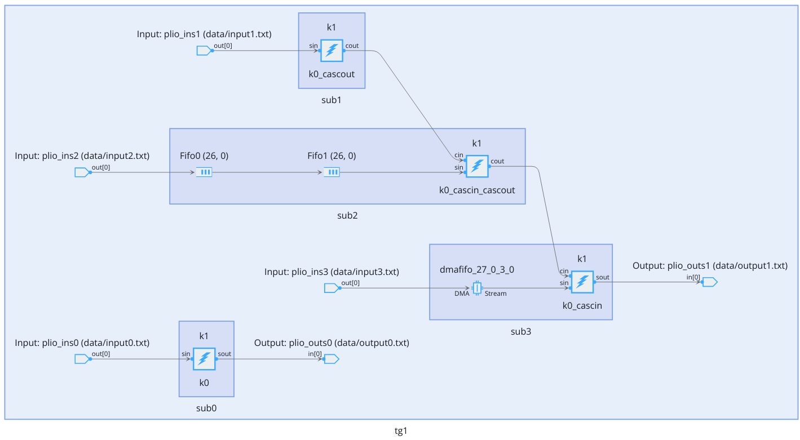
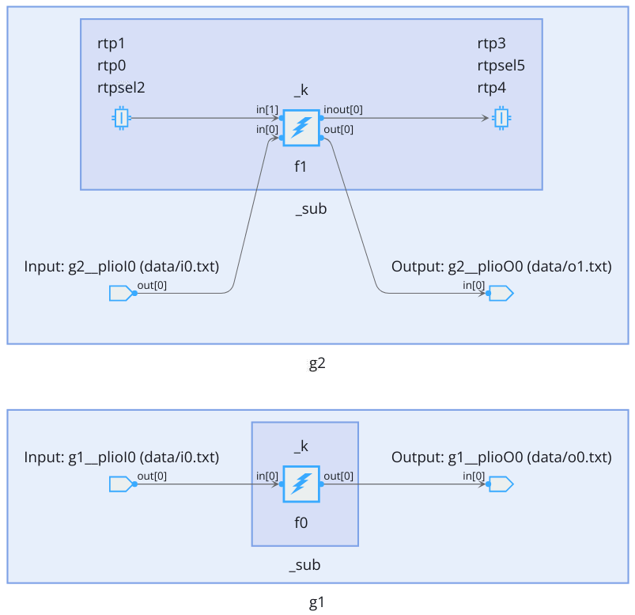

</table>
<table class="sphinxhide" width="100%">
 <tr width="100%">
    <td align="center"><h1>AI Engine Development</h1>
    <a href="https://www.xilinx.com/products/design-tools/vitis.html">See Vitis™ Development Environment on xilinx.com</br></a>
    <a href="https://www.xilinx.com/products/design-tools/vitis/vitis-ai.html">See Vitis™ AI Development Environment on xilinx.com</a>
    </td>
 </tr>
</table>

# Conditionnal Objects Instantiation


## Introduction

In some situations, you may want to have parameterizable graphs where some ports may or may not exist. Kernels may be different depending on parameters and there might be a variable number of ports, and some sub-graphs may or may not be instantiated. These cases are covered by the `aiecompiler` conditional port feature.

## Basics of Conditional Instantiation

`conditional` is a C++ feature belonging to the standard library. The format is:

```C++
typename std::conditional< BOOLEAN_CONDITION , TYPE_IF_TRUE , TYPE_IF_FALSE >::type VARIABLE;
```

If `BOOLEAN_CONDITION` is True, then `VARIABLE` is generated with type `TYPE_IF_TRUE`. If the condition is False, `VARIABLE` is also generated but with type `TYPE_IF_FALSE`.

For `aiecompiler` environment, the `BOOLEAN_CONDITION` will be generally passed through template parameter. Though `VARIABLE` is always created, the type is different depending on the condition. In the examples provided, `TYPE_IF_TRUE` is the port type, graph class name that is of interest, and `TYPE_IF_FALSE` is a dummy type like `int` or `std::tuple<>`.

## Conditional Usage Examples

The following examples illustrate various ways to generate conditional objects at the graph level. All examples are available in different source directories: `src1` to `src4`. They can be compiled using: `make CASE=N clean data aie aieviz` with `N= 1,2,3,4`. Type `make help` to get the list of all available examples.

All these examples can be compiled either for the AI Engine architecture `ARCH=1` (default value) or the AI Engine ML architecture `ARCH=2`.


### Case 1: Conditional Cascade Port

In this design, a graph is instantiated with a template parameter. Depending on parameter values, a kernel with an input cascade port, an output cascade port, both of them, or none of them is declared as the kernel of the graph. If there is no cascade output port, a streaming output port is declared. As the number of ports depends on the parameter value, the graph will expose a variable number of ports.

```C++
template<bool HAS_CASCADE_IN, bool HAS_CASCADE_OUT>
struct SubGraph: public graph
{
    input_port strmIn;
    typename std::conditional<!HAS_CASCADE_OUT,output_port,int>::type strmOut;
    typename std::conditional<HAS_CASCADE_IN, input_port, int>::type cascIn;
    typename std::conditional<HAS_CASCADE_OUT, output_port, int>::type cascOut;

    kernel     k1;

    SubGraph()
    {
        if constexpr (HAS_CASCADE_IN && HAS_CASCADE_OUT)
        {
            k1 = kernel::create(k0_cascin_cascout);
            connect(cascIn, k1.in[1]);
            connect(k1.out[0], cascOut);

        }
        else if constexpr (HAS_CASCADE_IN)
        {
            k1 = kernel::create(k0_cascin);
            connect(cascIn, k1.in[1]);
            connect(k1.out[0], strmOut);

        }
        else if constexpr (HAS_CASCADE_OUT)
        {
            k1 = kernel::create(k0_cascout);
            connect(k1.out[0], cascOut);

        }
        else
        {
            k1 = kernel::create(k0);
            connect(k1.out[0], strmOut);

        }
        connect(strmIn, k1.in[0]);
        source(k1) = "kernels.cpp";
        runtime<ratio>(k1) = 0.6;
    }
};
```

You can instantiate multiple sub-graphs with various parameters in order to create the complete graph. The testcase of the tutorial is the following:

```C++
struct TestGraph: public graph
{
    SubGraph<false,false> sub0;
    SubGraph<false,true> sub1;
    SubGraph<true,true> sub2;
    SubGraph<true,false> sub3;

    input_plio plioIns[4];
    output_plio plioOuts[2];

    TestGraph()
    {
        for(int i=0;i<4;i++)
            plioIns[i] = input_plio::create("plio_ins"+std::to_string(i), plio_32_bits, "data/input"+std::to_string(i)+".txt", 100, true);
        plioOuts[0] = output_plio::create("plio_outs0", plio_64_bits, "data/output0.txt", 125.5);
        plioOuts[1] = output_plio::create("plio_outs1", plio_64_bits, "data/output1.txt", 125.5);

        connect(plioIns[0].out[0], sub0.strmIn);
        connect(plioIns[1].out[0], sub1.strmIn);
        connect net2(plioIns[2].out[0], sub2.strmIn);
        connect net3(plioIns[3].out[0], sub3.strmIn);

        fifo_depth(net2) = 32;
        fifo_depth(net3) = 128;

        connect(sub1.cascOut, sub2.cascIn);
        connect(sub2.cascOut, sub3.cascIn);

        connect(sub0.strmOut, plioOuts[0].in[0]);
        connect(sub3.strmOut, plioOuts[1].in[0]);

    }
};
```

Four sub-graphs are instantiated with various parameters and then connected together. The graph as shown by the AMD Vitis™ Analyzer is:



Type `make CASE=1 clean data aie aieviz` to get this visualization.

### Case 2: Conditional Array of Sub-Graphs

In this example, an array of different kernel type and different size are created depending on a parameter value:

```C++
    typename std::conditional<ID==1,
                              std::array<Sub0<1>, 2>,
                              std::array<Sub0<2>, 3>>::type _subs;
```

If ID parameter is equal to 1, an array of two kernels parametrized with value 1 is generated. If ID is not equal to 1, the array length is 3 and the kernel is parametrized with 2.

Type `make CASE=2 aie aieviz` to visualize the resulting graph of this testcase.

### Case 3: Conditional Sequential Sub-Graphs

In this example, the template parameter of the graph is used to select or deselect the instantiation of a sub-graph:

```C++
template<int ID>
struct MyGraph: public graph
{
    input_plio _plioI;
    output_plio _plioO;

    constexpr static bool hasSub0() {return ID & 0x1;}
    constexpr static bool hasSub1() {returcn ID & 0x2;}

    typename std::conditional<hasSub0(), Sub0, int >::type _sub0;
    typename std::conditional<hasSub1(), Sub1, int >::type _sub1;

    ...
};
```

If ID has bit 0 set, Sub0 is instantiated. If it has bit 1 set, then Sub1 is instantiated.

Type `make CASE=3 aie aieviz` to visualize the resulting graph of this testcase.

### Case 4: Conditional RTP Ports

Last but not least, in this fourth testcase, a template parameter allows you to choose between a kernel that has RTP ports and another one which does not have these ports.

```C++
template<bool HAS_RTPS>
struct Sub0: public graph
{
    input_port _in0;
    output_port _out0;
    typename std::conditional< HAS_RTPS, input_port, std::tuple<>>::type _in1;
    typename std::conditional< HAS_RTPS, inout_port, std::tuple<>>::type _inout0;
    kernel _k;
    Sub0()
    {
        if constexpr (HAS_RTPS) {
            _k = kernel::create(f1);
        } else {
            _k = kernel::create(f0);
        }
        runtime<ratio>(_k) = 0.9;
        source(_k) = "k0.cpp";
        connect(_in0, _k.in[0]);
        connect(_k.out[0], _out0);

        if constexpr (HAS_RTPS) {
            connect(_in1, _k.in[1]);
            connect(_k.inout[0], _inout0);
        }
    }
};
```

In the testcase, two of these graphs are instantiated: one without RTPs and another one with RTP ports. The resulting graph in the Vitis Analyzer is as follows:



Type `make CASE=4 aie aieviz` to visualize the resulting graph of this testcase.

## Support

GitHub issues will be used for tracking requests and bugs. For questions, go to [support.xilinx.com](https://support.xilinx.com/).

<p class="sphinxhide" align="center"><sub>Copyright © 2023 Advanced Micro Devices, Inc</sub></p>

<p class="sphinxhide" align="center"><sup><a href="https://www.amd.com/en/corporate/copyright">Terms and Conditions</a></sup></p>
