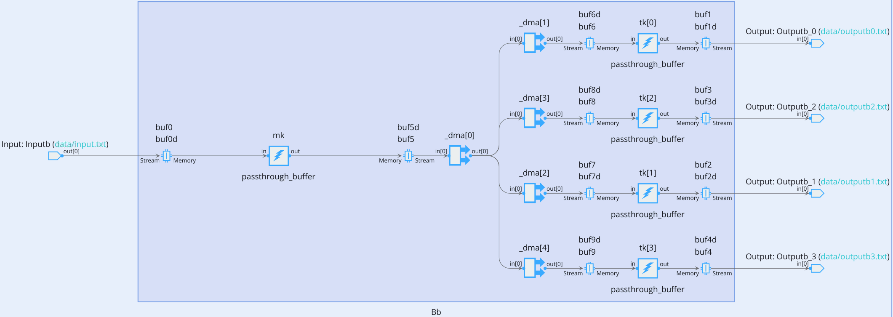

</table>
<table class="sphinxhide" width="100%">
 <tr width="100%">
    <td align="center"><h1>AI Engine Development</h1>
    <a href="https://www.xilinx.com/products/design-tools/vitis.html">See Vitis™ Development Environment on xilinx.com </a>
    <a href="https://www.xilinx.com/products/design-tools/vitis/vitis-ai.html">See Vitis™ AI Development Environment on xilinx.com</a>
    </td>
 </tr>
</table>

# Data Multicasting

## Introduction

In a complete system design there are a lot of situations where the same data must be used by various independent kernels. These kernels are not aware of the existence of the other kernels and should operate completely independently of the other kernel operations.

There can be situations where you can have data split (multicast) but the various branches do not have the same buffer size. This case is handled automatically in case of buffer interface.

## Case 1: Stream and Buffer Multicasting

When the data source is a stream and all the input interfaces of the destinations are streaming interfaces, the `aiecopiler` has nothing really special to do. The AXI-Stream interface interconnect is used to connect the destinations to the same source.

>**Note:** Be aware of inefficiencies and deadlocks. You may have to introduce FIFOs on the various paths to overcome stream stalls on some branches.

The situation is different when the source and destination are buffers. Memory interfaces can be accessed only by the four neighbors and cannot be extended further. That is why the `aiecompiler` has to use the AXI-Stream interconnect and the DMAs (MM2S -> S2MM) to multicast the source memory content to the destination memories.

All the infrastructure `_dma[0] ... _dma[4]` has been added by the compiler to multicast the data to all destination memories.

Type `make CASE=1 clean data aie aieviz` and explore the graph view and the array view shown by Vitis Analyzer.

## Case 2: Multirate Buffer Multicasting

[Multirate](../Multirate) design is a subject explored in another section of this tutorial. This subsection emphasizes the fact that in case of different buffer sizes for destinations, the `aiecompiler` is able to compute a number of runs per iteration for each kernel so that the data generated by the `maker` is consumed by all the `takers`.

The architecture is exactly the same but the repetition counts are different from case 1:

Type `make CASE=2 clean data aie aieviz` and explore the graph view and the array view shown by the AMD Vitis™ Analyzer.

## Support

GitHub issues will be used for tracking requests and bugs. For questions, go to [support.xilinx.com](https://support.xilinx.com/).

Copyright © 2023 Advanced Micro Devices, Inc

<a href="https://www.amd.com/en/corporate/copyright">Terms and Conditions</a>

