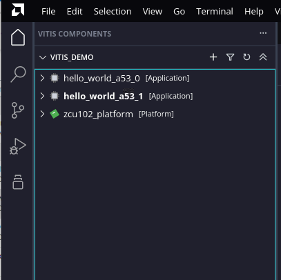
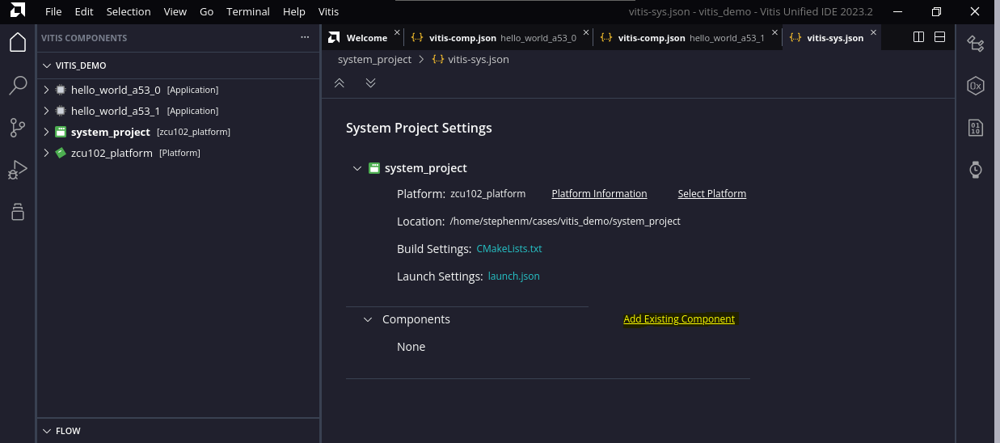
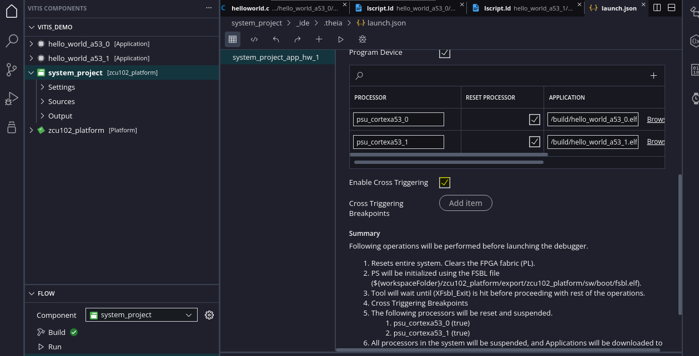
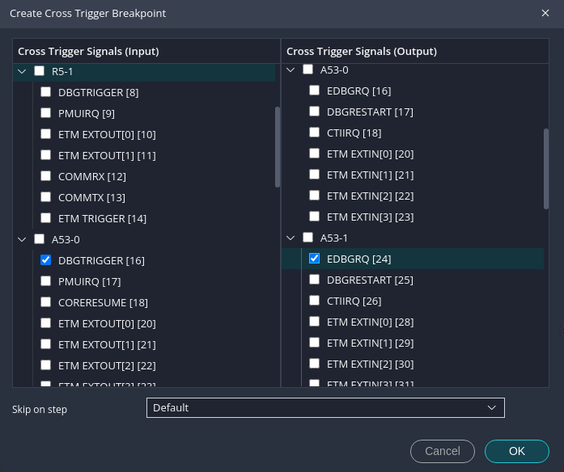
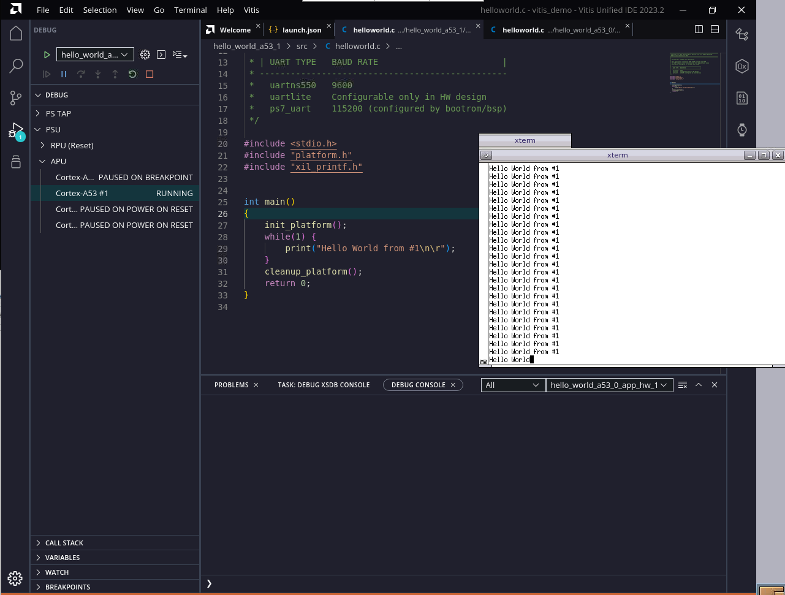
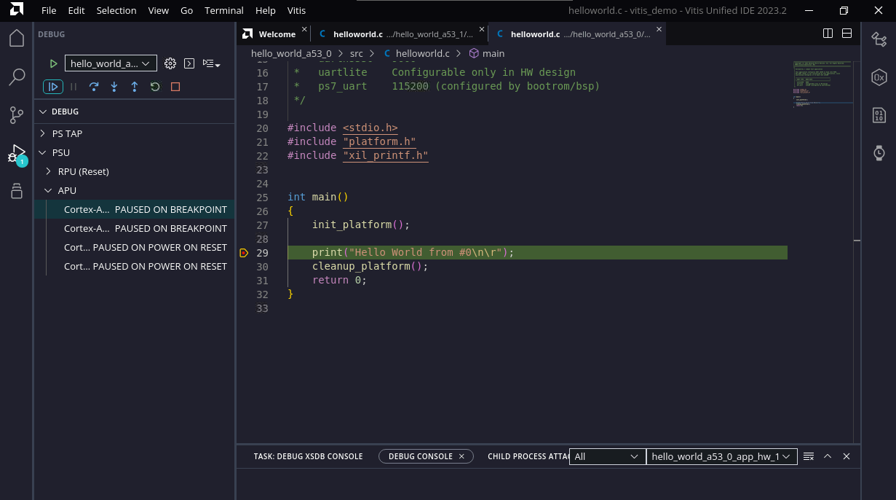

# Cross Triggering in Vitis Unified Embedded IDE

***Version: Vitis 2023.2***

Embedded systems can be complex, that may contain multiple processors. Users may also need to debug across software and hardware domains and can use PS-PL cross triggering. However, In this simple tutorial, we will learn how we can debug over multiple processors using cross triggering.

## Lets get started

Launch Vitis unified embedded tool in 2023.2, and create your platform. In this tutorial, I created two `Hello World` applications both on different processors.

NOTE: Refer to the Getting Started Embedded tutorial for information on creating a new application.

## System Project Creation

While a system project is not requirement for cross probing, it is useful to keep all the applicaiton components maintained in a system project. We can create a system project that has our components; our two hello world applications. To create a system project, select File -> New Component -> System Project

Select your platform

Select your components

  
Additional Notes

Users should place both applications into different sections in the DDR via the linker script or in different memories to avoid overlapping.

Set up the launch configurations, and scroll down to enable the Cross Triggering

Setup the cross trigger signals by selecting Add Item under the Cross Triggering Breakpoints.  For example, here we want to trigger the cortex a53 #1 when there is a breakpoint on cortex a53 #0

  
Additional Notes

Users should refer to [UG1400](https://docs.xilinx.com/r/en-US/ug1400-vitis-embedded/Cross-Triggering-in-Zynq-Devices) For more information on the cross triggering signals

  
Additional Notes

I have the hello world print in a while loop for demo purposes here

We can then set a breakpoint on the first processor (on line 29 below)

Here, we can see that when the breakpoint hit on the first processor that it halted the second processor

Copyright © 2020–2024 Advanced Micro Devices, Inc

<a href="https://www.amd.com/en/corporate/copyright">Terms and Conditions</a>

