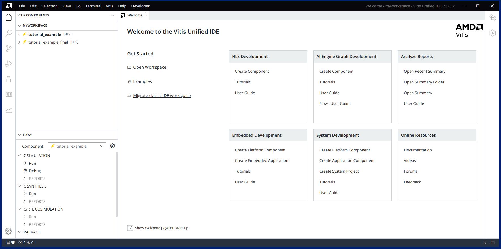
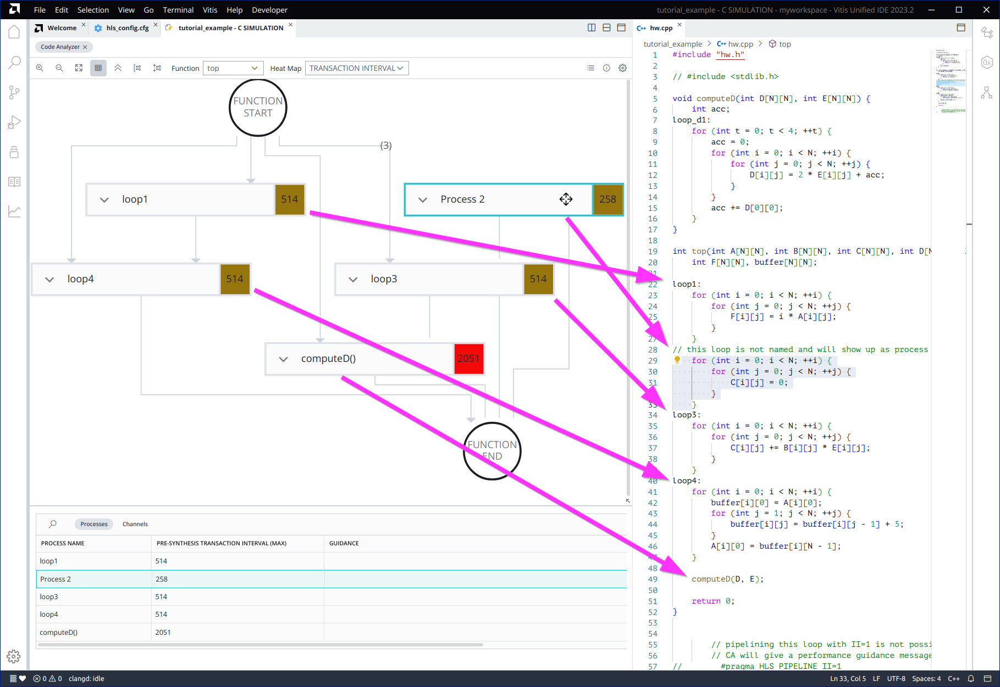
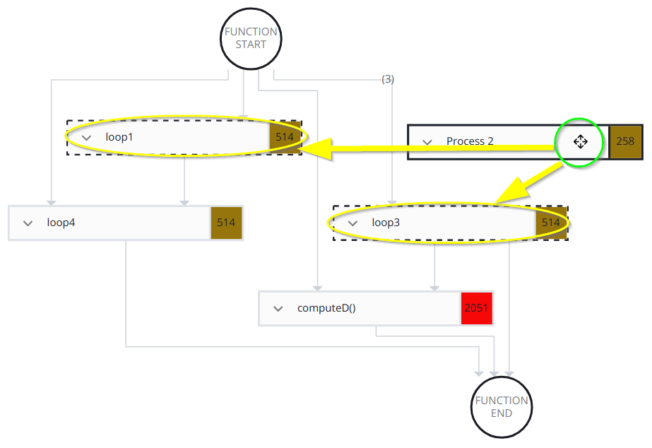
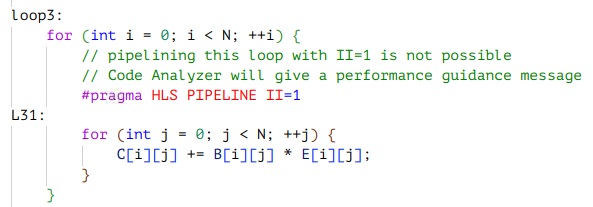
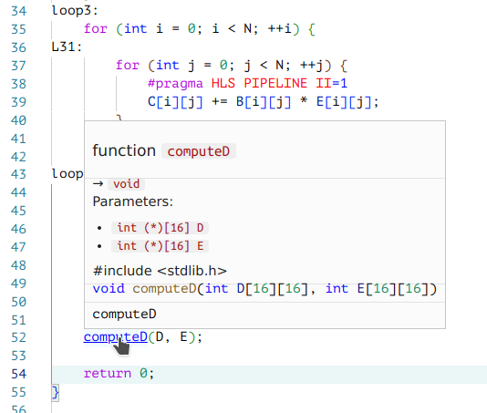
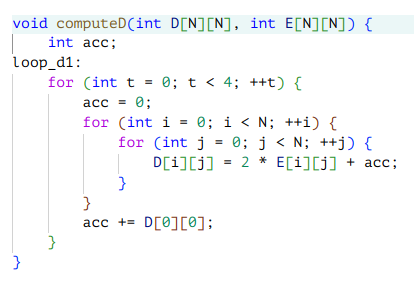
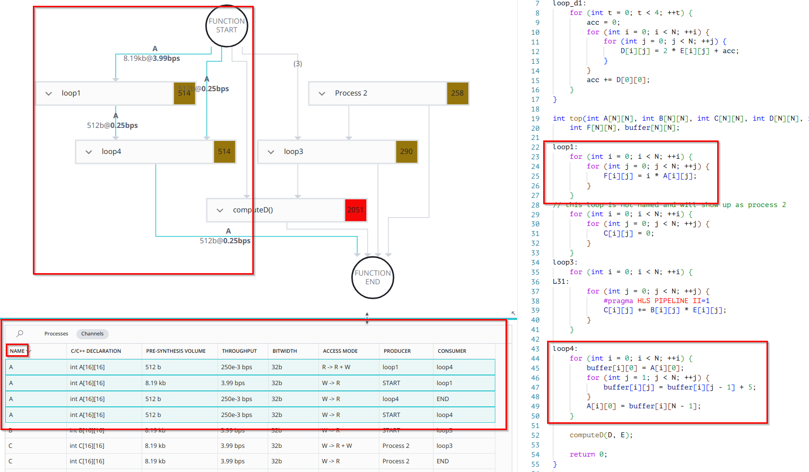
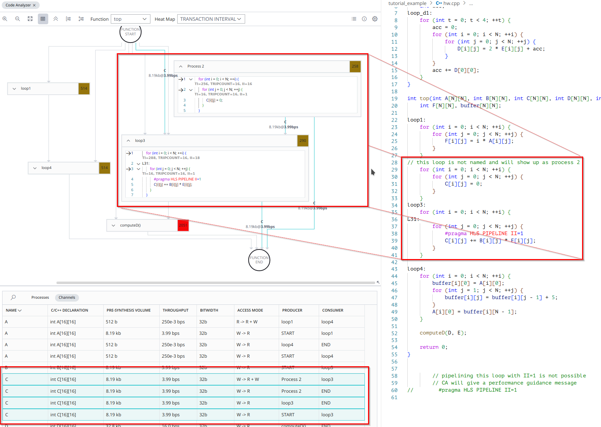
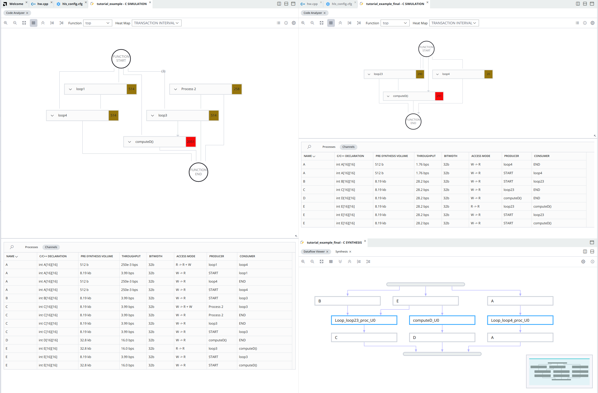

<table class="sphinxhide" width="100%">
 <tr width="100%">
    <td align="center"><h1>Vitis HLS Tutorials</h1>
    <a href="https://www.xilinx.com/products/design-tools/vitis.html">See Vitis™ Development Environment on xilinx.com</a>
    </td>
 </tr>
</table>

# Using Code Analyzer from Vitis Unified IDE

***Version: Vitis 2023.2***

## Tutorial Overview

This tutorial shows you how to use the pre-synthesis feature called Code Analyzer for the Vitis High-Level Synthesis tool flow.

It is assumed that you are familiar with the Vitis High-Level Synthesis (shortened Vitis HLS or VHLS) tool flow. Code Analyzer requires the same setup as for C-Simulation for an HLS component so you can follow the [getting started with Vitis HLS Components tutorial][GH_Getting_started_VHLS] to familiarize yourself with this process.

Vitis Code Analyzer helps you investigate your design efficiency and get a performance estimation before running the VHLS C-Synthesis compilation. It uses a C-Testbench from the C-Simulation setup to dynamically analyze your design and extract data volume and movement as well as estimate transaction interval to investigate the performance; the data is presented as a graph.

The documentation about Code Analyzer can be found in the [VHLS User Guide UG1399][VHLS_UG1399].

## Before You Begin

It is assumed that the Vitis tools are installed and set up.

The labs in this tutorial use:

- One component named `tutorial_example` that is the initial design which we are going to investigate with Code Analyzer.
- One component named `tutorial_example_final` which based on the above and has been optimized when following the tutorial. We use it for reference in the last section so that the tutorial matches with this second component.
- If necessary, the tutorial can be easily changed to other device or platforms.

### Accessing the Tutorial Reference Files

1. To access the reference files, type the following into a terminal: `$ git clone https://github.com/Xilinx/Vitis-Tutorials`
1. Navigate to `./Vitis-Tutorials/Vitis_HLS/Feature_Tutorials/01-using_code_analyzer/reference-files` directory.
1. You need an Vitis Unified IDE workspace. If you don't have one yet, you can create a new one, for example `$ mkdir ~/myworkspace`; that's the name we're going to use in this tutorial: change to match your preference.
1. Copy the 2 components into your Vitis Unified IDE workspace. `$ cp -r tutorial_example/ tutorial_example_final/ ~/myworkspace`
1. You are now ready. We will start the Vitis Unified IDE in the next section.

## Investigate `tutorial_example` using Code Analyzer

Launch the new Vitis Unified IDE to open directly your workspace `$ vitis --workspace ~/myworkspace`

The IDE starts from the Welcome page, you can close it if you wish. We can change the color scheme via `file` > `preferences` > `color theme`. We used the light color theme to get the screenshots in this tutorial. 

Select the component named `tutorial_example` in the `VITIS COMPONENTS` upper left-hand panel.

Notice [HLS] in grey, indicating an HLS component.

Hover on the `C SIMULATION` line to reveal the gear icon and click it to open the settings.

The screenshot below shows that Vitis HLS Code Analyzer is enabled. Notice that when enabled, other options are disabled because they are not compatible with Code Analyzer (namely O (optimization), profile and setup).

Let’s observe the lower left-hand panel: it's named `FLOW`.

Under `C SIMULATION` notice that we have 3 options: `Run`, `Debug` and `REPORTS`, but the REPORTS option is greyed-out. Let’s click `Run` to execute the C-Simulation. If you examine the console output you can read the message **Executing Code Analyzer instead of classic HLS C simulation**

After a few moments, the console reports **C-simulation finished successfully** and you can notice that the `REPORTS` section is now selectable. Expand the `REPORTS` and click on `Code Analyzer`.

You get presented with a graph view:

This view helps you convert your design into the dataflow form and assists you in its optimization.

Your C/C++ code is represented here as a dataflow design even if it is currently written in a sequential form. Dataflow processes are deduced from the top-level statements in the selected function body and their dependencies are turned into channels. Performance estimates are computed for the presented dataflow design, ignoring potential canonicalization issues.

With this graph view you get a lot of information immediately:

- Nodes represent dataflow processes with their names being function names or loops labels (unnamed loops are named “Process #N”). Estimated Transaction Intervals are also presented next to the node name. When you expand the node using the arrow-head button, you can see a snippet of the function call site or loop code.
- Edges are the communication channel extracted from the variables of the design. You can see their names, the volume of data and the average throughout, expressed by default in bits per second, both estimated from the C-TB run.

Transaction Interval is the minimal delay between two executions of a process.
Remember that Code Analyzer assumes that the top level region contains processes executing independently, and as such the region's performance is limited by the slowest process, the one with the largest TI number estimate. It is the process highlighted in red.

You can select other functions to investigate by selecting the function drop-down menu in the toolbar, but you can also iteratively drill down the function calls and loops in the different processes to achieve the same effect. This can be achieved by clicking on the right-pointing arrows next to lines of codes in processes.

Below the graph, a table on the lower half of the view shows the processes and channels with more details. We will review this later in the tutorial.

The figure below illustrates how every node in the graph relates to top-level statements in the function being analyzed.

The graph also allows users to perform graph-only transformations by merging processes together so that the graph nodes and edges are recomputed, and the new performance of the merged process can be investigated. The merge operation is performed with the move icon on the process: left-click the icon, hold, and start dragging the process and the graph will show the possible target processes by changing their borders into dashed lines. The screenshot below shows that we can merge `Process 2` with the process `loop1` directly before, and the process `loop3` directly after, but not `loop4` or `computeD()`.

Let's go ahead and merge `Process 2` with `loop3` by releasing the mouse button. The tool computes the updated metrics and updates the graph; here notice the `loop3` process is not present anymore. Now we can also try the reverse operation, the split operation, on the merged process: first, expand the process with the arrow-head icon.  A horizontal dashed line shows the split location with the original code for `Process 2` and `loop3` on each side.  A split button appears when you hover the mouse on the split line.  Select the split button with the mouse to perform the split.

More complex code might have more processes on the graph than what you might expect from the source code because class constructors or initialization might be extracted as processes. In those situations, Code Analyzer estimates that they will take some clock cycles at runtime.

### Process Table

Let’s look at the process table which shows process names and their pre-synthesis Transaction Interval estimation value. Recall that the Transaction Interval is the minimal delay between two executions of a process. It's worth investigating processes with the largest values because they are the bottle neck but in the context of this tutorial let’s take 2 other examples.

#### `Process 2` analysis

Focusing on `Process 2`, let's check how we arrive to a `TI=258`.

On the node representing `Process 2`, use the down pointing arrow on the left to show the code.

We can make the following observations:

1. The code is using a double nested loop to clear array `C[16][16]`. 
1. The performance analysis of Code Analyzer is overlaid in the code snippet, here this is shown between lines 1 and 2 and lines 2 and 3, right at the start of the regions defined by the for-loops. Let's look into the numbers.
1. Code Analyzer estimates the performance of the innermost-loop first: Initiation Interval of 1 clock cycle can be achieved to start the next iteration, so `II=1` is reported.
1. Each for-loop is counting from 0 to 15 because constant N=16 is used, so `TRIPCOUNT=16` is reported.
1. The Transaction Interval is `TI=TRIPCOUNT*II`, so for the innermost-loop we get `TI=16*1=16`.
1. We repeat the investigations hierarchically up into the parent loop: we compute the sum of all TI(s) of all the statements in the loop body. The TI sum becomes the II of the loop, since we have only the innermost-loop in the loop body we have an `II=16`, and with `TRIPCOUNT=16`, so their product gives us `TI=16*16=256`.
1. As the loops are the only statements from the extracted process itself, we add 2 extra cycles for the state machine of the process which gives the overall Transaction Interval for `Process 2` of `TI=256+2=258`

> **NOTE**: Performance analysis numbers are shown at the beginning of a loop, within its curly braces `{}`, or right after a function call site.

##### Reported Tripcount Values

1. If loop bounds are compile-time constants, they are reported in Code Analyzer;
1. Otherwise, if a tripcount pragma is provided, this value is used by Code Analyzer;
1. Otherwise, the tripcount value is measured when running the C-testbench.

In any case, the reported tripcounts account for the loop unrolling: loop tripcounts are divided by unrolling factors. Fully unrolled loops will always have a reported tripcount of 1.

#### `loop3` analysis

For loop 3: there is also a double nested loop with same tripcount for all loops.

However, with this example, Code Analyzer estimates that `II=2`.

A similar analysis and computation to the previous section can be performed and arrive to the conclusion that the innermost-loop has `TI=TRIPCOUNT*II=16*2=32` and the outermost-loop has an overall `TI=TRIPCOUNT*II=16*32=512`, finally adding 2 extra cycles for the state machine gives `TI=512+2=514`.

#### Pipelining `loop3` and new analysis

Let's try to improve the performance of `loop3` by using a pipeline pragma on the innermost-loop: on the graph, right click on the process and select “goto source”, this brings you to the call site.

Insert a new line after the for statement of the innermost loop and type `#pragma HLS PIPELINE II=1`. You can see that the editor suggest you the possible completions as you type. Save the file (note: it should be saved automatically) and run again `C SIMULATION`, then open Code Analyzer in the report section. Notice the updated Transaction Interval estimation `TI=290`. Expand the code by using the down pointing arrow.

We can observe that Code Analyzer took into account the Pipeline Pragma and estimated that `II=1` was now achievable. Similar to before, this means the innermost loop now achieves `TI=TRIPCOUNT*II=16*1=16`.

Because the innermost loop is pipelined, this means the hardware module generated is independent from the outermost loop module and the innermost loop will have its own finite state machine (FSM). The outermost loop will also have its own FSM, so it will take an extra 2 clock cycles to enter and exit the inner loop FSM; for this reason, the outermost loop's II is not only the sum of all TI from statements like in the previous situation but we need to add those 2 more cycles, `II=16+2=18`.

You don't need to remember all the details but it's good to have a good understanding of the estimations and the way they are computed and influence their parent hierarchy.

The Transaction Internal of the outermost loop will be `TI=TRIPCOUNT*II=16*18=288`.

For the extracted process itself, we add 2 extra cycles for the finite state machine of the process which gives the overall Transaction Interval for the pipelined `loop3` of `TI=288+2=290`.

We can check and analyze the other processes but there are some simplifications and optimizations that we can do perform. Let's look at the Channel table to see how it can help us.

#### Guidance messages when pipeline is not possible

At this point, you might think that we can also pipeline the outer loop, so let's just add the pipeline pragma: there is a placeholder in the source code that you can uncomment.
By the comments in the source code, you understand this is not possible, but why? Let's see what messages Code Analyzer gives.

After the code change and running `C SIMULATION` let's see the output from Code Analyzer:

1. The process table shows a guidance message relating to process `loop3` : *Some variables are accessed by more instructions than their hardware implementation can sustain in a single cycle, preventing some loops from being accelerated. Partition these variables to accelerate your design.*
2. We can expand the code of process `loop3`, to see what it relates to, along with other details.
3. The overlay for the TI computations shows the word `Details` which is a clickable button, let's click,
4. A side information panel opens which shows the details about the II issue: too many accesses for the arrays.

Comment out the pipeline pragma and **keep only the pragma in the innermost-loop**.

### Channel table

A Channel is the flow data going into and out of each Processes. Channels are named after the variable defining them in the C source code, they are usually arrays, pointers or hls::streams. The Channel table describes each Channel in a separate row.

The details available on each row are:

- Channel name
- C/C++ declaration
- Data volume expected to be delivered over the channel - measured from C-Simulation run
- Estimated throughput: data volume divided by the estimated Transaction Interval of the current region
- Channel's bitwidth
- Access mode from producer process to consumer process
- Producer and Consumer processes names

The Channel table rows and graph edges are cross-linked: selecting one select will the other and vice-versa. You can highlight multiple channels with CTRL+CLICK. It is also possible to sort the table columns or search in the table.

> **NOTE**: The average throughput is the channel volume divided by the region’s transaction interval, so it is meaningful to compare with other channels throughput values, for one given dataset and implementation. However, changing the C code or C-TB inputs might change transaction intervals or volume and hence change the throughput values, so be careful when comparing throughput of different runs.

### Investigations Based on TI and Processes

The transaction interval (TI) of dataflow processes heavily influences the throughput of the dataflow region. In fact, for dataflow regions (using the dataflow pragma), the TI of the region in steady-state execution is defined by the maximum TI of its processes. The predicted TI of the processes in Code Analyzer thus allows you to identify the performance bottlenecks in your design: you should accelerate the processes with the highest TI first.

In our example, we investigate computeD() which showed TI = 2051 clock cycles

On the graph, right-click the process, and then select **goto source**. This brings you to the call site then use CTRL+CLICK to go to definition.

&rarr;

&rarr;

We can see this behavior: “acc” is always cleared as we enter the i-j double loop nest and is updated only at the end of the t-loop before starting a new iteration. But it is cleared again at the start of a new t-loop iteration, so we can see 2 issues:

1. Despite being updated, “acc” is never different from zero when it is read, so it has no effects and can be removed from the code.
2. The t-loop is unnecessary because the array D[][] is just updated 4 times with the same values. We can remove the t-loop as well.

We can rerun c-simulation for the design to confirm it’s still functionally correct.

### Investigations based on channels table

#### Focus on A

Looking at the channel table and sorting by name, we can focus on the top-level argument A.

Remember that, in contrary to the Dataflow Viewer available after synthesis, Code Analyzer presents you with a dataflow view of your design even if it cannot yet be synthesized in its dataflow form. The channel table contains all the properties required to determine if your design is a synthesizable dataflow design. For instance, you can use it to spot back edges, unsupported accesses to variables, or multiple producer/consumer violations.

The channels created by the variable A in our example lead to multiple producer/consumer violations because it is used 4 times. In the screenshot below, we have sorted the Channel table by name and selected (CTRL+LEFT_CLICK) the 4 channels "A" to get them also highlighted on the graph. We can further notice that only one row of the table has a volume of ~8 kbits which is matching the size of the whole arrays because it is `int [16][16] type: 16*16*32=8192 bits`; the other 3 lines with a lower volume might be source of potential issues because the whole volume is not consumed – in practice this would indicate partial reads so the user needs to investigate further if FIFO is possible or if an array is the only possible implementation.

We can notice:

1. loop1 updates F from A
2. F is not used
3. So loop1 is not necessary.

Only loop4 makes sense and the path is START -> loop4 -> END for A.

If you look more closely at what happens in loop4 you can see that A is incremented by the value 5 for 15 times – because inner j-loop iterates from 1 to 15. So, this could be further simplified as A[i][0] += 15 * 5 without using the “buffer” array.

#### Focus on C

Similarly, we can see that something is not right with C because this top-level argument is used in 4 communication channels between processes. This is the observed behavior:

1. Loop2 visits every location and clears them
2. Loop3 does accumulation on each individual location
3. In short, if we were to merge the 2 loops then each location is cleared and is followed by a single addition, not an accumulation

Consequences:

4. loop2 is not necessary
5. loop3 can do C[i][j] = B[i][j] * E[i][j]; 

We can simplify the code to solve these issues.

After the code updates we can check the new version.

## Compare optimized with original version

For this tutorial, we have the version of the updated code in the component named `tutorial_example_final`. We can select this component and run `C SIMULATION`. After a few moments, the console reports “C_simulation finished successfully”. Expand the `REPORTS` and click on `Code Analyzer`.
It contains the updates previously mentioned and pipelines directives for the innermost-loops, and a pragma dataflow at the top to make sure that we are using dataflow. `C-Synthesis` will confirm that when we run it. 

The screenshot below shows the Code Analyzer graph for `tutorial_example` on the left and the Code Analyzer graph for `tutorial_example_final` on the right. 

At a glance, we can see that we have fewer processes and fewer channels as predicted by our investigations. 

We also show the `Dataflow Viewer` output on the bottom right after running `C SYNTHESIS`: you can notice the process extracted are the same.

## Conclusion
The `Code Analyzer` view gives us an overview of our design as if it was dataflow: we identified and fixed problems related to performance and legality, and now, we can now run C-synthesis.

We did all this without having to perform C-Synthesis and C-RTL Co-Simulation, significantly accelerating our work.

<!-- references -->
[GH_Getting_started_VHLS]: https://github.com/Xilinx/Vitis-Tutorials/tree/2023.2/Getting_Started/Vitis_HLS
[VHLS_UG1399]: https://docs.xilinx.com/r/en-US/ug1399-vitis-hls

 

<b><a href="/README.md">Return to Main Page</a></b>

Copyright © 2020–2023 Advanced Micro Devices, Inc

<a href="https://www.amd.com/en/corporate/copyright">Terms and Conditions</a>

