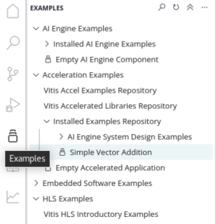
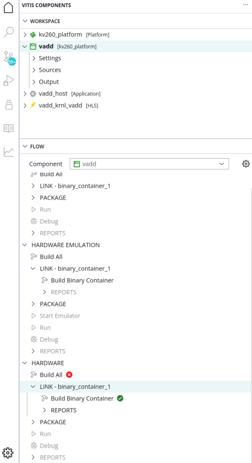
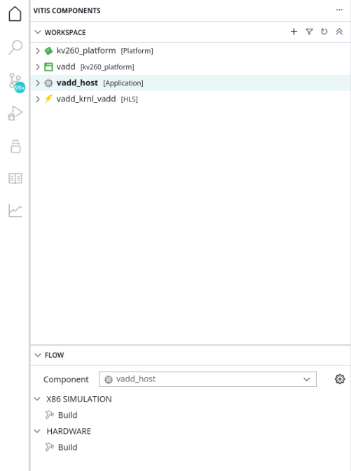

<table class="sphinxhide" width="100%">
 <tr width="100%">
    <td align="center"><h1>2023.2 Vitis™ Platform Creation Tutorials</h1>
    <a href="https://www.xilinx.com/products/design-tools/vitis.html">See Vitis™ Development Environment on xilinx.com</br></a>
    </td>
 </tr>
</table>

# Step 3: Test the Platform

- [Step 3: Test the Platform](#step-3-test-the-platform)
  - [Test 1: Read Platform Info](#test-1-read-platform-info)
  - [Test 2: Run Vector Addition Application](#test-2-run-vector-addition-application)
  - [Congratulations](#congratulations)
  - [Fast Track](#fast-track)

## Test 1: Read Platform Info

With the Vitis environment setup, the **platforminfo** tool can report XPFM platform information.

<details>

<summary><strong>Click for detailed logs</strong></summary>  

```bash
# in kv260_custom_pkg directory
platforminfo ./kv260_custom/export/kv260_custom/kv260_custom.xpfm
==========================
Basic Platform Information
==========================
Platform:           kv260_custom
File:               /Vitis-Tutorials/Vitis_Platform_Creation/Design_Tutorials/01-Edge-KV260/ref_files/step2_pfm/kv260_custom/export/kv260_custom/kv260_custom.xpfm
Description:        

=====================================
Hardware Platform (Shell) Information
=====================================
Vendor:                           xilinx
Board:                            kv260_hardware_Platform
Name:                             kv260_hardware_Platform
Version:                          0.0
Generated Version:                2023.2
Hardware:                         1
Software Emulation:               1
Hardware Emulation:               1
Hardware Emulation Platform:      0
FPGA Family:                      zynquplus
FPGA Device:                      xck26
Board Vendor:                     xilinx.com
Board Name:                       xilinx.com:kv260_som:1.4
Board Part:                       xck26-sfvc784-2LV-c

=================
Clock Information
=================
  Default Clock Index: 1
  Clock Index:         0
    Frequency:         99.999000
  Clock Index:         1
    Frequency:         199.998000
  Clock Index:         2
    Frequency:         399.996000

==================
Memory Information
==================
  Bus SP Tag: HP0
  Bus SP Tag: HP1
  Bus SP Tag: HP2
  Bus SP Tag: HP3
  Bus SP Tag: HPC0
  Bus SP Tag: HPC1

=============================
Software Platform Information
=============================
Number of Runtimes:            1
Default System Configuration:  kv260_custom
System Configurations:
  System Config Name:                      kv260_custom
  System Config Description:               
  System Config Default Processor Group:   linux_psu_cortexa53
  System Config Default Boot Image:        standard
  System Config Is QEMU Supported:         1
  System Config Processor Groups:
    Processor Group Name:      linux_psu_cortexa53
    Processor Group CPU Type:  cortex-a53
    Processor Group OS Name:   xrt
  System Config Boot Images:
    Boot Image Name:           standard
    Boot Image Type:           
    Boot Image BIF:            boot/linux.bif
    Boot Image Data:           linux_psu_cortexa53/image
    Boot Image Boot Mode:      
    Boot Image RootFileSystem: 
    Boot Image Mount Path:     
    Boot Image Read Me:        
    Boot Image QEMU Args:      qemu/pmu_args.txt:qemu/qemu_args.txt
    Boot Image QEMU Boot:      
    Boot Image QEMU Dev Tree:  
Supported Runtimes:
  Runtime: C/C++
```

</details>

You can verify clock information and memory information are set as expected.

### Test 2: Run Vector Addition Application

Vector addition is the simplest acceleration PL kernel. Vitis Unified IDE can create this application automatically. Running this test can check the AXI control bus, memory interface, and interrupt setting in platform are working properly.

1. Create a Vector Addition Application.

  - Go to `WorkSpace` directory created in step1
   - Run Vitis by typing `vitis -w .` in the console. `-w` is to specify the workspace. `.` means the current workspace directory. Close the welcome tab after Vitis launches.
   - Go to example view by clicking the example button and click **Simple Vector Addition**.
      
   - Click **Create Application from Template**. The project creation wizard would pop up. 
      - Input the **System project name** as `vadd` and use the default location for **System project location**. Then click **Next**.
      - Select **kv260_custom** platform, click **Next**.
         >Note: If the platform component is not in the current workspace user could click **+** button to add the platform component.
      - Set **Sysroot** to ```xilinx-zynqmp-common-v2023.2/sysroots/cortexa72-cortexa53-xilinx-linux```. Then click **Next**.
      - Review the summary of your `vadd` system project and click **Finish**.

  >**NOTE:** In this step, the addition of the kernel image and rootfs is omitted since it is recommended to use the official sd_card.img from AMD's download center. Furthermore, V++ does not incorporate the kernel image and rootfs in the generation of the sd_card.img for the SOM.

  After seconds the vadd system project, vadd host component and vadd kernel component will be ready in the component view. 
     
2. Building Vector Addition Application

   Vadd system project supports three targets: Software emulation, Hardware emulation and Hardware. User could select the target accordingly following steps below. As SOM has different development flow, we will only generate XCLBIN file and host application for hardware.

  - Navigate to the Flow Navigator, select vadd system project, then expand the **LINK-binary_container_1** under **HARDWARE** target.

      

  - Click **Build Binary Container**
  
  >Note: Once the compilation is complete, users can find the `binary_container_1.xclbin` by expanding the Output directory, which offers a structured view of the output. The actual file path of `binary_container_1.xclbin` is located in the `WorkSpace/vadd/build/hw/hw_link/` directory. Additionally, users can access the full path of the `binary_container_1.xclbin` file by hovering the mouse pointer over the image file.


  - Navigate to the Flow Navigator, select the vadd_host application component, and then click **Build** under the **HARDWARE** target..

      

  >Note: Once the compilation is complete, users can find the `vadd_host` executable file by expanding the Output directory, which offers a structured view of the output. The actual file path of `vadd_host` is located in the `WorkSpace/vadd_host/build/hw/` directory. Additionally, users can access the full path of the `vadd_host` file by hovering the mouse pointer over the image file.

3. Prepare the files to be transferred to the board.

   The AMD Kria™ SOM uses `xmutil` to load applications dynamically. The load process includes downloading binary file and loading device tree overlay. `xmutil` requires the application files to be stored in `/lib/firmware/xilinx` directory.

   The files related to this application need to have specified extensions. They are `dtbo`, `bin`, and `json`. Therefore, the final content in the directory on the board would look like the following.

   ```bash
   # On target board
   ls /lib/firmware/xilinx/vadd
   pl.dtbo                       #DTB overlay file
   binary_container_1.bin        #Acceleration binary container for XRT configuration. Also includes system.bit and metadata that describes the kernels. 
   shell.json                    #Description file
   ```

   The `dtbo` file is prepared in step 2 in the `dtg_output` folder. `Binary_container_1.bin` can be renamed from `binary_container_1.xclbin`. For `shell.json`, you can copy it from other applications or create one with the following contents.

    ```json
    {
      "shell_type" : "XRT_FLAT",
      "num_slots": "1"
    }
    ```

4. Transfer the files to the board.

    Make sure the Ethernet cable of SOM Starter Kit is connected. Use SCP or SFTP to upload the files from host to target board.

    ```bash
    # Running on host machine
    scp pl.dtbo binary_container_1.bin shell.json vadd_host petalinux@<SOM Starter Kit IP>:/home/petalinux
    ```

5. Load the hardware.

    ```bash
    # Running on target board
    sudo mkdir /lib/firmware/xilinx/vadd
    cd /home/petalinux
    cp pl.dtbo binary_container_1.bin shell.json /lib/firmware/xilinx/vadd
    sudo xmutil listapps
    sudo xmutil unloadapp
    sudo xmutil loadapp vadd
    ```

    If the application required files are loaded successfully, the following log is expected:

    ```bash
    Nov  8 06:20:28 xilinx-kv260-starterkit-20232 kernel: OF: overlay: WARNING: memory leak will occur if overlay removed, property: /fpga-full/firmware-name
    Nov  8 06:20:28 xilinx-kv260-starterkit-20232 kernel: OF: overlay: WARNING: memory leak will occur if overlay removed, property: /fpga-full/pid
    Nov  8 06:20:28 xilinx-kv260-starterkit-20232 kernel: OF: overlay: WARNING: memory leak will occur if overlay removed, property: /fpga-full/resets
    Nov  8 06:20:28 xilinx-kv260-starterkit-20232 kernel: OF: overlay: WARNING: memory leak will occur if overlay removed, property: /fpga-full/uid
    Nov  8 06:20:28 xilinx-kv260-starterkit-20232 kernel: OF: overlay: WARNING: memory leak will occur if overlay removed, property: /__symbols__/afi0
    Nov  8 06:20:28 xilinx-kv260-starterkit-20232 kernel: OF: overlay: WARNING: memory leak will occur if overlay removed, property: /__symbols__/clocking0
    Nov  8 06:20:28 xilinx-kv260-starterkit-20232 kernel: OF: overlay: WARNING: memory leak will occur if overlay removed, property: /__symbols__/clocking1
    Nov  8 06:20:28 xilinx-kv260-starterkit-20232 kernel: OF: overlay: WARNING: memory leak will occur if overlay removed, property: /__symbols__/axi_intc_0
    Nov  8 06:20:28 xilinx-kv260-starterkit-20232 kernel: OF: overlay: WARNING: memory leak will occur if overlay removed, property: /__symbols__/misc_clk_0
    Nov  8 06:20:28 xilinx-kv260-starterkit-20232 kernel: irq-xilinx: mismatch in kind-of-intr param
    Nov  8 06:20:28 xilinx-kv260-starterkit-20232 kernel: zocl-drm axi:zyxclmm_drm: error -ENXIO: IRQ index 32 not found
    vadd: loaded to slot 0
    ```

5. Running vector addition application on the board.

   - Run vadd application.

   ```bash
   chmod +x ./vadd_host
   ./vadd_host binary_container_1.bin
   ```

   - It should show program prints.

   ```
    xilinx-k26-starterkit-20232:~$ ./vadd_host binary_container_1.bin
    INFO: Reading binary_container_1.bin
    Loading: 'binary_container_1.bin'
    TEST PASSED
   ```

> **NOTE:** If you get errors like "error while loading shared libraries: libxilinxopencl.so.2: cannot open shared object file: No such file
or directory", it is because XRT is not installed in KV260 default rootfs. Run `sudo dnf install xrt` to install XRT.

### Congratulations

You have completed creating a custom platform from scratch and verifying it with a simple vadd application.

Feel free to check more tutorials in this repository.

### Fast Track

If you encounter any issues when creating the custom platform and the validation application in this tutorial, you can run `make all COMMON_IMAGE_ZYNQMP=<path/to/common_image/>` in [ref_files](./ref_files) directory to generate the reference design and compare with your design. COMMON_IMAGE_ZYNQMP is a flag to specify the common image path. Please download common image from [Xilinx website download page](https://www.xilinx.com/support/download.html) and give the path to the flag.

The command line flow has slight differences comparing to Vitis IDE flow.

- The vector addition application is called `vadd_host` and `binary_container_1.xclbin` in Vitis Unified IDE flow. The generated files in command line flow are called `simple_vadd` and `krnl_vadd.xclbin`.

### Next Steps

If user need to do iteration for your project, you could go through the [Iteration Guidelines](./Iteration_guideline.md) to do iterations.

<p class="sphinxhide" align="center"><sub>Copyright © 2020–2023 Advanced Micro Devices, Inc</sub></p>

<p class="sphinxhide" align="center"><sup><a href="https://www.amd.com/en/corporate/copyright">Terms and Conditions</a></sup></p>
