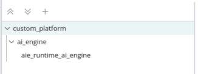
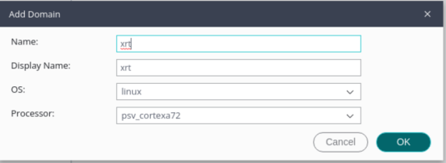
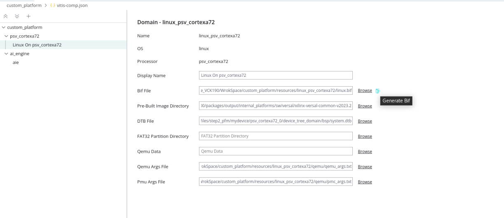
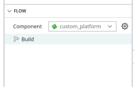
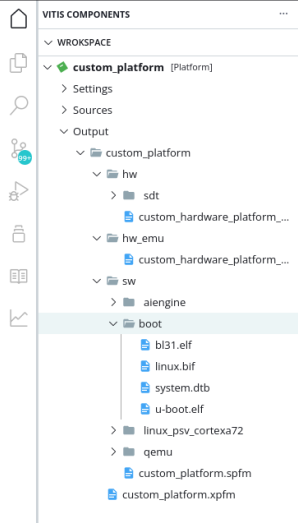

<table class="sphinxhide" width="100%">
 <tr width="100%">
    <td align="center"><h1>Vitis™ Platform Creation Tutorials</h1>
    <a href="https://www.xilinx.com/products/design-tools/vitis.html">See Vitis™ Development Environment on xilinx.com</br></a>
    </td>
 </tr>
</table>

# Step 2: Create the Vitis Software Platform

In this step, you will create a Vitis platform running Linux operation system. The Vitis platform requires several software components which need to be prepared in advance. AMD simplifies this process by offering common software images for rapid evaluation, expediting your development journey. However, it's important to note that the common image package doesn't include the Device Tree Blob (DTB) file. DTB files vary across platforms due to differences in device peripherals. To bridge this gap, we'll employ the `createdts` command to generate the device tree file for your platform. Of course, customization might be required depending on the unique demands of your project. If you find the need to fine-tune aspects like the kernel or root filesystem (rootfs), you can refer to [PetaLinux customization page](../../Feature_Tutorials/02_petalinux_customization/README.md) for customization. 
Listed below are the software components necessary for this platform:

| Component                                     | Conventional Path or Filename | Description                                                      | Provenance                         |
| --------------------------------------------- | ----------------------------- | ---------------------------------------------------------------- | ---------------------------------- |
| Boot components in BOOT.BIN                   | bl31.elf                      | Arm® trusted firmware/ secure monitor                            | Extracted from common image        |
| Boot components in BOOT.BIN                   | u-boot.elf                    | Second stage boot loader                                         | Extracted from common image        |
| Boot components in BOOT.BIN                   | system.dtb                    | Device tree information file                                     | Generated from "createdts" command |
| Boot components in FAT32 partition of SD card | boot.scr                      | U-boot configuration file to store in FAT32 partition of SD card | Extracted from common image        |
| Linux Software Components                     | Image                         | Linux kernel  Image                                              | Extracted from common image        |
| Linux Software Components                     | rootfs.ext4                   | Linux file system                                                | Extracted from common image        |
| Linux SDK                                     | sysroot                       | Cross compile and header files                                   | Extracted from common image        |
> Note: The Kernel Image, Linux file system, and Sysroot are not mandatory components for the platform itself. Instead, they are used to compile the application and generate the SD Card Image.

As most of the components are extracted from the common image package, we will prepare the common image first.

## Prepare the Common Images

1. Download common image from [AMD website download page.](https://www.xilinx.com/support/download/index.html/content/xilinx/en/downloadNav/embedded-platforms.html). 
2. Navigate to the **WorkSpace** folder that you created in step1 and place the image package in **WorkSpace** folder.

   ```bash
   cd WorkSpace
   tree -L 1     # to see the directory hierarchy
   .
   ├── custom_hardware_platform
   └── xilinx-versal-common-v2023.2.tar.gz
   ```

2. Extract the common image.

   Please follow steps below to extract the common image.

   ```bash
   cd WrokSpace
   tar xvf ../xilinx-versal-common-v2023.2.tar.gz -C .
   ```

   You can see the **xilinx-versal-common-v2023.2** folder which contains some components located in **WorkSpace** folder as shown below.

   ```bash
   tree -L 2
   .
   ├── xilinx-versal-common-v2023.2
   │   ├── bl31.elf
   │   ├── boot.scr
   │   ├── Image
   │   ├── README.txt
   │   ├── rootfs.ext4
   │   ├── rootfs.manifest
   │   ├── rootfs.tar.gz
   │   ├── sdk.sh
   │   └── u-boot.elf
   ```

From the above picture, you can see boot file, kernel image, rootfs, and SDK tool are ready. DTB is not available. In the subsequent step, we will focus on preparing the DTB file.

## Create the Device Tree File

The device tree describes the hardware components of the system. The `createdts` command can generate the device tree file according to the hardware configurations from the XSA file. If there are any settings not available in XSA, for example, any driver nodes that does not have corresponding hardware, or you have their own design hardware, you need to add customization settings in `system-user.dtsi`.

In addition to U-Boot file, lacks default environment variables. So you must update the bootargs manually. To streamline this process a pre-prepared [system-user.dtsi](ref_files/step2_pfm/system-user.dtsi) file which adds pre-defined bootargs is located in `step2_pfm` directory. Copy `system-user.dtsi` to  the `WorkSpace` directory, and follow these steps to generate the DTB file.

1. First, go to **WrokSapce** directory and launch XSCT tool.

   ```bash
   cd WorkSpace
   xsct 
   ```

2. Then execute the `createdts` command in XSCT console as shown below:

   ```bash
   createdts -hw ../custom_hardware_platform/custom_hardware_platform.xsa -zocl  -out .  \
   -platform-name mydevice  -git-branch xlnx_rel_v2023.1  -dtsi system-user.dtsi -compile
   ```

   The `createdts` command has the following main input options:

- `-hw`: Hardware XSA file with path
- `-platform-name`: Platform name
- `-git-branch`: device tree branch
- `-board`: board name of the device. You can check the board name at <DTG Repo>/device_tree/data/kernel_dtsi.
- `-out`: Specify the output directory
- `-zocl`: enable the zocl driver support
- `-dtsi`: Add user's device tree file support
- `-compile`: specify the option to compile the device tree

   The following information will be displayed on the XSCT console. You can safely disregard the warning. This message confirms that you have successfully obtained the `system.dtb` file which is located in `<mydevice/psv_cortexa72_0/device_tree_domain/bsp/>` directory.

   ```bash
   pl.dtsi:9.21-71.4: Warning (unit_address_vs_reg): /amba_pl@0: node has a unit name, but no reg or ranges property
   pl.dtsi:52.26-56.5: Warning (simple_bus_reg): /amba_pl@0/misc_clk_0: missing or empty reg/ranges property
   pl.dtsi:57.15-65.5: Warning (simple_bus_reg): /amba_pl@0/zyxclmm_drm: missing or empty reg/ranges property
   pl.dtsi:66.42-70.5: Warning (simple_bus_reg): /amba_pl@0/aie_core_ref_clk_0: missing or empty reg/ranges property
   pl.dtsi:9.21-71.4: Warning (unique_unit_address): /amba_pl@0: duplicate unit-address (also used in node /memory@0)
   versal.dtsi:316.24-325.5: Warning (interrupt_provider): /axi/gpio@ff0b0000: Missing #address-cells in interrupt provider
   ```

   > **NOTE:** `createdts` is a command executing in XSCT console to generate device files. This command needs several inputs to generate the device tree files. Regarding the meaning of every option, you can execute the `help` command to check the details. Besides XSCT is a Console tool of Vitis. You can start it by typing `xsct` in Linux terminal to start it. Or you can select menu **Xilinx > XSCT Console** to start the XSCT tool after you launch Vitis.

   > **NOTE**: Device tree knowledge is a common know-how. Please refer to [AMD Device tree WIKI page](https://xilinx-wiki.atlassian.net/wiki/spaces/A/pages/862421121/Device+Trees) or [Device Tree WIKI page](https://en.wikipedia.org/wiki/Devicetree#Linux) for more information if you are not familiar with it.
   

3. Execute the following command to exit XSCT console.

   ```bash
   exit
   ```

Following the completion of this step, all the necessary components for platform creation are now prepared. In the next phase, we will proceed to attach all these components to your platform and initiate the build process.

## Create the Vitis Platform

1. Install the sysroot

   - Go to common image extracted directory <WorkSpace/xilinx-versal-common-v2023.2/>.
   - Type `./sdk.sh -d <Install Target Dir>` to install the PetaLinux SDK. Use the `-d` option to provide a full pathname to the output directory. (This is an example. `.` means current directory) and confirm.

   >Note: The environment variable LD_LIBRARY_PATH must not be set when running this command.

   >Note: Sysroot is not mandatory components for the platform itself. It is the cross compile tool 
     
2. Create the Vitis platform.

   For this example, you will use the Vitis Unifeid IDE to create the Vitis Platform. Go to **WorkSpace** directory and follow steps below to create the platform

   1. Run Vitis by typing `vitis -w .` in the console. `-w` is to specify the workspace. `.` means the current worksapce directory.
   2. In the Vitis Unified IDE, from menu select **File > New Component > Platform** to create a platform component.
   3. On the **Create Platform Component** setup dialog
      - Enter the platform component name and location. For this example, type `custom_platform` and use default location. Click **Next**.
      - Click **Broswe** button, select the XSA file generated by the Vivado. In this case, it is `custom_hardware_platform_hw.xsa`. 
         >Note: If you want to create a platform with emulation support please click **Emulation** and select the emulation XSA file. In this case, it is `custom_hardware_platform_hwemu.xsa`.
      - Set the operating system to **aie_runtime**.</br>
      - Set the processor to **ai_eigine**.</br>
      - Review the summary and click **Finish**.
         >Note: After a few moments, the platform component will be prepared and available in the component view. Simultaneously, the platform configuration file, `vitis-comp.json`, will be automatically displayed in the main view. Users can access the `vitis-comp.json` file by expanding the Settings section under the platform component as well.

         >Note: The sequence of creating the AI Engine domain first was a workaround for a known bug, which will be fixed in the next release of the tool.
3. Add the Linux domain.

     - Click **+** button to add a domain.

         

     - Set Name to **xrt**.
     - Change OS to **linux**.
     - Keep other settings to default and click **OK**.

         


4. Set up the software settings in the Platform configuration view by clicking the **psv_cortexa72** domain, browse to the locations and select the directory or file needed to complete the dialog box for the following:

   - **Display Name**:  It has already been updated to `xrt`.
   - **Bif file**: Click the button to generate bif file or click **Browse** to select existing bif file. 

     >**Note:** The filenames in `<>` are placeholders in the bif file. Vitis will replace the placeholders with the relative path to platform during platform packaging. V++ packager, which runs when building the final application#, would expand it further to the full path during image packaging. Filename placeholders point to the files in boot components directory. The filenames in boot directory need to match with placeholders in BIF file. `<bitstream>` is a reserved keyword. V++ packager will replace it with the final system bit file.

   - **Pre-Built Image Directory**: Browse to **xilinx-versal-common-v2023.2** and click **OK**.

   - **DTB File**: Browse to **mydevice/psu_cortexa72_0/device_tree_domain/bsp** and select system.dtb, then click **OK**.

   - **FAT32 Partition Directory**: This directory is used to add additional file to the fat32 partition. User can set it according to your requirement.

   - **QEMU Data**: This Directory is used to add additional file for emulation. User can set it according to your requirement.

   

   >**Note:**: **Qemu Args File** and **Pmu Args File**  are populated by the tool


5. Select **custom_platform** platform component in the flow navigator, then click the **Build** button to build the platform.

   

   >Note: The generated platform is placed in the `custom_platform` directory. The platform is ready to be used for application development

   

   >Note: Users can locate the XPFM file by expanding the Output directory. This provides a logical view of the output. The actual path of platform file is under `WorkSpace/custom_platform/export/custom_platform/` directory. Users can also view the complete path of the platform file by simply hovering the mouse pointer over the XPFM file.

   >Note: The Vitis Unified IDE will find the boot-related files menntioned in the software components in begin of this step and place them in the boot folder of the platform.

   If you create a Vitis application component in the same workspace as this platform component, you can find this platform available in the platform selection page in the application Creation wizard. If you want to reuse this platform in another workspace, add its path to the PLATFORM_REPO_PATHS environment variable before launching the Vitis GUI, or use the "Add" button on the platform selection page of the Vitis GUI to add its path.

   User could also use Vitis python command to create the platform component.

   <details>
   <summary><strong>Click here to see how to use Vitis python command to create a Vitis platform.</strong></summary>
   Create a python script. For example, here is the parts of [platform_creation.py](./ref_files/step2_pfm/platform_creation.py).

   ```Tcl
   import vitis
   import argparse
   import os
   print("Platform generation")
   parser = argparse.ArgumentParser()
   parser.add_argument("--platform_name", type=str, dest="platform_name")
   parser.add_argument("--xsa_path", type=str, dest="xsa_path")
   parser.add_argument("--xsa-emu_path", type=str, dest="emuxsa_path")
   parser.add_argument("--boot", type=str, dest="boot")
   parser.add_argument("--dtb", type=str, dest="dtb")
   args = parser.parse_args()
   platform_name=args.platform_name
   xsa_path=args.xsa_path
   emuxsa_path=args.emuxsa_path
   dtb=args.dtb
   boot=args.boot
   print('args',args)
   client = vitis.create_client()
   client.set_workspace(path=os.getcwd())
   platform = client.create_platform_component(name = platform_name, hw =xsa_path, os = "aie_runtime",cpu = "ai_engine",emulation_xsa_path = emuxsa_path )
   platform = client.get_platform_component(name=platform_name)
   domain = platform.add_domain(cpu = "psv_cortexa72",os = "linux",name = "xrt",display_name = "xrt")
   domain = platform.get_domain(name="xrt")
   status = domain.generate_bif() 
   status = domain.add_boot_dir(path=boot)
   status = domain.set_dtb(path=dtb)
   status = platform.build()
   ```
   This python script is for user to create a platform. It needs the following input values.

   - `name`: Platform name.
   - `hw`: Hardware XSA file location.
   - `emulation_xsa_path`: Hardware emulation XSA file location.
   - `boot`: pre-built image path.
   - `dtb`: DTB file path.

   The following is the command brief explanation.
   - `client.create_platform_component` is used to create a platform with standalone domain or the Linux domain. 
   - `domain.add_boot_dir` is used to set the pre-built image path.  
   - `domain.set_dtb` is used to set the DTB file.

   You can pass the values to the script directly by replacing the variable with the actual value, or pass the value to python script. Here is an example of calling python script.

   ```bash
   vitis -s platform_creation.py --platform_name <> --xsa_path <> --xsa-emu_path <> --boot <> --dtb <>
   ```

   </details>


   Now you have completed the platform creation. Next, we will validate the output of this step.

## Validate the Output of Step 2

   With Vitis environment setup, the **platforminfo** tool can report XPFM platform information.

   You can verify hardware configuration (clocks, memory) and software configuration (domain) are set as expected.

   <details>
   <summary><b>Show Log</b></summary>

   ```bash
   #  go to the  XPFM file directory
   cd WorkSpace/custom_platform/export/custom_platform/
   # Report Platform Info
   platforminfo custom_platform.xpfm
   ==========================
   Basic Platform Information
   ==========================
   Platform:           custom_platform
   File:               /WorkSpace/custom_platform/export/custom_platform/custom_platform.xpfm
   Description:        

   =====================================
   Hardware Platform (Shell) Information
   =====================================
   Vendor:                           xilinx.com
   Board:                            extensible_platform_base
   Name:                             extensible_platform_base
   Version:                          1.0
   Generated Version:                2023.2
   Hardware:                         1
   Software Emulation:               1
   Hardware Emulation:               1
   Hardware Emulation Platform:      0
   FPGA Family:                      versal
   FPGA Device:                      xcvc1902
   Board Vendor:                     
   Board Name:                       
   Board Part:                       

   =================
   Clock Information
   =================
   Default Clock Index: 0
   Clock Index:         0
      Frequency:         156.250000

   ==================
   Memory Information
   ==================
   Bus SP Tag: DDR
   Bus SP Tag: LPDDR

   =============================
   Software Platform Information
   =============================
   Number of Runtimes:            1
   Default System Configuration:  custom_platform
   System Configurations:
   System Config Name:                      custom_platform
   System Config Description:               
   System Config Default Processor Group:   aie
   System Config Default Boot Image:        standard
   System Config Is QEMU Supported:         1
   System Config Processor Groups:
      Processor Group Name:      linux_psu_cortexa72
      Processor Group CPU Type:  psu_cortexa72
      Processor Group OS Name:   xrt
      Processor Group Name:      aie
      Processor Group CPU Type:  ai_engine
      Processor Group OS Name:   aie
   System Config Boot Images:
      Boot Image Name:           standard
      Boot Image Type:           
      Boot Image BIF:            boot/linux.bif
      Boot Image Data:           linux_psu_cortexa72/image
      Boot Image Boot Mode:      
      Boot Image RootFileSystem: 
      Boot Image Mount Path:     
      Boot Image Read Me:        
      Boot Image QEMU Args:      qemu/pmc_args.txt:qemu/qemu_args.txt
      Boot Image QEMU Boot:      
      Boot Image QEMU Dev Tree:  
      Supported Runtimes:
   Runtime: C/C++
   ```

   </details>

## Fast Track

Scripts are provided to create the Vitis platform. To use these scripts, please run the following steps.

1. Run build.
   > **NOTE:** Download the common image from [Xilinx website download page.](https://www.xilinx.com/support/download.html) and give its path to the following command.

   ```
   # cd to the step directory, e.g.
   cd step2_pfm
   make all COMMON_IMAGE_VERSAL=<path/to/common_image/>
   ```

2. To clean the generated files, please run

   ```bash
   make clean
   ```

## Next Step

Next, try to [build some applications on this platform and test them.](./step3.md)


<p class="sphinxhide" align="center"><sub>Copyright © 2020–2023 Advanced Micro Devices, Inc</sub></p>

<p class="sphinxhide" align="center"><sup><a href="https://www.amd.com/en/corporate/copyright">Terms and Conditions</a></sup></p>
